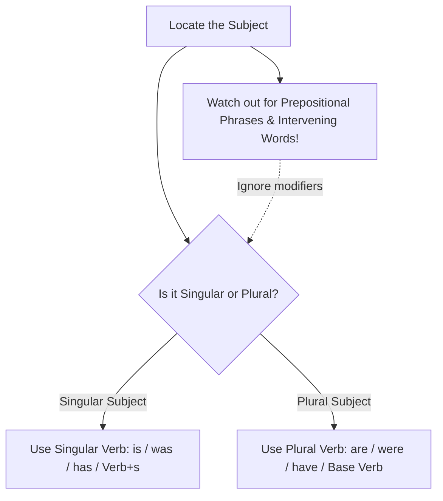
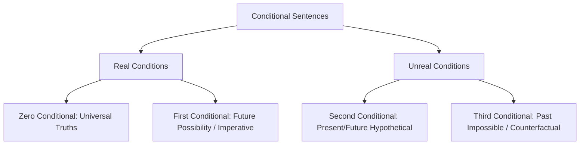
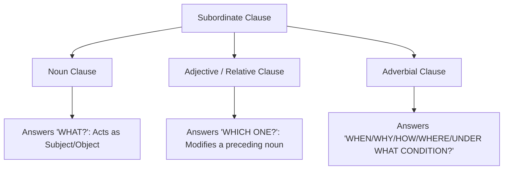

# GEEL-1106 / UREL-1106: ADVANCED ENGLISH
## THE DEFINITIVE EXAM PREPARATION PACKAGE & MASTER TEXTBOOK
**International Islamic University Chittagong (IIUC)**
**Center for General Education (CGED) | Faculty of Science & Engineering**

> *Authored by Experienced English Professor, Grammar Expert, Curriculum Designer & Note Maker*
> *Integrating all course materials, textbooks (E.L. Tibbitts), lecture slides, study guides, and 7-year past exam papers (2018–2025)*

---

## MASTER TABLE OF CONTENTS

1. [01: Course Overview and Syllabus Breakdown](#01_course_overview_and_syllabus_breakdown)
2. [02: Subject Verb Agreement Mastery](#02_subject_verb_agreement_mastery)
3. [03: Conditional Sentences Mastery](#03_conditional_sentences_mastery)
4. [04: Causative Verbs Mastery](#04_causative_verbs_mastery)
5. [05: Tenses and Right Forms Mastery](#05_tenses_and_right_forms_mastery)
6. [06: Voice Modifiers Gerund Participle](#06_voice_modifiers_gerund_participle)
7. [07: Prepositions Connectors and Synthesis](#07_prepositions_connectors_and_synthesis)
8. [08: Common Mistakes and Correction](#08_common_mistakes_and_correction)
9. [09: Seen Comprehension Tibbitts Mastery](#09_seen_comprehension_tibbitts_mastery)
10. [10: Unseen Comprehension and Summary Writing](#10_unseen_comprehension_and_summary_writing)
11. [11: Professional Writing Masterclass](#11_professional_writing_masterclass)
12. [12: Previous Question Analysis 2018 2025](#12_previous_question_analysis_2018_2025)
13. [13: Exam Suggestion Notes and Top Lists](#13_exam_suggestion_notes_and_top_lists)
14. [14: Last Night Revision Notes](#14_last_night_revision_notes)
15. [15: MCQ and CQ Practice Book](#15_mcq_and_cq_practice_book)
16. [16: Final Smart Note and Checklist](#16_final_smart_note_and_checklist)

---

# Course Overview & Master Syllabus Guide

## Course Identity
- **Course Code:** GEEL-1106 / UREL-1106
- **Course Title:** Advanced English
- **Department/Faculty:** Center for General Education (CGED) / Faculty of Science & Engineering (CSE, EEE, ETE, CCE, CE, Pharmacy), Year 1, Semester 1
- **Credit Hours:** 2.0 (Contact Hours: 3 Hours/Week, Notional Hours: 80)
- **Total Marks:** 100 Marks (CIE: 50 Marks, SEE: 50 Marks)

---

## Course Assessment Architecture

### 1. Continuous Internal Evaluation (CIE) — 50 Marks
| Component | Weightage | Focus & Description |
| :--- | :--- | :--- |
| **Attendance** | 10 Marks | Class participation and physical attendance |
| **Class Test / Assignment / Quizzes** | 10 Marks | Mid-semester quizzes, continuous assessments, short assignments |
| **Mid-Term Examination** | 30 Marks | Reading (Seen 1C–10C: 10 Marks), Sentence Construction (10 Marks), Composition (5 Marks), Speaking (5 Marks) |

### 2. Semester End Examination (SEE) — 50 Marks (2 Hours 30 Minutes)
*Source: Official Examination Pattern & Historical Question Papers (2018–2025)*

```
Total Written SEE: 45 Marks + 5 Marks Speaking/Listening (Total = 50 Marks)
```

| Section | Target Area | Marks Distribution | Question Types Tested |
| :--- | :--- | :--- | :--- |
| **Part A: Reading (25 Marks)** | **Seen Passage (Units 11C–20C)**<br>*(From Tibbitts: Exercises in Reading Comprehension)* | **15 Marks** | 1. Fill in the blanks (word from text)<br>2. True / False / Right / Wrong<br>3. Synonym & Antonym identification<br>4. Direct & Inferential Comprehension Questions<br>5. Phrase Explanation & Sentence Generation<br>6. Table Completion<br>7. Summary Writing |
| | **Unseen Passage**<br>*(Contemporary articles on environment, health, education, diplomacy)* | **10 Marks** | 1. Vocabulary in context<br>2. Inferring author's tone, mood, and purpose<br>3. Wh-questions and sentence completion<br>4. 50-Word Precision Summary Writing |
| **Part B: Grammar (10 Marks)** | **Core Advanced Grammar** | **10 Marks**<br>*(10 questions × 1 mark each)* | 1. Preposition & Conjunction / Connectors / Linkers<br>2. Fill in the blanks / Completing Sentences (Conditionals, Clauses)<br>3. Common Mistakes Correction in English<br>4. Combining a Group of Sentences (Participles, Clauses)<br>5. Causative Verbs & Voice Transformations<br>6. Subject-Verb Agreement<br>7. Gerund vs. Present Participle Identification |
| **Part C: Writing (15 Marks / 10–15 Marks)** | **Professional & Academic Writing** | **10–15 Marks**<br>*(Usually 2 or 3 items of 5 marks each)* | 1. **Argumentative Writing (Agree / Disagree Essay)** (5 Marks)<br>2. **Data & Chart Description** (Graph / Bar / Pie / Table) (5 Marks)<br>3. **Official Business Letter** (Complaint / Order / Request / Credit) (5 Marks) |

---

## Course Learning Outcomes (CLOs) & Bloom's Taxonomy Alignment
1. **CLO 1 (Cognitive: Understanding):** Comprehend complex literary, academic, and engineering texts; accurately deduce synonyms, antonyms, and sentence structures.
2. **CLO 2 (Cognitive: Understanding & Applying):** Demonstrate oral and written fluency, write concise summaries, and interpret graphical data.
3. **CLO 3 (Cognitive: Applying & Analyzing):** Apply core grammatical rules (Subject-Verb Agreement, Causative Verbs, Conditionals, Right Forms of Verbs) in both academic and workplace writing.

---

## Prescribed & Recommended Reference Bibliography
1. **Text Book:** *Exercises in Reading Comprehension*, Edited by E.L. Tibbitts, Longman House, Essex, UK.
2. *Oxford Advanced Learner's Dictionary of Current English*, A.S. Hornby, Oxford University Press.
3. *English Sentences: Learning through Structures & Functions*, Mohammad Sarwar Alam & Mohammad Taher Hossain Salim, Friends' Book Corner, Dhaka.
4. *Build up Your English*, A.J. Glover, The English Language Book Society & J.M. Dent and Sons Ltd, London.
5. *Oxford Practice Grammar (2nd Ed.)*, John Eastwood, Oxford University Press.
6. *A Communicative Grammar of English (2nd Ed.)*, Geoffrey Leech & Jan Svartvik, Longman.
7. *Practise Writing*, Mary Stephens, Longman.
8. *Writing Matters: Writing Skills and Strategies for Students of English*, Kristine Brown & Susan Hood, Cambridge University Press.


---

# Chapter 1: Subject-Verb Agreement

## Introduction
Subject-Verb Agreement (also called grammatical concord) is the foundational cornerstone of English sentence mechanics. In Standard Written English, the predicate verb must agree in number (singular or plural) and person (first, second, or third) with its true subject. While the principle sounds elementary, English syntax presents numerous traps: intervening prepositional phrases, inverted word orders, correlative conjunctions, indefinite pronouns, collective nouns, and quantifying fractions that challenge even advanced university scholars.

## Learning Objectives
By completing this chapter, university students will be able to:
1. Identify the authentic grammatical "headword" in complex sentences containing intervening phrases and modifiers.
2. Formulate correct verb choices with compound subjects linked by `and`, `as well as`, `along with`, `together with`, and `accompanied by`.
3. Apply proximity and correlative conjunction rules (`either... or`, `neither... nor`, `not only... but also`).
4. Resolve concord with indefinite pronouns, collective nouns, fractions, percentages, and expressions of quantity/time/distance.
5. Confidently tackle all Subject-Verb Agreement questions appearing in GEEL-1106 Semester End Examinations.

## Easy Definition
**Subject-Verb Agreement** simply means that a singular subject must take a singular verb, and a plural subject must take a plural verb.
- **Singular:** *The engineer works on the project.*
- **Plural:** *The engineers work on the project.*

## Why It Is Important
In academic, technical, and professional engineering writing, agreement errors immediately undermine credibility. Examiners heavily penalize concord errors in Semester End Examinations because verb inflection reveals whether a student understands sentence hierarchy or merely matches verbs to the nearest adjacent word.

## Basic Concept
1. **Third Person Singular inflection:** In the Present Indefinite tense, a third-person singular subject requires the suffix **-s** or **-es** on the lexical verb (*he writes*, *she develops*, *the system operates*).
2. **Plural Inflection:** Plural subjects do **not** take `-s` or `-es` on the lexical verb (*they write*, *the systems operate*).
3. **Be-Verbs & Auxiliaries:**
   - Singular: *is, was, has, does*
   - Plural: *are, were, have, do*



## Detailed Explanation
The core challenge in advanced English is identifying the **true subject (the headword)**. Modifiers—such as prepositional phrases, participial phrases, relative clauses, and appositives—frequently sit between the subject and the verb. 

> [!WARNING]
> **The Proximity Illusion:** Never automatically match the verb with the noun sitting directly before it. Always trace backward to find the grammatical headword of the noun phrase.

---

## Grammar Rules (Rule-by-Rule Explanation)

### Rule 1: The Headword Rule (Intervening Prepositional Phrases)
When a prepositional phrase (e.g., beginning with *of, in, on, at, for, with, about*) separates the subject from the verb, the verb agrees with the **headword** preceding the preposition, **never** with the object of the preposition.
- **Structure:** `Subject (Headword) + [Preposition + Object of Preposition] + Verb`
- **Examples from Course Material:**
  1. *The boys in the room **are** studying.* (Headword: *boys* [plural])
  2. *The freshness of these vegetables **attracts** the customers.* (Headword: *freshness* [uncountable singular])
  3. *The freshness of these vegetables **is** attractive.* (Headword: *freshness* [singular])
  4. *The beauty of many places of Bangladesh **is** attractive to the tourists.* (Headword: *beauty* [singular])
  5. *The study of languages **is** very interesting.* (Headword: *study* [singular])
  6. *Several theories on this subject **have** been proposed.* (Headword: *theories* [plural])
  7. *The view of these disciplines **varies** from time to time.* (Headword: *view* [singular])
  8. *The danger of forest fires **is** not to be taken lightly.* (Headword: *danger* [singular])
  9. *The effects of that crime **are** likely to be devastating.* (Headword: *effects* [plural])
  10. *The fear of rape and robbery **has** caused many people to flee to the cities.* (Headword: *fear* [singular])
  11. *The picture of soldiers **brings** back many memories.* (Headword: *picture* [singular])
  12. *The quality of these recordings **is** not very good.* (Headword: *quality* [singular])
  13. *The effects of cigarette smoking **have** been proven to be extremely harmful.* (Headword: *effects* [plural])
  14. *The use of credit cards in place of cash **has** increased rapidly in recent years.* (Headword: *use* [singular])
  15. *Living expenses in this country as well as in many other countries **are** all time high.* (Headword: *expenses* [plural])
  16. *The levels of intoxication **vary** from time to time.* (Headword: *levels* [plural])

---

### Rule 2: Parenthetical Expressions & Accompaniment Connectors
When a subject is joined to other nouns by additive connectors such as:
- *as well as*
- *along with*
- *together with*
- *accompanied by*
- *with*
- *in addition to*
- *including / excluding*

The verb agrees strictly with the **first subject** (the initial noun). The accompanying phrase is grammatically parenthetical.
- **Formula:** `Subject 1 + [as well as / along with / together with / accompanied by / with] + Subject 2 + Verb (governed by Subject 1)`
- **Examples from Course Material:**
  17. *The actress along with her manager and some friends **is** going to a party tonight.* (Subject 1: *actress* [singular])
  18. *The Prime Minister with all members of her cabinet **has** arrived.* (Subject 1: *Prime Minister* [singular])
  19. *Mr. Robbins accompanied by his wife and children **is** arriving tonight.* (Subject 1: *Mr. Robbins* [singular])
  20. *My father together with my brothers and sisters **has** come to see me off.* (Subject 1: *My father* [singular])
  21. *John along with twenty friends **is** planning a party.* (Subject 1: *John* [singular])
  22. *Mr. Jones accompanied by several members of the committee **has** proposed some changes of the rules.* (Subject 1: *Mr. Jones* [singular])
  23. *My classmates as well as I **are** not willing to suspend the classes.* (Subject 1: *My classmates* [plural] $
ightarrow$ *are*)

---

### Rule 3: Indefinite Pronouns Ending in -body, -one, -thing
Indefinite pronouns with *-one*, *-body*, and *-thing* are grammatically singular in standard English and invariably take a singular verb.
- **Words:** *Everyone, everybody, everything, someone, somebody, something, anyone, anybody, anything, no one, nobody, nothing.*
- **Formula:** `Indefinite Pronoun (-body / -one / -thing) + Singular Verb`
- **Examples from Course Material:**
  24. *Everybody who has not purchased a ticket should be in this line.*
  25. *Something **was** under this house.*
  26. *Somebody **is** waiting outside.*
  27. *Nobody **likes** a liar.*
  28. *No problem **has** ever been so difficult.*
  29. *Anybody who **has** lost his ticket should report to the desk.*
  30. *Nobody **works** harder than John does.*
  31. *After she had perused the material, the secretary decided that everything **was** in order.*
  32. *Anything **is** better than going to another movie tonight.*
  33. *Everybody who **has** a fever must go home immediately.*

---

### Rule 4: `None of` and `No` (Countable vs. Non-Countable Concord)
- When *none of* or *no* modifies an **uncountable (non-count) noun** or a singular noun, it takes a **singular verb**.
- When *none of* or *no* modifies a **plural countable noun**, it takes a **plural verb** in descriptive university grammar.
- **Formula:**
  - `None of / No + Uncountable Noun + Singular Verb`
  - `None of / No + Plural Countable Noun + Plural Verb`
- **Examples from Course Material:**
  34. *None of the student **was** present.* (Singular noun)
  35. *No examples **were** relevant.* (Plural countable noun)
  36. *None of the money **was** spent.* (Uncountable noun)
  37. *No example **was** cited.* (Singular noun)
  38. *No money **was** necessary.* (Uncountable noun)
  39. *No students **have** passed.* (Plural countable noun)
  40. *None of the students **have** submitted the assignment.* (Plural countable noun)

---

### Rule 5: Correlative Conjunctions (`Either... or`, `Neither... nor`) vs. `Either of / Neither of`
1. **Isolated `Either of` / `Neither of`:**
   - When followed by *of*, *either* and *neither* function as pronouns meaning "one of the two" or "not one of the two". They are strictly **singular** and take a **singular verb**.
   - Formula: `Either of / Neither of + Plural Noun / Pronoun + Singular Verb`
   - Examples:
     41. *Either of two brothers **has** done this.*
     42. *Neither of Rafiq and Hasib **was** present.*
     43. *Neither of these two machines **works** tremendously.*
2. **Correlative `Either... or` / `Neither... nor` / `Not only... but also`:**
   - The verb follows the **nearest subject** (Subject 2).
   - Formula: `Neither S1 nor S2 + Verb (governed by S2)`
   - Examples:
     44. *Either Shihab or his classmates **were** reported about it.* (Nearest: *classmates* [plural])
     45. *Neither Maria nor her friends **are** going to class today.* (Nearest: *friends* [plural])
     46. *Neither John nor his friends **are** going to the beach today.* (Nearest: *friends* [plural])
     47. *Either John or his wife **makes** breakfast each morning.* (Nearest: *wife* [singular])
     *(Past Exam)*: *Neither you nor your brothers **are** suitable for the post.* (Nearest: *brothers* [plural])

---

### Rule 6: Collective Nouns vs. Nouns of Multitude
A **collective noun** represents a collection of individuals regarded as a single unit (e.g., *committee, jury, family, government, audience, public, crowd, team*).
1. **Unified Action (Singular):** When the group acts unanimously as a single entity, use a **singular verb**.
2. **Divided Action / Individual Focus (Noun of Multitude - Plural):** When individual members act separately, hold conflicting views, or the context emphasizes their separate activities, use a **plural verb** (often accompanied by plural pronouns like *their*).
- **Words `Majority` and `Minority`:**
  - Used alone without another noun $
ightarrow$ **Singular** (*The majority believes...*).
  - Used with `of + plural noun` $
ightarrow$ **Plural** (*The majority of the students have passed*).
  - Used with `of + non-count noun` $
ightarrow$ **Singular** (*The majority of the building was damaged*).
- **Examples from Course Material:**
  48. *The organization **is** known worldwide.* (Single entity)
  49. *The family **has** gone to Nepal to enjoy vacation.* (Acting together)
  50. *The group **works** with best planning.* (Unified)
  51. *The committee **has** reached a final decision.* (Consensus)
  52. *The committee **are** trying to enforce their widely different views.* (Divided opinions)
  53. *The jury **are** divided in their verdicts.* (Disagreement)
  54. *The jury **has** reached a consensus.* (Unanimous agreement)
  55. *The majority **believes** that the law is oppressive.* (Used alone without 'of')
  56. *The majority of the building **was** affected during the earthquake.* (Portion of a singular object)
  57. *The majority of the students **have** passed.* (Plural countable)
  58. *The public **was** dispersed by the police.* (Unit)
  59. *The crowd **is** moving towards the barricade.* (Unit)

---

### Rule 7: Quantities of Time, Distance, Money, and Weight
Expressions indicating a specific period of time, amount of money, distance, or weight are considered **single units of measurement** and take a **singular verb**.
- **Formula:** `[Number + Plural Unit of Time/Money/Distance/Weight] + Singular Verb`
- **Examples from Course Material:**
  60. *Twenty-five dollars **was** required for the job.*
  61. *Fifty minutes **is** not enough time to finish the test.*
  62. *Forty dollars **has** already been spent here.*
  63. *Thirty miles **means** a whole distance of thirty miles.*
  64. *Fifty kgs **is** a heavy weight for this weak man.*
  65. *Sixty miles **was** covered with one liter of petrol.*

---

### Rule 8: `A number of` vs. `The number of`
This is one of the most frequently tested rules in university exams:
- `A number of + plural noun` = "several" or "many" (indefinite quantifier) $
ightarrow$ takes a **Plural Verb**.
- `The number of + plural noun` = the specific mathematical figure/statistic $
ightarrow$ takes a **Singular Verb**.
- **Formula:**
  $$	ext{A number of} + 	ext{Plural Noun} \longrightarrow \mathbf{Plural\ Verb}$$
  $$	ext{The number of} + 	ext{Plural Noun} \longrightarrow \mathbf{Singular\ Verb}$$
- **Examples from Course Material:**
  66. *A number of students **are** going to the class picnic.*
  67. *The number of days in a week **is** seven.*
  68. *A number of applicants **have** already been interviewed.*
  69. *The number of residents who have been questioned on this matter **is** quite small.*
  70. *A number of reporters **were** on the bureau last night.*
  71. *The number of students who have withdrawn from class this quarter **is** appalling.*
  72. *A number of boys **come** here every day to play football.*
  73. *The number of crows in this town **is** increasing day by day.*

---

### Rule 9: Inverted Sentences Beginning with Expletive `There`
The word *there* is an introductory expletive (dummy pronoun), **never** the grammatical subject. The true subject appears **after** the verb.
- **Formula:**
  - `There + is / was / has been + Singular Subject`
  - `There + are / were / have been + Plural Subject`
- **Examples from Course Material:**
  74. *There **is** a storm approaching.* (Subject: *a storm*)
  75. *There **have** been a number of telephone calls today.* (Subject: *a number of calls* [plural])
  76. *There **was** an accident last night.* (Subject: *an accident*)
  77. *There **work** one hundred laborers in our factory.* (Subject: *one hundred laborers*)
  78. *There **lies** a big pond in front of our house.* (Subject: *a big pond*)
  79. *There **have** been too many interruptions in this class.* (Subject: *too many interruptions*)
  80. *There **lives** a saint in our village.* (Subject: *a saint*)

---

### Rule 10: Compound Subjects Joined by `And` (Two Things vs. One Concept)
1. **Independent Entities:** Two or more singular subjects joined by *and* usually take a **plural verb**.
   - Example 82: *The Founder and the President **were** present.* (Two distinct individuals because article 'the' is repeated).
2. **Single Identity / Person:** If two titles refer to the same person (indicated by a single determiner/article preceding the first noun), the verb is **singular**.
   - Example 81: *The Founder and President **is** coming.* (One person holds both offices).
   - Example 87: *My relative and friend **has** come.* (One person is both relative and friend).
3. **Inseparable Pairs (Compound Idea / Unit):** When two nouns commonly joined by *and* express a single collective concept, food combination, or proverb, the verb is **singular**.
   - Example 83: *Bread and butter **was** his favorite food.*
   - Example 84: *Slow and steady **wins** the race.*
   - Example 85: *Time and tide **waits** for none.* (Proverbial unit; modern variants also accept *wait*, but prescribed course grammar standardizes on *waits*).
   - Example 86: *Early to bed and early to rise **makes** a man healthy.*

---

### Rule 11: Titles of Books, Films, and Proper Names Plural in Form
Titles of literary works, movies, organizations, and countries ending in `-s` are single entities and take a **singular verb**.
- **Examples from Course Material:**
  88. *Gulliver's Travels **is** a famous book.*
  89. *Star Wars **was** a successful film.*
  90. *The Arabian Nights **attracts** the reader.*
  *(Slide examples)*: *The United States of America **is** a rich country.* / *The United States **has** a big navy.*

---

### Rule 12: Subjects Preceded by `Each` and `Every`
When two or more singular nouns are joined by *and* but preceded by *each* or *every*, the subject remains **singular**.
- **Formula:** `Each / Every + Noun 1 + and + [each / every] + Noun 2 + Singular Verb`
- **Examples from Course Material:**
  91. *Each boy and each girl **was** dressed in a new dress.*
  92. *Every man, woman and child **was** charmed.*
  93. *Every man, woman and child in the village **prays** for his well-being.*
  94. *Every hour and minute **brings** its call for duty.*

---

### Rule 13: Nouns Plural in Form but Singular in Meaning
Certain nouns end in `-s` but refer to a single academic discipline, physical phenomenon, or disease. They take a **singular verb**.
- **Words:** *Physics, Mathematics, Economics, Politics, News, Wages, Whereabouts, Measles, Mumps, Ethics.*
- **Examples from Course Material:**
  95. *The news **is** true.*
  96. *The wages of sin **is** death.*
  97. *His whereabouts **is** known to the police.*
  98. *Politics **is** a business of his life.*
  99. *Physics **is** a branch of science.*
  100. *Mathematics **makes** him nervous.*

---

### Rule 14: `More than one` vs. `More than two` & Fractions
1. `More than one + Singular Noun` takes a **singular verb** (governed by the grammatical form of *one*).
2. `More than two / three + Plural Noun` takes a **plural verb**.
3. **Fractions and Percentages (`Two-thirds of`, `Three-fourths of`, `Lots of`, `A lot of`):**
   - If the noun following *of* is **uncountable / singular** $
ightarrow$ **Singular Verb**.
   - If the noun following *of* is **plural countable** $
ightarrow$ **Plural Verb**.
- **Examples from Course Material:**
  101. *More than one student **has** been selected.*
  102. *More than two persons **were** killed.*
  103. *More than one boy **was** present there.*
  104. *There **are** lots of works to do.* / *There **is** lots of work to do.* (Note: *work* non-count takes *is*).
  105. *There **is** a lot of water in this pond.*
  106. *There **are** a lot of problems in this job.*
  107. *Lots of people **think** so.*
  108. *Two-thirds of the job **has** been completed.*
  109. *Three-fourths of the students **come** to the class.*
  110. *Two-fourths of the building **has** been painted white.*

---

### Rule 15: `Many a` vs. `A great many` / `A good many`
- `Many a + Singular Noun` = "many individuals considered one by one" $
ightarrow$ **Singular Verb**.
- `A great many / A good many + Plural Noun` = "a large number" $
ightarrow$ **Plural Verb**.
- **Examples from Course Material:**
  111. *Many a student **fears** English.*
  112. *A great many persons **have** been found waiting there.*
  113. *A good many boys **were** present in the class.*

---

### Rule 16: Paired Objects (`A pair of` vs. Plural Tools/Garments)
*(From Lecture Slides)*
Certain clothing items and tools exist in two connected parts and are inherently plural: *pants, scissors, trousers, jeans, pliers, tweezers, glasses, shorts*.
1. If used alone $
ightarrow$ **Plural Verb** (*The scissors **are** dull* / *The pants **are** in the drawer*).
2. If preceded by `a pair of` / `this pair of` $
ightarrow$ The headword becomes *pair* (singular) $
ightarrow$ **Singular Verb**.
- **Examples from Slides:**
  - *This pair of scissors **is** dull.*
  - *A pair of jeans **was** in the washing machine this morning.*
  - *The pants **are** in the drawer.*
  - *The memoranda **are** not important.* (Latin plural: *memorandum* $
ightarrow$ *memoranda* [plural]).

---

### Rule 17: Subjunctive Mood with `If` and `Wish`
*(From Lecture Slides)*
In hypothetical conditions and counterfactual wishes, the subjunctive form of *be* is invariably **were**, regardless of whether the subject is singular or plural.
- **Examples from Slides:**
  - *If I **were** in your shoes!*
  - *If I **were** a king!*
  - *I wish I **were** a child again!*

---

## Formula Cheat Sheet

| Structure Pattern | Determining Factor | Verb Number |
| :--- | :--- | :--- |
| `Noun 1 + of + Noun 2` | Headword (Noun 1) | Governed by Noun 1 |
| `S1 + as well as / along with + S2` | First Subject (S1) | Governed by S1 |
| `Either S1 or S2` / `Neither S1 nor S2` | Proximity (S2) | Governed by S2 |
| `Either of` / `Neither of` + Plural Noun | Pronoun (*Either/Neither*) | **Singular** |
| `Every- / Some- / Any- / No-` + body/one/thing | Distributive logic | **Singular** |
| `A number of + Plural Noun` | Quantifier (*several*) | **Plural** |
| `The number of + Plural Noun` | Mathematical figure | **Singular** |
| `Amount of money / time / distance` | Single unit | **Singular** |
| `Fraction / % + of + Uncountable` | Non-count mass | **Singular** |
| `Fraction / % + of + Plural Count` | Countable collection | **Plural** |
| `Many a + Singular Noun` | Distributive | **Singular** |
| `A great many + Plural Noun` | Quantifier | **Plural** |
| `A pair of + Plural garment/tool` | Headword (*pair*) | **Singular** |

---

## Step-by-Step Usage Guide (How to Solve in Exam Hall)
1. **Step 1: Isolate the Verb.** Look at the verb or blank in the sentence.
2. **Step 2: Cross out Prepositional Phrases.** Put brackets around all modifying prepositional phrases (*of the students*, *in this country*, *on the table*).
3. **Step 3: Eliminate Additive Parentheticals.** Ignore phrases introduced by *with, together with, as well as, accompanied by*.
4. **Step 4: Identify the Grammatical Subject.** Determine if the headword is singular, plural, non-countable, or an indefinite pronoun.
5. **Step 5: Apply Specific Rules.** Check for correlative conjunctions (*or/nor* $
ightarrow$ nearest), *a number of* (plural) vs *the number of* (singular), or single units of money/time.
6. **Step 6: Match Verb Form.** Select the correct inflection (*is/are, was/were, has/have, Verb-s/Verb*).

---

## Comparison Table: Common Confusions

| Confused Pair | Example 1 | Example 2 | Key Distinction |
| :--- | :--- | :--- | :--- |
| **A number of** vs. **The number of** | *A number of students **are** absent.* | *The number of students **is** forty.* | *A number* = many (plural); *The number* = statistic (singular). |
| **As well as** vs. **And** | *He as well as his brothers **is** coming.* | *He and his brothers **are** coming.* | *And* creates compound plural; *as well as* is parenthetical. |
| **Neither of** vs. **Neither... nor** | *Neither of the boys **is** guilty.* | *Neither the boy nor his parents **are** guilty.* | *Neither of* is strictly singular; *Neither... nor* follows nearest noun. |
| **Bread and butter** (food vs. items) | *Bread and butter **is** wholesome food.* | *Bread and butter **are** sold at the store.* | Unit concept = singular; Separate merchandise items = plural. |
| **Many a** vs. **Many** | *Many a soldier **dies** in war.* | *Many soldiers **die** in war.* | *Many a* takes singular noun & verb; *Many* takes plural. |

---

## Previous Examination Questions (IIUC Solved Archive)

1. *(Spring 2023, Q3a)*: **A bouquet of flowers (was/were) given to the guest at the airport.**
   - **Answer:** **was**
   - **Reasoning:** The headword is *bouquet* (singular collective unit). The prepositional phrase *of flowers* does not alter the number of the subject.

2. *(Spring 2022, Q3b)*: **Living expenses in this country as well as in many other countries (is/are) all time high.**
   - **Answer:** **are**
   - **Reasoning:** The grammatical headword is the plural noun *expenses*. The parenthetical phrase *as well as in many other countries* does not affect the verb.

3. *(Autumn 2023, Q3d)*: **Neither you nor your brothers (is/are) suitable for this post.**
   - **Answer:** **are**
   - **Reasoning:** When joined by *neither... nor*, the verb agrees with the closer subject (*your brothers* [plural]).

4. *(Spring 2024, Q3g)*: **The number of applicants who have been interviewed (is/are) remarkably high.**
   - **Answer:** **is**
   - **Reasoning:** *The number of* takes a singular verb.

---

## Practice Questions

### Section A: Multiple Choice Questions (MCQs)
1. The quality of these mangoes ___ not up to the mark.
   (A) are  (B) were  (C) is  (D) have been
   *Answer:* (C) — Headword *quality* is uncountable singular.
2. The actress, accompanied by her director and producers, ___ arriving on the morning flight.
   (A) are  (B) is  (C) were  (D) have
   *Answer:* (B) — Governed by first subject *actress*.
3. Neither of the two proposals ___ acceptable to the board of directors.
   (A) were  (B) are  (C) is  (D) have been
   *Answer:* (C) — *Neither of* takes singular verb.
4. Three-fourths of the infrastructure ___ damaged during the cyclone.
   (A) was  (B) were  (C) are  (D) have been
   *Answer:* (A) — *Infrastructure* is uncountable singular.
5. A number of engineers ___ currently working on the metro rail project.
   (A) is  (B) are  (C) was  (D) has been
   *Answer:* (B) — *A number of* takes plural verb.

### Section B: Fill in the Blanks
1. Fifty miles on this rough hilly terrain ___ (is/are) a grueling trek. $
ightarrow$ **is**
2. Mathematics ___ (is/are) considered the language of the universe. $
ightarrow$ **is**
3. Many a student ___ (regret/regrets) not attending lectures regularly. $
ightarrow$ **regrets**
4. There ___ (has/have) been severe disruptions in power supply this week. $
ightarrow$ **have**
5. Every boy and girl in the department ___ (was/were) presented a commemorative medal. $
ightarrow$ **was**

### Section C: Sentence Correction Drill
1. *Incorrect:* The use of artificial intelligence in hospitals have reduced human error.
   - *Correct:* The use of artificial intelligence in hospitals **has** reduced human error.
2. *Incorrect:* Neither the manager nor the technicians was able to troubleshoot the circuit.
   - *Correct:* Neither the manager nor the technicians **were** able to troubleshoot the circuit.
3. *Incorrect:* This scissors are too blunt to cut the wiring.
   - *Correct:* **These** scissors are too blunt... / This **pair of** scissors **is** too blunt...
4. *Incorrect:* More than one passenger were injured in the highway collision.
   - *Correct:* More than one passenger **was** injured in the highway collision.
5. *Incorrect:* The jury were unanimous in declaring the defendant guilty.
   - *Correct:* The jury **was** unanimous in declaring the defendant guilty.

---

## Quick Revision (Summary Checklist)
- [ ] Ignore all `of, in, at, on` prepositional phrases when finding the true subject.
- [ ] Connectors like `as well as, along with, together with` $
ightarrow$ Match the **1st subject**.
- [ ] Correlatives `either... or, neither... nor` $
ightarrow$ Match the **2nd (nearest) subject**.
- [ ] `A number of` = **Plural**; `The number of` = **Singular**.
- [ ] `Each, every, everyone, nobody, someone` = **Singular**.
- [ ] Money, time, distance, weight units = **Singular**.
- [ ] Titles of books and films ending in `-s` = **Singular**.


---

# Chapter 2: Conditional Sentences

## Introduction
Conditional sentences express hypotheses, dependencies, cause-and-effect relationships, and speculative realities. In academic and professional English, conditionals allow scholars to construct hypotheses, analyze counterfactual events, establish engineering constraints, and formulate polite requests. In GEEL-1106 / UREL-1106 examinations, conditionals consistently appear in multiple sections: right form of verbs, completing sentences, sentence corrections, and reading passage rewrites.

## Learning Objectives
By mastering this chapter, students will be able to:
1. Distinguish sharply between **Real Conditions** (factual, predictive, imperative) and **Unreal Conditions** (hypothetical, counterfactual).
2. Construct First, Second, and Third Conditionals using accurate modal auxiliaries and tense sequences.
3. Master Inverted Conditionals without *if* (*Had I known...*, *Were he sincere...*, *Should you encounter...*).
4. Clearly articulate the semantic difference between `if you had` and `if you had had`.
5. Solve all past examination conditional problems with 100% precision.

## Easy Definition
A **Conditional Sentence** is a complex sentence containing two parts:
1. **The Subordinate Clause (If-Clause):** Stating the condition or hypothesis.
2. **The Principal Clause (Main Clause):** Stating the outcome or consequence dependent upon that condition.
- *Example:* *If you attend class regularly [Condition], you will understand the lectures [Result].*

## Why It Is Important
Conditionals govern scientific reasoning, legal clauses, academic argumentation, and problem-solving. Misusing tenses in conditional clauses (such as using *would* inside the *if*-clause) is an immediate indicator of weak English proficiency.

## Basic Concept
The two clauses may appear in either order with identical meaning. When the *if*-clause precedes the main clause, a comma is mandatory. When the main clause comes first, no comma is required.
- *If you work hard, you will get your expected result.* (Comma used)
- *You will get your expected result if you work hard.* (No comma needed)



---

## Grammar Rules & Structural Formulas

### 1. Real Condition (Conditional - 1)
Real conditions state situations where it is genuinely possible or likely that the condition will be fulfilled, resulting in the realization of the action.

#### Structure 1A: Present + Future Indicative
- **Formula:** `If + Present Simple, Subject + shall / will / can / may + Base Verb (V1)`
- **Meaning:** Predictable future outcome based on a present condition.
- **Examples:**
  - *If you wait for me, I shall go with you.*
  - *If you get A+, we shall reward you.*
  - *You will suffer in the long run if you neglect your studies now.*

#### Structure 1B: Present + Present Simple (Zero Conditional / General Truth)
- **Formula:** `If + Present Simple, Subject + Present Simple (V1/Vs)`
- **Meaning:** Scientific facts, habitual truths, or logical certainties.
- **Examples:**
  - *If water is boiled at 100 degrees Celsius, it becomes vapor.* (From Spring 2022 Exam)
  - *If you are an honest man, you are trustworthy as well.*
  - *If you have sincerity and honesty, you are a trustworthy person.*

#### Structure 1C: Present + Imperative (Instructions / Commands / Requests)
- **Formula:** `If + Present Simple, [Imperative: Base Verb (V1) + Object]`
- **Meaning:** Giving instructions, orders, or religious/moral advice.
- **Examples:**
  - *If you have a certificate on computer literacy, apply for the post.*
  - *If you want to win the race, get regular training.*
  - *Read attentively if you want to get the highest grade.*
  - *Hurry up, if you want to avail yourself of the opportunity.*

---

### 2. Unreal Condition: Present & Future (Conditional - 2)
Used for hypothetical, improbable, or counterfactual situations in the present or future. The speaker knows the condition does not exist or is contrary to present reality.

#### Structure 2A: Lexical Past Verb
- **Formula:** `If + Past Simple (V2), Subject + would / could / might + Base Verb (V1)`
- **Examples:**
  - *If I earned one million, I could spend a lot for the welfare of the people.*
  - *If you supported me, I could protest the injustice.*
  - *I would be very grateful to you, if you accompanied me.*
  - *The students could do it themselves if they tried a little.*

#### Structure 2B: Subjunctive `Were`
In unreal conditional clauses, standard grammar requires **were** for all persons (even *I, he, she, it*).
- **Formula:** `If + Subject + were + Complement, Subject + would / could + Base Verb (V1)`
- **Examples:**
  - *If I were you, I would accept the offer.*
  - *If you were honest, we would select you our representative.*
  - *If I were the Prime Minister of Bangladesh, I would work hard to control corruption.*

#### Structure 2C: Past Possession (`If + Subject + had`)
- **Formula:** `If + Subject + had + Noun, Subject + would / could + Base Verb (V1)`
- **Meaning:** Refers to the **present/future**: "I know I do not possess this right now."
- **Examples:**
  - *If I had time, I would wait for you.* (Meaning: I do not have time now, so I cannot wait).
  - *If you had common sense, you would not do it.*
  - *If you had sincerity and honesty, we could support you.*

---

### 3. Unreal Condition: Past Activity (Conditional - 3)
Used for counterfactual situations in the **past**. The event already occurred or failed to occur; it is completely impossible to change the outcome.

#### Structure 3A: Standard Past Perfect
- **Formula:** `If + Subject + had + Past Participle (V3), Subject + would / could / might + have + Past Participle (V3)`
- **Examples:**
  - *If you had arrived earlier, you would have gotten much necessary information.* (Meaning: You did not arrive earlier, so you did not get the information).
  - *If you had done the work systematically, you could have finished successfully.*
  - *The audience would have thanked you, if you had spoken more loudly.*
  - *She would have spent a part of the money for the poor if she had won the lottery.*

#### Structure 3B: Past Subjunctive Condition with `Had been`
- **Formula:** `If + Subject + had been + Complement, Subject + would / could + have + V3`
- **Examples:**
  - *If you had been present at that time, we could have protested the injustice.*
  - *If the anti-corruption commission had been active, corruption would not have been so rampant.*
  - *The thief could have been caught, if the night guard had been awake.*

#### Structure 3C: Past Possession with `Had had`
- **Formula:** `If + Subject + had had + Noun, Subject + would / could + have + V3`
- **Meaning:** Refers to **past possession**: "You did not possess it in the past."
- **Examples:**
  - *If you had had sincerity and honesty, you could have commanded people's respect.*
  - *If my father had had a lot of money, I could have spent a lot.*
  - *If you had had a certificate on computer literacy, you would have gotten the job.*

---

### Rule-by-Rule Explanation: The Critical Contrast

> [!IMPORTANT]
> **Semantic Difference Between `If you had` and `If you had had`**
> - **`If you had [Noun]` (Conditional-2 / Present/Future):**
>   - *Example:* *If you had sincerity and honesty, we could support you.*
>   - *Meaning:* We know that you do **not** have sincerity and honesty right now in the present, so we will not support you.
> - **`If you had had [Noun]` (Conditional-3 / Past):**
>   - *Example:* *If you had had sincerity and honesty, you could have commanded people's respect.*
>   - *Meaning:* You did **not** have sincerity and honesty back then in the past, and consequently you could not command the respect of the people.

---

### 4. Inverted Conditionals (Omission of `If`)
In formal, literary, and examination English, *if* can be omitted by inverting the auxiliary verb before the subject.

#### Inversion Type A: Past Perfect (`Had` Inversion)
- **Standard:** `If + Subject + had + V3...`
- **Inverted:** `Had + Subject + V3, Subject + would / could + have + V3`
- **Examples:**
  - *Had you been honest in all your activities, you could have commanded the respect of the people.*
  - *Had you renewed your visa in time, you would not have fallen into trouble.* (From Spring 2023 / Spring 2022 Exam)
  - *Had I had enough experience in that field, I would not have sought your help.*
  - *Had Bangladesh cricket team been more sincere, they would not have been so badly defeated.*
  - *Had the government taken necessary steps in due time, commodity prices would not have risen.*

#### Inversion Type B: Subjunctive `Were` Inversion
- **Standard:** `If I were in your position...`
- **Inverted:** `Were I in your position, I would not reject the offer.`

#### Inversion Type C: Tentative `Should` Inversion
- **Standard:** `If you should need any assistance...`
- **Inverted:** `Should you need any assistance, please contact our helpline.`

---

### 5. Conditional Conjunctions Beyond `If`
- **Provided that / Providing that / As long as:** Means "only if / on the condition that".
  - *(Exam Spring 2024)*: *I will leave no stone unturned provided that **you support me wholeheartedly**.*
- **Unless:** Means "if not". It already contains a negative meaning; do not use another negative inside the unless-clause.
  - *Unless you start now, you will miss the train.*
- **In case:** Precautionary condition ("because it might happen").
  - *Take an umbrella in case it rains.*
- **As though / As if:**
  - After Present Tense $
ightarrow$ Use Past Simple (Unreal Present): *He talks as though he **knew** everything.*
  - After Past Tense $
ightarrow$ Use Past Perfect (Unreal Past): *He talked as though he **had not known** anything.* (Spring 2024 Exam correction)

---

## Master Comparison Table

| Type | Name | If-Clause Tense | Main Clause Verb Form | Semantic Focus |
| :--- | :--- | :--- | :--- | :--- |
| **Type 0** | Universal Fact | Present Simple | Present Simple | Scientific law / certainty |
| **Type 1** | Real Future | Present Simple | `will / shall / can / may + V1` | Real future possibility |
| **Type 1 (Imp)** | Directive | Present Simple | `Imperative (Base V1)` | Instruction / command |
| **Type 2** | Unreal Present | Past Simple (`were/had/V2`) | `would / could / might + V1` | Counterfactual present/future |
| **Type 3** | Unreal Past | Past Perfect (`had + V3`) | `would / could / might + have + V3`| Regret / counterfactual past |
| **Inverted 3** | Formal Inversion | `Had + Subject + V3` | `would / could / might + have + V3`| High-level formal past condition |

---

## Complete Solved Exercises from Course Materials

### Part 1: Right Form of Verbs (From Uploaded Course Book)
1. *If you attend the classes late, you **will miss** many important lessons.*
2. *If you are a sincere student, **attend** the classes punctually.*
3. *If you are a sincere student, you **are** a regular student as well.*
4. ***Help** yourself in all activities, if you want to be self-dependent in your life.*
5. *You **are** an honest man, if you are a God-fearing man.*
6. ***Hurry up**, if you want to avail yourself of the opportunity.*
7. *He **visits** us twice a week, if he stays in this city.*
8. *I **shall phone** you, if I reach there before you.*
9. *If you waste your time now, you **will repent** for it later on.*
10. *If I were you, I **would not reject** the offer.*
11. *If you supported me, I **could protest** the injustice.*
12. *If I had enough experience in this field, I **could apply** for the post.*
13. *I would be very grateful to you, if you **accompanied** me.*
14. *I could do the work better, if you **gave** me necessary instructions.*
15. *If you had done the work systematically, you **could have finished** successfully.*
16. *The audience would have thanked you, if you **had spoken** more loudly.*
17. *Had you been honest in all your activities, you **could have commanded** the respect of the people.*
18. *You **would have done** a better result, if you had prepared the notes earlier.*
19. *I shall help you if you **ask** me to help.*
20. *If you want to win the race, **get** regular training.*
21. *If I **were** the Prime Minister of Bangladesh, I would work hard to remove terrorism.*
22. *If you had the common sense, you **would not do** it.*
23. *We could elect you the president if you **attended** the meeting.*
24. *If you really had been present, I **would have seen** you.*
25. *She would have spent a part of the money for the poor if she **had won** the lottery.*
26. *If you read attentively, you **will understand** the subject matter.*
27. *If I **had** one million taka, I would spend it in welfare activities.*
28. *If you really had learned the lesson, you **would have been** able to answer the questions.*
29. *If you supported me, I **would win**.*
30. *The students could do it themselves if they **tried** a little.*
31. *He would have attacked you if you **had spoken** to him.*
32. *If my father had had a lot of money, I **would have spent** a lot.*
33. *Had you been well prepared, you **would have done** a better result.*
34. *You would have been able to do the exercise, if you **had understood** the lesson.*
35. *Had you given me necessary information, I **would not have missed** the grand chance.*
36. *Had the government **taken** necessary steps in due time, the price of essential goods would not have risen.*
37. *The thief could have been caught, if the night guard **had been** awake.*
38. *If you **had been** alert, you could have avoided the accident.*
39. *If you had had the honesty you are speaking of, we **would have seen** it in your activities.*
40. *Buy this book, if you **want** to be benefited from the book.*
41. *If the anti-corruption commission had been active, corruption **would not have been** so rampant in the country.*
42. *I would feel much excited, if I **did not get** the information earlier.*
43. *Had the Bangladesh cricket team been more sincere, they **would not have been** so badly defeated.*
44. *If they were your friends, they **would help** you.*
45. *Had I had enough experience in that field, I **would not have sought** your help.*
46. *If the authority **had taken** a drastic step in this regard, definitely we would have gotten a positive result.*
47. *If you consulted an expert, you **could accomplish** the job earlier.*

---

### Part 2: Completing Sentences with Conditionals (Course Guide Drills)
1. *Obey your teachers **if you want to prosper in life**.*
2. *If you see him waiting for me, **tell him to sit in my office**.*
3. *You can have a nice experience **if you visit the historical sites of Bangladesh**.*
4. *I would have given you a nice suggestion **if you had consulted me earlier**.*
5. *I would not reject the offer **if I were in your position**.*
6. *Had you been my supporter, **we could have won the student council election**.*
7. *You will shine in life **provided that you utilize every minute of your youth**.*
8. *Your article would have been more suggestive **if you had incorporated field survey data**.*
9. *If you were a religious person, **you would never indulge in bribery**.*
10. *Had the syllabuses been more comprehensive, **the students would have gained practical engineering skills**.*
11. *If you attend the classes regularly, **you will achieve an excellent CGPA**.*
12. ***If you assist me in this critical project**, I shall be ever grateful to you.*
13. ***If you possessed dynamic leadership qualities**, we would think to make you our representative.*
14. ***Had modern computer laboratories been established**, the students would have been more benefited.*
15. ***If you claim to be an honest citizen**, show your honesty in practice.*
16. *Had I got a job in a multinational company, **I would have settled permanently in Chittagong**.*
17. *Had our cricketers not joined ICL, **their international careers would not have been jeopardized**.*
18. *I would have suggested your name for the committee **if you had demonstrated sincere dedication**.*
19. *If you had had a certificate on computer literacy, **the corporate firm would have appointed you immediately**.*
20. *You could be a doctor **if you prepared thoroughly for the medical admission test**.*

---

## Previous Examination Questions (IIUC Solved)
1. *(Spring 2023, Q3b)*: **Had you renewed your visa in time, you ___ (Complete as a conditional sentence)**
   - **Model Answer:** *...you would not have fallen into such complications.* / *...you could have traveled without any harassment.*
2. *(Spring 2022, Q3e)*: **If water is boiled at 100 degree Celsius, it ___ (become) vapour. (Complete the sentence)**
   - **Model Answer:** **becomes** (Zero conditional / scientific fact).
3. *(Spring 2024, Q3b)*: **I will leave no stone unturned provided that ___ . (Complete it with suitable clause)**
   - **Model Answer:** *...you extend your heartfelt cooperation.* / *...I am given the necessary resources.*
4. *(Autumn 2025, Q3b)*: **Had I the ability to help the poor, I ___ .**
   - **Model Answer:** *...would help them unconditionally.* (Note: *Had I the ability* = Conditional 2 $
ightarrow$ *would + V1*).

---

## Practice MCQs
1. If the software developer had debugged the code thoroughly, the system ___ during the launch.
   (A) will not crash  (B) would not crash  (C) would not have crashed  (D) had not crashed
   *Answer:* (C) — Conditional 3 requires *would have + V3*.
2. Had the university announced the scholarship earlier, I ___ for it.
   (A) would apply  (B) could have applied  (C) will apply  (D) applied
   *Answer:* (B) — Inverted Conditional 3.
3. If I ___ you, I would consult the course instructor immediately.
   (A) was  (B) am  (C) were  (D) have been
   *Answer:* (C) — Subjunctive *were*.
4. Unless the government ___ strict anti-pollution measures, urban air quality will deteriorate.
   (A) will take  (B) takes  (C) does not take  (D) took
   *Answer:* (B) — *Unless* takes present simple indicative.
5. He talks as though he ___ an expert in cyber security.
   (A) is  (B) was  (C) were  (D) has been
   *Answer:* (C) — *As though* following present tense takes unreal past subjunctive *were*.


---

# Chapter 3: Causative Verbs

## Introduction
In English syntax, **Causative Verbs** designate actions that the grammatical subject does not execute personally, but instead causes, arranges, persuades, or forces another agent (or service provider) to perform. For university engineering students, causative constructions are indispensable for writing technical reports, software delegation workflows, and administrative correspondence. In GEEL-1106 Semester End Examinations, causative verbs are frequently tested in Sentence Correction, Right Form of Verbs, and sentence restructuring questions.

## Learning Objectives
By completing this chapter, students will be able to:
1. Identify and correctly deploy the core causative verbs: `have`, `get`, `make`, `let`, `help`, `allow`, `permit`, and `force`.
2. Apply the precise structural formulas governing active versus passive causative patterns.
3. Master the subtle difference between agent-focused causatives (*have someone do* vs. *get someone to do*) and object-focused causatives (*have/get something done*).
4. Correct recurring university exam traps (such as *I will cut my hair* $
ightarrow$ *I will have my hair cut*).
5. Solve all course-guide exercises and previous exam questions with complete accuracy.

## Easy Definition
A **Causative Verb** shows that the subject causes someone else to perform an action, rather than doing the action themselves.
- *Non-causative:* **I repaired my laptop.** (I opened the hardware and fixed it myself).
- *Causative:* **I had my laptop repaired.** (I took it to a professional technician who repaired it for me).

## Why It Is Important
In professional engineering and corporate environments, managers and engineers delegate tasks. If an engineer writes *"I will print the blueprints,"* it means personal physical execution. If they write *"I will get the blueprints printed,"* it denotes delegation. Confusing these structures causes serious ambiguity and exam mark deductions.

---

## The 7 Master Causative Formulas

```
+--------------------------------------------------------------------------------+
|                         MASTER CAUSATIVE FORMULA MATRIX                        |
+--------------------------------------------------------------------------------+
| 1. GET (Active Agent)      --> get + Someone + TO DO (Infinitive with 'to')     |
| 2. HAVE (Active Agent)     --> have + Someone + DO (Bare Infinitive)           |
| 3. GET/HAVE (Passive Obj)  --> get / have + Something + DONE (Past Participle) |
| 4. MAKE / LET (Active)     --> make / let + Someone + DO (Bare Infinitive)     |
| 5. MAKE / LET (Passive)    --> be made / be let + TO DO (To-infinitive)        |
| 6. HELP                    --> help + Someone + DO / TO DO (Both Valid)        |
| 7. ALLOW / PERMIT / FORCE  --> allow / permit / force + Someone + TO DO        |
+--------------------------------------------------------------------------------+
```

---

## Rule-by-Rule Detailed Explanation

### Rule 1: Causative `GET` with Personal Agent (Persuasion / Arrangement)
When the subject persuades, convinces, or hires a person to perform an action, *get* requires a **to-infinitive**.
- **Formula:** `Subject + GET (any tense) + Person (Agent) + to + Base Verb (V1)`
- **Examples from Course Material:**
  - *We **got our servants to wash** our living rooms.*
  - *Would you like to **get someone to do** this job for you?*
  - *He was in the habit of **getting his friends to do** all his activities.*

### Rule 2: Causative `HAVE` with Personal Agent (Direct Delegation / Request)
When the subject assigns, requests, or instructs an agent to do a task, *have* requires a **bare infinitive** (verb base without *to*).
- **Formula:** `Subject + HAVE (any tense) + Person (Agent) + Base Verb (V1 without to)`
- **Examples from Course Material:**
  - *Please **have your brother compose** the letter.*
  - *If you **have this idle man do** this important job, it will remain undone forever.*
  - *The professor **had the students write** a term paper.*

### Rule 3: Causative `HAVE` / `GET` with Object (Passive Causative)
When the focus is on the object undergoing the action—and the performer of the action is either obvious, unimportant, or omitted—both *get* and *have* take a **past participle (V3)**.
- **Formula:** `Subject + HAVE / GET (any tense) + Thing (Object) + Past Participle (V3)`
- **Examples from Course Material:**
  - *Please **get the assignment checked** by someone who has wide knowledge.*
  - *They are **having their houses painted** for the grand occasion.*
  - *Some students are in the habit of **getting their assignments copied** from classmates.*
  - *Would you **have your computer updated**?*
  - *Have you **got your assignment printed** from any computer shop?*
  - *We **got a part of our building painted** white.*
  - *Many people are in the habit of **getting their dresses changed** according to fashion.*
  - *Did you **get the letter posted** in due time?*
  - *Before submitting the proposal, you should **get it checked** again and again.* (Autumn 2025 Exam)
  - *Before that I had **got all my documents checked**.*
  - *Don't **have this important job done** later.*

### Rule 4: Causative `MAKE` (Active vs. Passive)
1. **Active Voice:** To force, compel, or require someone to do something. Uses a **bare infinitive**.
   - **Formula:** `Subject + MAKE (any tense) + Person + Base Verb (V1)`
   - *Example:* *We **made them confess** the truth.*
   - *Example:* *They are **making their younger brothers learn** the rules of behavior.*
   - *Example:* *Don't **make me disclose** your secret matter to anyone.*
2. **Passive Voice:** When the sentence is transformed into the passive, the preposition **to** re-emerges before the infinitive!
   - **Formula:** `Subject + be MADE + TO + Base Verb (V1)`
   - *Example:* *The criminal **was made to confess** the truth.*
   - *Example:* *These students **are being made to adapt** themselves with the challenges of life.*
   - *Example:* *He **must be made to resign** from the post.*

### Rule 5: Causative `LET` (Active vs. Passive)
1. **Active Voice:** To permit or allow someone to do something. Uses a **bare infinitive**.
   - **Formula:** `Subject + LET (any tense) + Person + Base Verb (V1)`
   - *Example:* *They **let us use** their personal belongings.*
2. **Passive Voice:** In course and formal examination grammar, when *let* is cast in the passive, it takes a **to-infinitive** (or is converted to *be allowed to*).
   - **Formula:** `Subject + be LET + TO + Base Verb (V1)`
   - *Example:* *They **were let to use** our personal belongings.*
   - *Example:* *We **were let to stay** at his apartment.*
   - *Example:* *I think we shall **be let to enter** the hall.*

### Rule 6: Causative `HELP` (Dual Construction)
*Help* is uniquely versatile in modern English: it accepts **either** a bare infinitive or a to-infinitive with no change in meaning.
- **Formula:** `Subject + HELP + Person + [to] + Base Verb (V1)`
- **Examples from Course Material:**
  - *I would like to **help you find / to find** out the truth.*
  - *They **helped us solve / to solve** all our problems.*

### Rule 7: Causative `ALLOW`, `PERMIT`, and `FORCE`
Verbs expressing permission or coercion that are not pure modal causatives always require a **to-infinitive** in both active and passive.
- **Formula:** `Subject + allow / permit / force + Person + TO + Base Verb (V1)`
- **Passive:** `Subject + be allowed / permitted / forced + TO + Base Verb (V1)`
- **Examples from Course Material:**
  - *The bonsai is not **allowed to grow** more than two feet.*
  - *He was **allowed to sit** for the final examination.*
  - *They **forced me to disclose** the secret.*

---

## Comparison Table: Causative Verbs at a Glance

| Verb | Force Level / Nuance | Active Form | Passive Form |
| :--- | :--- | :--- | :--- |
| **Make** | Coercion / Obligation | `make + person + V1 (bare)` | `be made + to + V1` |
| **Have** | Request / Professional delegation | `have + person + V1 (bare)` | `have + thing + V3` |
| **Get** | Persuasion / Effort / Arrangement | `get + person + to + V1` | `get + thing + V3` |
| **Let** | Permission / Absence of restraint | `let + person + V1 (bare)` | `be let + to + V1` / `be allowed to` |
| **Help** | Assistance | `help + person + (to) + V1` | `be helped + to + V1` |
| **Force** | Physical / Mental compulsion | `force + person + to + V1` | `be forced + to + V1` |
| **Allow** | Formal permission | `allow + person + to + V1` | `be allowed + to + V1` |

---

## Complete Solved Coursebook Exercises (All 30 Sentences from Uploaded PDF)

1. *We got our servants (wash) our living rooms.*
   - **Answer:** **to wash** [Formula: `get + person + to do`]
2. *Would you like to get someone (do) this job for you?*
   - **Answer:** **to do** [Formula: `get + person + to do`]
3. *We made them (confess) the truth.*
   - **Answer:** **confess** [Formula: `make (active) + person + bare infinitive`]
4. *They were let (use) our personal belongings.*
   - **Answer:** **to use** [Formula: `be let (passive) + to do`]
5. *Please get the assignment (check) by someone who has a wide knowledge in this field.*
   - **Answer:** **checked** [Formula: `get + thing + V3`]
6. *They are having their houses (paint) for the grand occasion.*
   - **Answer:** **painted** [Formula: `have + thing + V3`]
7. *I would like to help you (find) out the truth.*
   - **Answer:** **find / to find** [Formula: `help + person + do / to do`]
8. *Some students are in the habit of getting their assignment (copy) from their classmates.*
   - **Answer:** **copied** [Formula: `get + thing + V3`]
9. *The criminal was made (confess) the truth.*
   - **Answer:** **to confess** [Formula: `be made (passive) + to do`]
10. *We were let (stay) at his apartment.*
    - **Answer:** **to stay** [Formula: `be let (passive) + to do`]
11. *Please have your brother (compose) the letter.*
    - **Answer:** **compose** [Formula: `have + person + bare infinitive`]
12. *Would you have your computer (update)?*
    - **Answer:** **updated** [Formula: `have + thing + V3`]
13. *Have you got your assignment (print) from any computer shop?*
    - **Answer:** **printed** [Formula: `get + thing + V3`]
14. *They are making their younger brothers (learn) the rules of behavior.*
    - **Answer:** **learn** [Formula: `make + person + bare infinitive`]
15. *The bonsai is not allowed (grow) more than two feet.*
    - **Answer:** **to grow** [Formula: `be allowed + to do`]
16. *We got a part of our building (paint) white.*
    - **Answer:** **painted** [Formula: `get + thing + V3`]
17. *Many people are in the habit of getting their dresses (change) according to fashion.*
    - **Answer:** **changed** [Formula: `get + thing + V3`]
18. *I think we shall be let (enter) the hall.*
    - **Answer:** **to enter** [Formula: `be let (passive) + to do`]
19. *These students are being made (adapt) themselves with challenges of life.*
    - **Answer:** **to adapt** [Formula: `be made (passive) + to do`]
20. *Did you get the letter (post) in due time?*
    - **Answer:** **posted** [Formula: `get + thing + V3`]
21. *Before submitting the proposal you should get it (check) again and again.*
    - **Answer:** **checked** [Formula: `get + thing + V3`]
22. *They helped us (solve) all our problems.*
    - **Answer:** **solve / to solve** [Formula: `help + person + do / to do`]
23. *He must be made (resign) from the post.*
    - **Answer:** **to resign** [Formula: `be made (passive) + to do`]
24. *Don't make me (disclose) your secret matter to anyone.*
    - **Answer:** **disclose** [Formula: `make + person + bare infinitive`]
25. *Before that I had got all my documents (check).*
    - **Answer:** **checked** [Formula: `get + thing + V3`]
26. *He was in the habit of getting his friends (do) all his activities.*
    - **Answer:** **to do** [Formula: `get + person + to do`]
27. *If you have this idle man (do) this important job it will remain undone forever.*
    - **Answer:** **do** [Formula: `have + person + bare infinitive`]
28. *Don't have this important job (do) later.*
    - **Answer:** **done** [Formula: `have + thing + V3`]
29. *He was allowed (sit) for final examination.*
    - **Answer:** **to sit** [Formula: `be allowed + to do`]
30. *They forced me (disclose) the secret.*
    - **Answer:** **to disclose** [Formula: `force + person + to do`]

---

## Previous Examination Questions (IIUC Solved Archive)

1. *(Spring 2025, Q3i)*: **I will cut my hair tomorrow. (Correct this sentence based on the causative verb)**
   - **Correction:** **I will have my hair cut tomorrow.** *(or: I will get my hair cut tomorrow.)*
   - **Why:** You do not cut your own hair with scissors; a barber cuts it for you. Therefore, the passive causative `have/get + object + V3` is mandatory.

2. *(Autumn 2025, Q3d)*: **Before submit the assignment you should get it check again and again. (Correct the sentence)**
   - **Correction:** **Before submitting the assignment, you should get it checked again and again.**
   - **Why:** Prepositions like *before* require a gerund (*submitting*), and causative *get* with the object *it* requires the past participle (*checked*).

---

## Practice Questions

### Section A: Multiple Choice Questions (MCQs)
1. The project manager had the software engineer ___ the entire backend architecture.
   (A) rewritten  (B) rewrite  (C) to rewrite  (D) rewriting
   *Answer:* (B) — `have + person + bare infinitive`.
2. I must get my identity card ___ before the semester registration deadline.
   (A) renew  (B) to renew  (C) renewed  (D) renewing
   *Answer:* (C) — `get + thing + V3`.
3. The unruly passengers were made ___ the aircraft by airport security.
   (A) leave  (B) left  (C) to leave  (D) leaving
   *Answer:* (C) — Passive causative `be made + to do`.
4. Our professor never lets us ___ programmable calculators into the exam hall.
   (A) to bring  (B) brought  (C) bring  (D) bringing
   *Answer:* (C) — `let + person + bare infinitive`.
5. She finally got her brother ___ her with the circuit design.
   (A) assist  (B) to assist  (C) assisted  (D) assisting
   *Answer:* (B) — `get + person + to do`.

### Section B: Sentence Correction Drill
1. *Incorrect:* The doctor had the nurse to administer the intravenous injection.
   - *Correct:* The doctor had the nurse **administer** the intravenous injection.
2. *Incorrect:* You should get your car service before driving across the country.
   - *Correct:* You should get your car **serviced** before driving across the country.
3. *Incorrect:* The teacher made the student to apologize for cheating.
   - *Correct:* The teacher made the student **apologize** for cheating.
4. *Incorrect:* I will paint my house next month by professional painters.
   - *Correct:* I will **have my house painted** next month by professional painters.
5. *Incorrect:* The suspect was made sign the confession under police interrogation.
   - *Correct:* The suspect was made **to sign** the confession under police interrogation.


---

# Chapter 4: Tenses, Sequence of Tenses & Right Forms of Verbs

## Introduction
The English verb system is the engine of the sentence. In university-level academic writing and the GEEL-1106 Semester End Examination, mastery over verb forms extends far beyond memorizing 12 basic tenses. Students must navigate complex tense harmonies (Sequence of Tenses), subordinating time conjunctions, idiomatic verbal triggers (`lest`, `as though`, `it is high time`), and verbal complements requiring gerunds or infinitives.

## Learning Objectives
By completing this chapter, students will be able to:
1. Apply the **Sequence of Tenses** across complex and compound sentences with standard academic precision.
2. Formulate correct verb structures using specific temporal and modal conjunctions: `since`, `as though / as if`, `lest`, `until / unless`, and correlatives (`no sooner... than`).
3. Correctly employ specialized triggers: `it is high time + V2`, `would you mind + V-ing`, and `be worth + V-ing`.
4. Distinguish between habitual, progressive, perfective, and future time references in academic writing.
5. Solve all past examination Right Form of Verbs questions from 2018 to 2025.

## Easy Definition
**Right Form of Verbs** refers to using the exact tense, aspect, mood, voice, and finite/non-finite form of a verb demanded by the grammatical context, introductory conjunctions, and logical time markers of a sentence.

## Why It Is Important
Examiners heavily test verb inflection because an incorrect verb form distorts temporal logic and clarity. In technical and business correspondence, using the wrong verb form (e.g., *It is high time we take steps* instead of *took steps*) immediately reflects poorly on a professional.

---

## Master Rules & Formula Guide

### Rule 1: The Principle of Sequence of Tenses
In a complex sentence, the tense of the verb in the subordinate clause is normally governed by the tense of the verb in the principal (main) clause.

```
+---------------------------------------------------------------------------------+
|                         SEQUENCE OF TENSES RULES                                |
+---------------------------------------------------------------------------------+
| 1. Main Clause: PRESENT / FUTURE  --> Subordinate: ANY TENSE (based on logic)   |
| 2. Main Clause: PAST              --> Subordinate: PAST TENSE (Past Correlative)|
| 3. EXCEPTION: Universal Truth     --> Remains PRESENT INDEFINITE                |
+---------------------------------------------------------------------------------+
```

- **Rule 1A (Past Governs Past):** If the principal clause is in the past tense, the subordinate clause must also be in a past tense form (*was/were, had done, would do*).
  - *Incorrect:* He said that he will go to Dhaka.
  - *Correct:* *He said that he **would go** to Dhaka.*
  - *Incorrect:* We reached there when the sun is setting.
  - *Correct:* *We reached there when the sun **was setting**.* (Spring 2025 Exam)
- **Rule 1B (Universal / Scientific Truth Exception):** If the subordinate clause expresses a habitual fact, scientific truth, or universal law, it remains in the **Present Simple**, even if the principal clause is in the past tense.
  - *The professor stated that the earth **rotates** around the sun.*
  - *Newton proved that objects **fall** towards the center of gravity.*

---

### Rule 2: Temporal Conjunction `Since`
The conjunction `since` has two strict mathematical formulas in standard grammar examinations:

$$	ext{Present Simple / Present Perfect} + \mathbf{since} + \mathbf{Past\ Simple\ (V2)}$$
$$	ext{Past Simple\ (V2)} + \mathbf{since} + \mathbf{Past\ Perfect\ (had + V3)}$$

- **Pattern 2A (Present + since + Past Simple):**
  - *It **is** ten years since I **saw** him last.*
  - *Many years **have passed** since we **graduated** from college.*
- **Pattern 2B (Past Simple + since + Past Perfect):**
  - *(Autumn 2023 Exam, Q3r)*: *It **was** many years since I **(see)** her last.*
  - **Correction:** *It was many years since I **had seen** her last.*

---

### Rule 3: `As though` and `As if` (Unreal Hypotheses)
Clauses introduced by `as though` or `as if` express hypothetical, counterfactual, or untrue states.

$$	ext{Present Simple} + \mathbf{as\ though / as\ if} + \mathbf{Past\ Simple\ (were / V2)}$$
$$	ext{Past Simple} + \mathbf{as\ though / as\ if} + \mathbf{Past\ Perfect\ (had + V3)}$$

- **Pattern 3A (Present before `as though`):**
  - *He talks as though he **knew** everything.*
  - *He behaves as if he **were** a billionaire.*
- **Pattern 3B (Past before `as though`):**
  - *(Spring 2024 Exam, Q3a)*: *He talked as though he did not know anything. (Correct it if necessary)*
  - **Correction:** *He talked as though he **had not known** anything.*
  - **Why:** The main clause *talked* is in the past tense; hence, the hypothetical past requires the **Past Perfect** (*had not known*).

---

### Rule 4: Conjunction `Lest` (Precautionary Fear)
`Lest` means *"for fear that / so that... not"*. It is inherently negative; never use *not* after *lest*. The verb following `lest` strictly requires the modal auxiliary **should** (or *might* in older prose) followed by the **base verb**.

$$\mathbf{Lest} + 	ext{Subject} + \mathbf{should} + \mathbf{Base\ Verb\ (V1)}$$

- **Examples:**
  - *(Spring 2025 Exam, Q3a / Akhir Islam Guide)*: *He started to run fast ___ he should be late.*
    - **Answer:** **lest**
  - *Study hard lest you **should fail** in the examination.*
  - *Walk cautiously lest you **should stumble**.*

---

### Rule 5: `It is time` and `It is high time`
Used to indicate that an action is overdue and must be taken immediately.
1. **With a grammatical subject:** The verb must be in the **Past Simple (V2)** (unreal past expressing urgency).
   $$\mathbf{It\ is\ high\ time} + 	ext{Subject} + \mathbf{Past\ Simple\ (V2)}$$
   - *(Autumn 2025 Exam, Q3h)*: *It is high time they raise the issue in the parliament. (Correct the sentence)*
   - **Correction:** *It is high time they **raised** the issue in the parliament.*
   - *It is high time we **changed** our bad habits.*
2. **Without a subject:** Takes a **to-infinitive**.
   $$\mathbf{It\ is\ high\ time} + \mathbf{to + V1}$$
   - *It is high time **to start** the project.*

---

### Rule 6: Specialized Triggers Requiring Gerund (`-ing`)
In university English tests, certain idioms and prepositions frequently trick students into using an infinitive instead of a gerund.

| Trigger Idiom | Required Structure | Correct Exam Example |
| :--- | :--- | :--- |
| **Would you mind** | `would you mind + V-ing` | *(Autumn 2025 Exam)*: *Would you mind **taking** the issue seriously?* |
| **Be worth** | `subject + be + worth + V-ing` | *(Spring 2025 Exam)*: *It **is not worth telling** lies about it.* |
| **Cannot help / Could not help**| `cannot help + V-ing` | *I cannot help **admiring** his intellect.* |
| **Look forward to** | `look forward to + V-ing` | *We look forward to **hearing** from you soon.* |
| **With a view to** | `with a view to + V-ing` | *He went to the library with a view to **reading**.* |
| **Preposition + Verb** | `preposition + V-ing` | *(Autumn 2025 Exam)*: *Before **submitting** the assignment...* |

> [!WARNING]
> **Exam Alert:** The expression *It doesn't worth to say lies* is a recurring error on IIUC question papers. *Worth* is an adjective, not a verb! You cannot say *doesn't worth*. The correct form is **It is not worth telling lies**.

---

### Rule 7: Correlative Time Conjunctions (Past Inversion)
When an action occurs immediately after another past action:
1. `No sooner had + Subject + V3 ... than + Subject + V2`
2. `Scarcely had + Subject + V3 ... when + Subject + V2`
3. `Hardly had + Subject + V3 ... when / before + Subject + V2`

- *No sooner **had** the bell **rung** **than** the students left the classroom.*
- *Hardly **had** the engineer **arrived** at the site **when** the generator malfunctioned.*

---

### Rule 8: Modal Auxiliaries & Semi-Modals
1. Pure modals (*can, could, may, might, shall, should, will, would, must*) must be followed by a **Bare Infinitive (V1)**.
   - *(Autumn 2018 Exam)*: *You must be go right now. (Correct this sentence)*
   - **Correction:** *You **must go** right now.*
2. Modal perfects (*must have done, could have done, should have done*) express past deductions or unfulfilled past obligations.
   - *He **should have submitted** the report yesterday.*

---

## Solved Previous Exam Questions (Tenses & Verb Forms)

1. *(Autumn 2025, Q3c)*: **I had finished my assignment. I went to university. I wanted to join a seminar. (Combine the sentences and make it complex)**
   - **Model Answer:** *Having finished my assignment, I went to university because I wanted to join a seminar.* / *After I had finished my assignment, I went to university as I wanted to join a seminar.*

2. *(Autumn 2025, Q3g)*: **Would you mind to take the issue seriously? (Correct if incorrect)**
   - **Model Answer:** *Would you mind **taking** the issue seriously?*

3. *(Autumn 2025, Q3h)*: **It is high time they raise the issue in the parliament. (Correct)**
   - **Model Answer:** *It is high time they **raised** the issue in the parliament.*

4. *(Spring 2024, Q3a)*: **He talked as though he did not know anything. (Correct)**
   - **Model Answer:** *He talked as though he **had not known** anything.*

5. *(Spring 2024, Q3f)*: **When I went to home I found that the money was disappeared. (Correct)**
   - **Model Answer:** *When I **went home**, I found that the money **had disappeared**.*
   - **Note:** *Disappear* is an intransitive verb and cannot be passive (*was disappeared* is wrong; it must be *had disappeared*). Also, *home* as an adverb of place does not take the preposition *to*.

6. *(Autumn 2023, Q3r)*: **It was many years since I (see) her last. (Use correct form of verb)**
   - **Model Answer:** **had seen**

7. *(Spring 2025, Q3b)*: **We reached there. The sun was setting at that time. (Combine into a simple sentence)**
   - **Model Answer:** *Reaching there, we found the sun setting.* / *We reached there at sunset.*

---

## Practice Questions

### Section A: Multiple Choice Questions (MCQs)
1. It is high time the government ___ effective measures against environmental pollution.
   (A) takes  (B) took  (C) has taken  (D) had taken
   *Answer:* (B) — `It is high time + Past Simple (V2)`.
2. He behaved as if he ___ the proprietor of the enterprise.
   (A) is  (B) was  (C) were  (D) has been
   *Answer:* (C) — `as if` takes subjunctive *were*.
3. She stepped quietly lest she ___ the sleeping infant.
   (A) would wake  (B) should wake  (C) wakes  (D) does not wake
   *Answer:* (B) — `lest + should + V1`.
4. It is five years since the software company ___ its operations in Chittagong.
   (A) started  (B) had started  (C) starts  (D) has started
   *Answer:* (A) — `Present + since + Past Simple`.
5. I could not help ___ when I heard the comical explanation.
   (A) to laugh  (B) laugh  (C) laughing  (D) laughed
   *Answer:* (C) — `cannot/could not help + V-ing`.

### Section B: Sentence Correction Drill
1. *Incorrect:* It doesn't worth to read this outdated manual.
   - *Correct:* It **is not worth reading** this outdated manual.
2. *Incorrect:* No sooner had we entered the hall when the lecture commenced.
   - *Correct:* No sooner had we entered the hall **than** the lecture commenced.
3. *Incorrect:* We are looking forward to receive your confirmation letter.
   - *Correct:* We are looking forward to **receiving** your confirmation letter.
4. *Incorrect:* When the police arrived, the burglar was escaped.
   - *Correct:* When the police arrived, the burglar **had escaped**.
5. *Incorrect:* He ran fast lest he will miss the shuttle bus.
   - *Correct:* He ran fast lest he **should miss** the shuttle bus.


---

# Chapter 5: Voice Transformation, Modifiers & Gerund vs. Participle

## Introduction
Advanced sentence control requires fluency in manipulating grammatical voice and non-finite verb forms. In academic research, scientific discourse, and engineering documentation, the passive voice allows objective reporting, while participles enable concise synthesis of complex observations. Furthermore, distinguishing between **Gerunds** and **Present Participles** is one of the most consistent and heavily weighted question types across all GEEL-1106 / UREL-1106 Semester End Examinations.

## Learning Objectives
By mastering this chapter, students will be able to:
1. Transform active and passive structures smoothly, including complex multi-clause sentences, modal auxiliaries, and quasi-passive constructions.
2. Accurately categorize any `-ing` word as a **Gerund** or a **Present Participle** using definitive syntactic tests.
3. Identify and eliminate **dangling modifiers** and **misplaced modifiers** in technical and academic prose.
4. Convert passive descriptions found in Tibbitts reading comprehension passages into energetic active voice sentences.
5. Solve all past exam voice and non-finite verb problems with 100% precision.

---

## Part A: Active and Passive Voice Transformation

### 1. Fundamental Principle
Voice shows whether the grammatical subject is the **performer (Agent)** or the **recipient (Patient)** of the verbal action.
- **Active Voice:** Focuses on the doer of the action.
  $$	ext{Subject (Agent)} + 	ext{Transitive Verb} + 	ext{Object (Patient)}$$
- **Passive Voice:** Focuses on the action itself or the recipient; the doer is demoted to a prepositional phrase (`by + agent`) or omitted entirely.
  $$	ext{Object} + \mathbf{be\ (appropriate\ tense)} + \mathbf{Past\ Participle\ (V3)} + [\mathbf{by} + 	ext{Agent}]$$

---

### 2. Complete Tense Transformation Matrix

| Tense | Active Formula | Passive Formula | Active Example | Passive Transformation |
| :--- | :--- | :--- | :--- | :--- |
| **Present Simple** | `V1 / Vs` | `am/is/are + V3` | *Craftsmen make luxurious goods.* | *Luxurious goods **are made** by craftsmen.* |
| **Present Continuous** | `am/is/are + V-ing` | `am/is/are + being + V3`| *They are shooting a scene.* | *A scene **is being shot** by them.* |
| **Present Perfect** | `have/has + V3` | `have/has + been + V3` | *He has achieved the target.* | *The target **has been achieved** by him.* |
| **Past Simple** | `V2` | `was/were + V3` | *Louis XVI signed the decree.* | *The decree **was signed** by Louis XVI.* |
| **Past Continuous** | `was/were + V-ing` | `was/were + being + V3` | *Special apparatus was recording dialogue.*| *Dialogue **was being recorded** by special apparatus.* |
| **Past Perfect** | `had + V3` | `had + been + V3` | *The founders had foreseen the result.* | *The result **had been foreseen** by the founders.* |
| **Future Simple** | `will/shall + V1` | `will/shall + be + V3` | *We will dispatch the order.* | *The order **will be dispatched**.* |
| **Modal Auxiliaries** | `Modal + V1` | `Modal + be + V3` | *The government must enforce the law.* | *The law **must be enforced** by the government.* |

---

### 3. Specialized Voice Transformations in Academic English

#### A. Passive of Passages (Tibbitts Exam Requirement)
In GEEL-1106, questions frequently ask students to convert passive passage descriptions into the active voice by inferring the natural agent.
- *(Spring 2023 Exam, Q1 / Tibbitts 14C)*: *The boxes are weighed, wrapped in paper and tied with string.* (Change into Active Voice)
  - **Active Formulation:** *The workers weigh the boxes, wrap them in paper, and tie them with string.* (or: *A machine weighs...*)
- *(Autumn 2018 Exam, Q1 / Tibbitts 17C)*: *The dialogue is recorded by special apparatus while the scene is being filmed.* (Change into Active Voice)
  - **Active Formulation:** *Special apparatus records the dialogue while the crew films the scene.*

#### B. Quasi-Passive Verbs
Verbs active in form but passive in meaning:
- *Honey tastes sweet.* $
ightarrow$ *Honey is sweet when it is tasted.*
- *Rice sells cheap.* $
ightarrow$ *Rice is cheap when it is sold.*

#### C. Imperative Passive
- *Close the door.* $
ightarrow$ *Let the door be closed.*
- *Do not disclose the secret.* $
ightarrow$ *Let not the secret be disclosed.*

---

## Part B: Gerund vs. Present Participle (Master Diagnostic Guide)

Both the **Gerund** and the **Present Participle** end in `-ing`, but they perform entirely different grammatical functions in sentence architecture.

```
+--------------------------------------------------------------------------------+
|                         GERUND VS. PRESENT PARTICIPLE                          |
+--------------------------------------------------------------------------------+
| GERUND             = VERBAL NOUN       --> Acts as Subject, Object, Complement |
| PRESENT PARTICIPLE = VERBAL ADJECTIVE  --> Acts as Modifier, Continuous Action |
+--------------------------------------------------------------------------------+
```

---

### The Three Infallible Tests for Exam Identification

#### Test 1: Function Test (Noun vs. Adjective)
- If the `-ing` word answers the question **"WHAT?"** and functions as the subject, direct object, or object of a preposition, it is a **Gerund**.
  - *Reading improves vocabulary.* (What improves vocabulary? $
ightarrow$ *Reading* = **Gerund [Subject]**)
  - *He is fond of swimming.* (Object of preposition *of* $
ightarrow$ **Gerund**)
- If the `-ing` word answers the question **"WHAT KIND OF?"** or describes an ongoing action/state of a noun, it is a **Present Participle**.
  - *The smiling child approached us.* (What kind of child? $
ightarrow$ *smiling* = **Participle [Adjective]**)
  - *He saw a running train.* (Train which is running $
ightarrow$ **Participle**)

---

#### Test 2: The Compound Noun Substitution Test (`for + V-ing`)
This is the single most important rule tested on IIUC exam papers! When an `-ing` word appears before a noun:

$$	ext{If it means: } \mathbf{[Noun]\ for\ [Action-ing]} \longrightarrow \mathbf{GERUND}$$
$$	ext{If it means: } \mathbf{[Noun]\ which\ is\ [Action-ing]} \longrightarrow \mathbf{PRESENT\ PARTICIPLE}$$

Let us analyze the classic examples:
1. **Walking stick:**
   - Does it mean a stick that is walking down the road? **No!**
   - It means **a stick for walking**.
   - Therefore, *walking* is a **GERUND**!
   - *(Autumn 2023 Exam, Q3p)*: *Nobody saw him without walking stick. Is the underlined word gerund or participle?* $
ightarrow$ **GERUND**.
2. **Sleeping room:** A room *for sleeping* $
ightarrow$ **GERUND**.
3. **Dining table:** A table *for dining* $
ightarrow$ **GERUND**.
4. **Swimming pool:** A pool *for swimming* $
ightarrow$ **GERUND**.
5. **Sleeping child:** A child *who is sleeping* $
ightarrow$ **PRESENT PARTICIPLE**.
6. **Running train:** A train *that is running* $
ightarrow$ **PRESENT PARTICIPLE**.
7. **Barking dog:** A dog *that is barking* $
ightarrow$ **PRESENT PARTICIPLE**.

---

#### Test 3: Participial Phrases vs. Gerundial Prepositional Phrases
1. **Participial Phrase (Adverbial/Adjectival Modifier):** Modifies a noun or the entire clause; can be expanded into an adverbial clause (*When/Because/After...*).
   - *(Akhir Islam Study Guide / Course Book)*: *Knowing the fact, he smiled.*
     - Can be expanded to: *As he knew the fact, he smiled.*
     - *Knowing* modifies the subject *he*.
     - Classification: **PRESENT PARTICIPLE**.
2. **Gerundial Phrase (Object of Preposition):** Follows a preposition.
   - *(Autumn 2025 Exam, Q3)*: *A conveyor belt is used for **increasing** government revenue.*
     - Follows preposition *for*.
     - Classification: **GERUND**.
   - *By **working** diligently, they achieved success.* $
ightarrow$ **GERUND**.

---

## Part C: Modifiers & Dangling Modifier Elimination

### 1. Misplaced Modifiers
A modifier must be placed as close as possible to the word it is intended to modify.
- *Incorrect:* *Covered in dirt, the mechanic inspected the car.* (Ambiguous: Was the mechanic covered in dirt, or the car?)
- *Correct:* *The mechanic inspected the car, which was covered in dirt.*

### 2. Dangling Modifiers
A **dangling modifier** occurs when a participial phrase introduces a sentence, but the implied subject of the modifier is **not** the grammatical subject of the main clause.
- *Incorrect:* *Walking down the university corridor, the bell rang.* (Did the bell walk down the corridor?)
- *Correct:* *Walking down the university corridor, **I heard** the bell ring.*
- *Incorrect:* *Having finished the assignment, the television was turned on.*
- *Correct:* *Having finished the assignment, **the student** turned on the television.*

---

## Master Comparison Table

| Word / Phrase | Sentence Context | Grammatical Function | Classification |
| :--- | :--- | :--- | :--- |
| **Walking** | *He carries a **walking** stick.* | Noun complement (*stick for walking*) | **Gerund** |
| **Walking** | *A **walking** man needs energy.* | Adjective modifying *man* (*man who walks*) | **Participle** |
| **Swimming** | ***Swimming** is excellent exercise.* | Subject of finite verb *is* | **Gerund** |
| **Swimming** | *Look at that **swimming** duck.* | Adjective modifying *duck* | **Participle** |
| **Increasing** | *...used for **increasing** revenue.* | Object of preposition *for* | **Gerund** |
| **Knowing** | ***Knowing** the answer, he raised his hand.* | Modifying subject *he* (reason clause) | **Participle** |
| **Rolling** | *A **rolling** stone gathers no moss.* | Adjective modifying *stone* (*stone that rolls*)| **Participle** |
| **Writing** | *He has improved his **writing** style.* | Noun modifying *style* (*style of writing*) | **Gerund** |

---

## Previous Examination Questions (IIUC Solved Archive)

1. *(Autumn 2023, Q3p)*: **Nobody saw him without walking stick. (If the underlined word is gerund or participle?)**
   - **Answer:** **Gerund**
   - **Reasoning:** In the compound noun *walking stick*, the word *walking* denotes purpose (*a stick designed for walking*). It functions as a verbal noun.

2. *(Autumn 2025, Q3)*: **A conveyor belt is used for increasing government revenue. (Is the underlined word gerund or participle?)**
   - **Answer:** **Gerund**
   - **Reasoning:** *Increasing* is the object of the preposition *for*. Any `-ing` form functioning as the object of a preposition is a gerund.

3. *(Akhir Islam Study Guide / Autumn 2022)*: **Knowing the fact, he smiled. (Identify gerund or participle)**
   - **Answer:** **Present Participle**
   - **Reasoning:** *Knowing* introduces a participial clause qualifying the pronoun *he* (*Being in possession of the facts, he smiled*).

4. *(Spring 2023, Q1)*: **The boxes are weighed by workers. (Change into Active Voice)**
   - **Answer:** **Workers weigh the boxes.**

---

## Practice Questions

### Section A: Multiple Choice Questions (MCQs)
1. "The laughing spectators cheered the winning team." The word *laughing* is a:
   (A) Gerund  (B) Present Participle  (C) Past Participle  (D) Infinitive
   *Answer:* (B) — Verbal adjective describing spectators.
2. In the sentence "He is tired of waiting outside," *waiting* functions as a:
   (A) Present Participle  (B) Finite Verb  (C) Gerund  (D) Adjective
   *Answer:* (C) — Object of the preposition *of*.
3. Identify the sentence containing a **dangling modifier**:
   (A) After reading the report, the committee approved the budget.
   (B) Driving through the heavy fog, our car nearly crashed into a tree.
   (C) Having completed the circuit design, the prototype was assembled.
   (D) To succeed in engineering, one must cultivate discipline.
   *Answer:* (C) — The prototype did not complete the circuit design; the engineer did.
4. "The police arrested the man driving the stolen vehicle." The word *driving* is a:
   (A) Gerund  (B) Present Participle  (C) Noun  (D) Adverb
   *Answer:* (B) — Modifying *the man* (reduced relative clause *who was driving*).
5. "Reading books is his favourite leisure activity." *Reading* is a:
   (A) Present Participle  (B) Gerund  (C) Modal  (D) Adjective
   *Answer:* (B) — Subject of the verb *is*.

### Section B: Sentence Correction Drill
1. *Incorrect:* Stepping off the boat, the harbor was crowded with tourists.
   - *Correct:* Stepping off the boat, **we saw** that the harbor was crowded with tourists.
2. *Incorrect:* The assignment was wrote by the student carefully.
   - *Correct:* The assignment **was written** by the student carefully.
3. *Incorrect:* He bought a pair of running shoes for him running.
   - *Correct:* He bought a pair of **running shoes** for **his running**. (Note: *running shoes* $
ightarrow$ shoes for running [Gerund]).
4. *Incorrect:* The manager insisted on me submitting the monthly expense ledger.
   - *Correct:* The manager insisted on **my submitting** the monthly expense ledger. (Formal English requires a possessive adjective before a gerund).
5. *Incorrect:* The cake was eaten from the children.
   - *Correct:* The cake was eaten **by** the children.


---

# Chapter 6: Prepositions, Conjunctions & Sentence Synthesis

## Introduction
Precision in academic English relies on two vital syntactic skills: the accurate deployment of **Appropriate Prepositions** and the skillful **Synthesis of Sentences** through conjunctions, connectors, and non-finite clauses. In GEEL-1106 Semester End Examinations, questions on prepositions, sentence combining, clause classification, and conjunction gaps constitute a major portion of the 10-mark Grammar Section.

## Learning Objectives
By mastering this chapter, students will be able to:
1. Accurately use high-frequency appropriate prepositions repeatedly tested in IIUC exams (`adhere to`, `indifferent to`, `cut with`, `for the benefit of`, `in place of`).
2. Deploy coordinating, subordinating, and correlative conjunctions to express subtle logical relationships (contrast, purpose, cause, result, condition).
3. Synthesize multiple short, repetitive sentences into elegant **Simple**, **Complex**, and **Compound** sentences using participial phrases, infinitives, appositives, and nominative absolutes.
4. Classify subordinate clauses with complete precision into **Noun Clauses**, **Adjective (Relative) Clauses**, and **Adverbial Clauses**.
5. Solve all past examination sentence combining and preposition questions from 2018 to 2025.

---

## Part A: High-Yield Appropriate Prepositions (IIUC Exam Archive)

Prepositions in English often do not follow predictable literal translations. University students must master **Fixed (Appropriate) Prepositions** associated with specific verbs, nouns, and adjectives.

### 1. Most Repeated Prepositions on IIUC Question Papers

| Expression | Meaning | Exam Example Sentence | Exam Citation |
| :--- | :--- | :--- | :--- |
| **indifferent to** | Unconcerned, callous | *Students should not be **indifferent to** their studies.* | Spring 2025 |
| **adhere to** | Stick firmly to, comply with | *A researcher must strictly **adhere to** scientific methodology.* | Akhir Islam Guide |
| **cut with (an instrument)** | Use an instrument | *The woodcutter cut down the ancient tree **with** an axe.* | Final Exam Archive |
| **in place of** | As a substitute for | *The use of credit cards **in place of** cash has increased rapidly.* | Spring 2022 / SVA text |
| **benefit of** | Advantage / welfare | *The Co-operative Movement exists for the **benefit of** its members.*| Spring 2022 |
| **rely on / depend on** | Trust / be contingent upon | *Free and fair elections **depend on** the good intentions of government.*| Autumn 2023 |
| **prevent from** | Stop from doing | *Strict security prevented the unauthorized user **from accessing** the database.*| Final Exam Archive |
| **abstain from** | Refrain from | *Citizens must **abstain from** smoking in public transport.* | Exam Practice |
| **participate in** | Take part in | *All citizens should actively **participate in** nation-building.* | Autumn 2025 |
| **capable of** | Having the ability for | *The microprocessor is **capable of** executing millions of instructions per second.*| Spring 2025 |
| **concur with (person)** | Agree with | *I completely **concur with** the chairman on this strategy.* | Final Exam Archive |
| **dispense with** | Do without | *Modern computerized offices have **dispensed with** manual paper files.*| Final Exam Archive |

---

### 2. Prepositions of Instrument vs. Agent
- **WITH + Instrument / Tool:** Used for the object, weapon, or instrument utilized.
  - *He cut the wire **with** pliers.*
  - *He signed the deed **with** a Parker pen.*
- **BY + Agent / Performer:** Used for the person or active force performing the action.
  - *The letter was written **by** John **with** an ink pen.*

---

## Part B: Logical Connectors & Conjunctions

### 1. Purpose Connectors: `so that` vs. `in order that` vs. `lest`
- **So that / In order that:** Followed by `subject + can / could / may / might + V1`.
  - *(Spring 2024 Exam)*: *My brother is learning Japanese **so that** he may get a scholarship in Japan.*
  - *(Autumn 2023 Exam)*: *Government should undertake steps **so that** our education system is developed.*
- **Lest:** Means "for fear that... not"; followed by `subject + should + V1`.
  - *(Spring 2025 Exam)*: *He started to run fast **lest** he should be late.*

---

### 2. Contrast & Concession Connectors: `Though` / `Although` vs. `Despite`
- **Though / Although + Clause (Subject + Verb):**
  - *(Autumn 2023 Exam)*: *Though the creative model is good, many teachers are not aware of it.*
- **Despite / In spite of + Noun Phrase / Gerund:**
  - *Despite having several shortcomings, the system was approved.*
  - *In spite of his poverty, he maintained his integrity.*
  - > [!CAUTION]
    > **Never write:** *despite of*. *Despite* never takes *of*! Only *in spite of* uses *of*.

---

### 3. Correlative Connectors: Parallelism Rules
When using correlative conjunctions (*either... or, neither... nor, not only... but also, both... and*), the grammatical structures following both elements must be **strictly parallel**.
- *(Spring 2024 / Spring 2023 Exam)*:
  - *Incorrect:* *He not only spoke loudly but also clear.*
  - *Correct:* *He spoke **not only loudly but also clearly**.* (Adverb balanced with adverb).
- *(Spring 2023 Exam)*:
  - *Incorrect:* *Mehnaj is a scholar, an athlete, an artistic.*
  - *Correct:* *Mehnaj is a scholar, an athlete, and **an artist**.* (Noun balanced with nouns).

---

## Part C: Sentence Synthesis (Combining a Group of Sentences)

Sentence synthesis is the art of combining multiple simple, repetitive statements into one unified, mature sentence.

```
+--------------------------------------------------------------------------------+
|                        SENTENCE SYNTHESIS STRATEGIES                           |
+--------------------------------------------------------------------------------+
| 1. Combining into a SIMPLE SENTENCE:                                           |
|    - Using a Present or Perfect Participle                                     |
|    - Using a Preposition with a Gerund                                         |
|    - Using an Infinitive of Purpose                                            |
|    - Using a Noun in Apposition                                                |
|    - Using a Nominative Absolute                                               |
| 2. Combining into a COMPLEX SENTENCE:                                          |
|    - Using Subordinating Conjunctions (because, as, though, so that, after)    |
|    - Using Relative Pronouns (who, which, that, where, whose)                  |
| 3. Combining into a COMPOUND SENTENCE:                                         |
|    - Using Coordinating Conjunctions (FANBOYS: for, and, nor, but, or, yet, so)|
+--------------------------------------------------------------------------------+
```

---

### 1. Combining into a Simple Sentence (Exam Tested Techniques)

#### Technique A: Participial Phrase
When two actions have the same subject and happen in close succession:
- **Given Sentences:** *We reached there. The sun was setting at that time.*
- **Combined (Simple Sentence):**
  - *(Spring 2025 Exam, Q3b)*: ***Reaching there, we found the sun setting.*** / ***We reached there at sunset.***

#### Technique B: Perfect Participle (`Having + V3`)
When one action is completely finished before the next action begins:
- **Given Sentences:** *I finished my work. I went to sleep.*
- **Combined (Simple Sentence):** ***Having finished my work, I went to sleep.***

#### Technique C: Preposition + Gerund
- **Given Sentences:** *He revised the syllabus thoroughly. He secured the first position.*
- **Combined (Simple Sentence):** ***By revising the syllabus thoroughly, he secured the first position.***

#### Technique D: Noun in Apposition
- **Given Sentences:** *Louis XVI was the King of France. He was executed at the guillotine in 1793.*
- **Combined (Simple Sentence):** ***Louis XVI, the King of France, was executed at the guillotine in 1793.***

#### Technique E: Nominative Absolute
When two clauses have **different subjects**, the first subject is retained before a participle:
- **Given Sentences:** *The meeting came to an end. The delegates left the conference hall.*
- **Combined (Simple Sentence):** ***The meeting having come to an end, the delegates left the conference hall.***

---

### 2. Combining into a Complex Sentence (Exam Tested Techniques)

#### Technique A: Subordinating Conjunction of Cause/Reason
- **Given Sentences:** *I had finished my assignment. I went to university. I wanted to join a seminar.*
- **Combined (Complex Sentence):**
  - *(Autumn 2025 Exam, Q3c)*: ***After I had finished my assignment, I went to university because I wanted to join a seminar.***

#### Technique B: Relative Pronoun
- **Given Sentences:** *The ancient building collapsed last night. It had been constructed during the colonial era.*
- **Combined (Complex Sentence):**
  - *(Spring 2024 Exam, Q3g)*: ***The ancient building which had been constructed during the colonial era collapsed last night.***

---

## Part D: Subordinate Clause Identification

In university examinations, students are asked to identify the type of underlined subordinate clause.



1. **Noun Clause:** Functions as a subject, direct object, or predicate noun. Can be substituted with the pronoun "something" or "it".
   - *He informed me **what happened there**.* (He informed me *something* $
ightarrow$ **Noun Clause [Object]**).
   - ***What he said** is true.* (**Noun Clause [Subject]**).
2. **Adjective (Relative) Clause:** Modifies an antecedent noun or pronoun immediately preceding it.
   - *The man **whom they had come to see executed** came into sight.* (Modifies *man* $
ightarrow$ **Adjective Clause**).
   - *A square in Paris **which was used to execute traitors** was packed.* (Modifies *square* $
ightarrow$ **Adjective Clause**).
3. **Adverbial Clause:** Modifies a verb, adjective, or another adverb, indicating time, cause, purpose, result, condition, or concession.
   - *(Autumn 2023 Exam, Q3b)*: ***Though the creative model is good**, many teachers are not aware of it.*
     - Classification: **Adverbial Clause of Concession / Contrast**.
   - *Wait here **until I return**.* (**Adverbial Clause of Time**).
   - *He worked hard **so that he might pass**.* (**Adverbial Clause of Purpose**).

---

## Previous Examination Questions (IIUC Solved Archive)

1. *(Spring 2025, Q3f)*: **Students should not be indifferent ___ their studies. (Use appropriate preposition)**
   - **Answer:** **to**

2. *(Spring 2025, Q3b)*: **We reached there. The sun was setting at that time. (Combine these sentences into a simple sentence)**
   - **Answer:** **Reaching there, we found the sun setting.** *(or: We reached there at sunset.)*

3. *(Spring 2024, Q3c)*: **My brother is learning Japanese. ___ he may get a scholarship in Japan. (Complete with suitable conjunction)**
   - **Answer:** **so that** / **in order that**

4. *(Autumn 2023, Q3a)*: **Government should undertake steps ___ our education system is developed. (Use a suitable conjunction)**
   - **Answer:** **so that** / **in order that**

5. *(Autumn 2023, Q3b)*: **"Though the creative model is good, many teachers are not aware of it." What type of subordinate clause is it?**
   - **Answer:** **Adverbial Clause of Concession (or Contrast)**

6. *(Spring 2022, Q3d)*: **Make a sentence with phrase preposition 'in place of'.**
   - **Model Answer:** *The hospital administration decided to recruit experienced nurses in place of temporary trainees.*

7. *(Spring 2022, Q1f)*: **The Co-operative Movement exists ___ the benefit of its members. (Fill in the blank with a preposition)**
   - **Answer:** **for**

8. *(Spring 2025, Q3e)*: **The country was hit very (hard/hardly) by the drought. (Choose the correct adverb)**
   - **Answer:** **hard**
   - **Why:** *Hard* means with great force/severely. *Hardly* is a negative adverb meaning scarcely/almost not at all.

---

## Practice Questions

### Section A: Multiple Choice Questions (MCQs)
1. He persevered through all hardships ___ he might achieve his lifelong ambition.
   (A) lest  (B) so that  (C) although  (D) because of
   *Answer:* (B) — Purpose conjunction followed by *might + V1*.
2. The woodcutter felled the colossal oak tree ___ a heavy axe.
   (A) by  (B) from  (C) with  (D) in
   *Answer:* (C) — Instrument takes *with*.
3. "The news that the flight was cancelled shocked everyone." The underlined clause *that the flight was cancelled* is a:
   (A) Adjective Clause  (B) Noun Clause in Apposition  (C) Adverbial Clause  (D) Coordinate Clause
   *Answer:* (B) — Defines the content of the noun *news*.
4. You will not be permitted to enter the laboratory ___ you produce your institutional ID.
   (A) if  (B) unless  (C) provided  (D) lest
   *Answer:* (B) — *Unless* = if not.
5. In the sentence "He spoke not only fluently but also ___," the blank must be filled with:
   (A) persuasiveness  (B) persuasive  (C) persuasively  (D) with persuasion
   *Answer:* (C) — Parallelism requires an adverb balancing *fluently*.

### Section B: Sentence Synthesis Drill
1. *Combine into a Simple Sentence:* He heard the alarming siren. He immediately evacuated the premises.
   - *Answer:* **Hearing the alarming siren, he immediately evacuated the premises.**
2. *Combine into a Complex Sentence:* The engineer identified the flaw in the circuit. The system was already functioning smoothly.
   - *Answer:* **Although the engineer identified the flaw in the circuit, the system was already functioning smoothly.**
3. *Combine into a Simple Sentence using Noun in Apposition:* Dr. Muhammad Yunus founded Grameen Bank. He was awarded the Nobel Peace Prize.
   - *Answer:* **Dr. Muhammad Yunus, the founder of Grameen Bank, was awarded the Nobel Peace Prize.**


---

# Chapter 7: Common Mistakes in English & Sentence Correction

## Introduction
In the GEEL-1106 / UREL-1106 Semester End Examination, **Sentence Correction** (Common Mistakes in English) is an unavoidable testing component. Rather than testing obscure vocabulary, examiners specifically probe the recurring grammatical pitfalls, literal mother-tongue translations, faulty word orders, and parallelism violations that non-native English speakers frequently produce. Mastering this chapter ensures full marks on the sentence correction questions and elevates student writing to international academic standards.

## Learning Objectives
By mastering this chapter, students will be able to:
1. Identify and correct all major syntactic errors tested on university question papers: faulty word order, double comparatives, parallelism mismatches, and incorrect verbal complements.
2. Eliminate non-standard prepositional usage and misplaced adverbs.
3. Distinguish between countable and non-countable noun errors (*advice*, *information*, *furniture*, *luggage*).
4. Master the standard conventions of numerical expressions (*the first two* vs. *the two first*).
5. Correct all past examination sentence correction problems with complete analytical justification.

---

## The Top 50 University Examination Traps & Corrections

### Category 1: Real Past Examination Corrections (IIUC Solved Archive)

#### 1. The Ordinal vs. Cardinal Number Trap
- **Incorrect (Spring 2025 Exam, Q3d):** *The two first pages of my book has been lost.*
- **Corrected:** **The first two pages of my book have been lost.**
- **Grammar Rationale:**
  1. **Word Order:** Ordinal numbers (*first, second, third*) must always precede cardinal numbers (*one, two, three*). It is *the first two*, not *the two first*.
  2. **Subject-Verb Agreement:** The headword *pages* is plural; therefore, the verb must be plural (**have been lost**, not *has been lost*).

#### 2. The `Worth` Complement Trap
- **Incorrect (Spring 2025 Exam, Q3c):** *It doesn't worth to say lies about it.*
- **Corrected:** **It is not worth telling lies about it.**
- **Grammar Rationale:**
  1. *Worth* is a predicative adjective, not a lexical verb. It cannot take the auxiliary *does/doesn't*. It requires the verb *to be* $
ightarrow$ **is not worth**.
  2. The adjective *worth* takes a gerund complement (`worth + V-ing`), never a to-infinitive $
ightarrow$ **telling**, not *to say*.
  3. Collocation: In English, one **tells a lie**, not *says a lie*.

#### 3. The `Went to home` & Passive Intransitive Trap
- **Incorrect (Spring 2024 Exam, Q3f):** *When I went to home I found that the money was disappeared.*
- **Corrected:** **When I went home, I found that the money had disappeared.**
- **Grammar Rationale:**
  1. The word *home* functions as an adverb of direction/place following verbs of motion (*go, come, arrive*); it does not take the preposition *to*.
  2. The verb *disappear* is purely intransitive; it has no passive voice. Saying *was disappeared* is grammatically invalid.
  3. Since the disappearance occurred prior to the moment of finding, the **Past Perfect** (*had disappeared*) is grammatically required.

#### 4. The Parallel Structure (Faulty Coordinate Balance) Trap
- **Incorrect (Spring 2023 Exam, Q3j / Spring 2024, Q3g):** *He not only spoke loudly but also clear.*
- **Corrected:** **He spoke not only loudly but also clearly.**
- **Grammar Rationale:** Correlative conjunctions (`not only... but also`) require identical grammatical forms. *Loudly* is an adverb; therefore, *clear* must be converted to the adverb **clearly**.

#### 5. The Series Parallelism Trap
- **Incorrect (Spring 2023 Exam, Q3d):** *Mehnaj is a scholar, an athlete, an artistic.*
- **Corrected:** **Mehnaj is a scholar, an athlete, and an artist.**
- **Grammar Rationale:** The items in a coordinate series must belong to the same part of speech. *Scholar* and *athlete* are nouns. *Artistic* is an adjective. To balance the series, use the noun **artist**, preceded by the coordinating conjunction *and*.

#### 6. The `Let Alone` Negative Idiom Trap
- **Incorrect (Spring 2025 Exam, Q3g):** *He can not walk a mile ten miles.*
- **Corrected:** **He cannot walk a mile, let alone ten miles.**
- **Grammar Rationale:** In negative contexts emphasizing that an even more extreme action is completely out of the question, English uses the idiomatic phrase **let alone**.

#### 7. The Modal Auxiliary Inflection Trap
- **Incorrect (Autumn 2018 Exam, Q3iv):** *You must be go right now.*
- **Corrected:** **You must go right now.**
- **Grammar Rationale:** Pure modal auxiliaries (*must, can, should, will*) are directly followed by the **bare infinitive** of the lexical verb (*go*), not by *be + verb*.

#### 8. The Counting Connective Trap
- **Incorrect (Spring 2024 Exam, Q3j):** *I counted one hundred seven people.*
- **Corrected:** **I counted one hundred and seven people.**
- **Grammar Rationale:** In British and standard academic English, numbers between 101 and 999 require the connective conjunction **and** between the hundreds and tens/units.

#### 9. The Gerund Complement with `Would you mind`
- **Incorrect (Autumn 2025 Exam, Q3g):** *Would you mind to take the issue seriously?*
- **Corrected:** **Would you mind taking the issue seriously?**
- **Grammar Rationale:** The polite formula *Would you mind* strictly requires a **gerund** (`V-ing`), never a to-infinitive.

#### 10. The Urgent Subjunctive Trap (`It is high time`)
- **Incorrect (Autumn 2025 Exam, Q3h):** *It is high time they raise the issue in the parliament.*
- **Corrected:** **It is high time they raised the issue in the parliament.**
- **Grammar Rationale:** *It is high time + Subject* takes a **Past Simple verb (V2)** to express unreal present urgency.

---

### Category 2: Countable vs. Uncountable Noun Pitfalls

11. *Incorrect:* He gave me many valuable advices.
    - *Correct:* He gave me **much valuable advice** / **many pieces of valuable advice**.
    - *Rule:* *Advice* is strictly uncountable; it never takes a plural `-s` or the quantifier *many*.
12. *Incorrect:* All the furnitures of the seminar hall have been auctioned.
    - *Correct:* All the **furniture** in the seminar hall has been auctioned.
    - *Rule:* *Furniture* is an uncountable collective noun; takes a singular verb.
13. *Incorrect:* The sceneries of Cox's Bazar are breathtaking.
    - *Correct:* The **scenery** of Cox's Bazar is breathtaking.
    - *Rule:* *Scenery* is non-countable; use *scenery is*.
14. *Incorrect:* We have gathered a lot of informations about the project.
    - *Correct:* We have gathered **a lot of information** about the project.
15. *Incorrect:* The traveler carried three heavy luggages.
    - *Correct:* The traveler carried three **pieces of luggage** / heavy **luggage**.

---

### Category 3: Redundancy & Double Expressions

16. *Incorrect:* He returned back to Chittagong yesterday.
    - *Correct:* He **returned** to Chittagong yesterday. (*Return* already contains the meaning of *back*).
17. *Incorrect:* Repeat the sentence again.
    - *Correct:* **Repeat the sentence.** (*Repeat* already means to state again).
18. *Incorrect:* This is the most unique architectural design.
    - *Correct:* This is a **unique** architectural design. (*Unique* is an absolute adjective; it cannot take *more* or *most*).
19. *Incorrect:* Although he worked diligently, but he could not achieve the grade.
    - *Correct:* **Although he worked diligently, he could not achieve the grade.** (Never combine *although* and *but* in the same sentence).
20. *Incorrect:* In my personal opinion, I think the policy is flawed.
    - *Correct:* **In my opinion, the policy is flawed.** / **I think the policy is flawed.**

---

### Category 4: Prepositional & Adverbial Errors

21. *Incorrect:* He discussed about the matter in detail.
    - *Correct:* He **discussed the matter** in detail. (*Discuss* is a transitive verb; do not use *about*).
22. *Incorrect:* We reached at the station before the departure time.
    - *Correct:* We **reached the station** before the departure time. (*Reach* takes a direct object without *at*).
23. *Incorrect:* She ordered for a cup of coffee.
    - *Correct:* She **ordered a cup of coffee**.
24. *Incorrect:* He is senior than me by two years.
    - *Correct:* He is **senior to me** by two years. (Latin comparatives *senior, junior, superior, inferior, prior* take **to**, never *than*).
25. *Incorrect:* I prefer tea than coffee.
    - *Correct:* I prefer tea **to** coffee. (*Prefer* takes **to**).
26. *Incorrect:* He died from malaria.
    - *Correct:* He died **of** malaria. (Die **of** a disease; die **from** an external cause/overwork).
27. *Incorrect:* She is good in English.
    - *Correct:* She is **good at** English. (Competence takes *good at*).
28. *Incorrect:* He congratulated me for my outstanding achievement.
    - *Correct:* He congratulated me **on** my outstanding achievement.
29. *Incorrect:* The teacher prevented him to enter the exam room.
    - *Correct:* The teacher prevented him **from entering** the exam room.
30. *Incorrect:* He insisted me to go there.
    - *Correct:* He insisted **on my going** there.

---

### Category 5: Concord & Structural Errors

31. *Incorrect:* Neither of the plans were feasible.
    - *Correct:* Neither of the plans **was** feasible.
32. *Incorrect:* One of my friend is an electrical engineer.
    - *Correct:* One of my **friends is** an electrical engineer. (*One of + Plural Noun + Singular Verb*).
33. *Incorrect:* The police is investigating the robbery.
    - *Correct:* The police **are** investigating the robbery. (*Police* is a plural collective noun).
34. *Incorrect:* Cattle is grazing in the open field.
    - *Correct:* Cattle **are** grazing in the open field. (*Cattle* is plural).
35. *Incorrect:* Ten miles are a long distance to walk.
    - *Correct:* Ten miles **is** a long distance to walk.
36. *Incorrect:* He denied to accept the bribe.
    - *Correct:* He **refused to accept** the bribe. / He **denied accepting** the bribe.
37. *Incorrect:* I have seen him yesterday.
    - *Correct:* I **saw** him yesterday. (Specific past time markers like *yesterday, last night, in 1971* require the **Past Simple**, not Present Perfect).
38. *Incorrect:* He said me the truth.
    - *Correct:* He **told me** the truth. (*Tell someone something*; *say something to someone*).
39. *Incorrect:* Why you did not come to class?
    - *Correct:* **Why did you not come** to class? (Interrogative requires inversion of auxiliary verb before subject).
40. *Incorrect:* He is suffering with fever for three days.
    - *Correct:* He **has been suffering from fever** for three days. (Duration requires Present Perfect Continuous; suffer takes **from**).

---

### Category 6: Advanced Academic Writing Errors

41. *Incorrect:* The reason why he failed is because he was careless.
    - *Correct:* The reason why he failed is **that** he was careless. (Avoid redundant *reason... because*).
42. *Incorrect:* He gave me a ten-dollars note.
    - *Correct:* He gave me a **ten-dollar note**. (Hyphenated compound adjective before a noun never takes plural `-s`).
43. *Incorrect:* Shakespeare is greater than any poet in England.
    - *Correct:* Shakespeare is greater than **any other** poet in England. (In comparative degree, the subject must be excluded from the group using *other*).
44. *Incorrect:* Between you and I, this decision is disastrous.
    - *Correct:* Between you and **me**, this decision is disastrous. (Prepositions require objective pronouns).
45. *Incorrect:* Let he and I complete the project.
    - *Correct:* Let **him and me** complete the project. (*Let* takes objective pronouns).
46. *Incorrect:* He explained me the solution.
    - *Correct:* He explained the solution **to me**.
47. *Incorrect:* I look forward to meet you at the symposium.
    - *Correct:* I look forward to **meeting** you at the symposium.
48. *Incorrect:* He is too much weak to walk.
    - *Correct:* He is **too weak** to walk.
49. *Incorrect:* He knows to swim.
    - *Correct:* He knows **how to swim**.
50. *Incorrect:* The climate of Chittagong is better than Dhaka.
    - *Correct:* The climate of Chittagong is better than **that of Dhaka**. (Illogical comparison: Compare climate to climate, not climate to a city).

---

## Sentence Correction Practice Exercise (Self-Assessment)
1. *Before submit the application, you must verify all credentials.*
   - **Correction:** **Before submitting** the application, you must verify all credentials.
2. *Neither the monitor nor the keyboards was functioning.*
   - **Correction:** Neither the monitor nor the keyboards **were** functioning.
3. *He talked as if he knew the secret.* (When reporting past: *He talked...*)
   - **Correction:** He talked as if he **had known** the secret.
4. *It does not worth to purchase an expired license.*
   - **Correction:** It **is not worth purchasing** an expired license.
5. *The first two chapters of the manual is very complex.*
   - **Correction:** The first two chapters of the manual **are** very complex.


---

# Chapter 8: Seen Comprehension Master Unit (Tibbitts 11C–20C Mastery)

## Introduction
In the GEEL-1106 / UREL-1106 Semester End Examination (SEE), **Section A: Seen Reading Comprehension** carries **15 Marks** (representing 30% of the entire written paper). According to the official IIUC syllabus and faculty notices, the Seen Comprehension passage is taken directly from the prescribed textbook:
> **Textbook:** *Exercises in Reading Comprehension*, Edited by E.L. Tibbitts, Longman House, Essex, UK.
> **Prescribed Examination Range for Final Exam:** **Units 11C through 20C** (Units 1C–10C are evaluated in CIE / Mid-Terms).

Every semester, questions test:
1. **Factual and inferential comprehension questions** (3–4 marks)
2. **True / False / Right / Wrong identification** (3 marks)
3. **Synonym and Antonym deduction from text** (2–3 marks)
4. **Vocabulary substitution & Word Formation** (2 marks)
5. **Grammar derived from passage sentences** (voice change, relative clauses, parts of speech) (3 marks)
6. **Phrase explanation & sentence construction** (2 marks)

This master unit covers all recurring passages with complete background, paragraph analysis, exhaustive vocabulary banks, and verified previous exam questions.

---

## Unit 1: Passage 17C — Shooting a Film / "The Path of Power"
- **Exam History:** Appeared in **Autumn 2018** and **Spring 2024** (High Priority).

### 1. The Full Passage Text (Authentic Reading)
> There is excitement in the film studio. They are shooting a scene from the film "The Path of Power". The director is there with a team of technicians. His task is a difficult one. He has to be creative, but he also has to satisfy popular taste. He has to consider many different elements such as the story and the dialogue, the actors and the action, the camera-work and lighting, and he has to get them all combined into an intelligible motion picture.
> 
> His assistants—the cameraman, the make-up artist, the sound engineer—are all ready. The director has told the chief cameraman in what part of the stage set the action is going to take place. The chief cameraman has the camera set up, and the camera-operator has the camera loaded with film. The actors are on the set. The set is a large apartment, expensively furnished.
> 
> The rehearsal has finished. The red light glows outside the studio doors; the warning buzzer sounds. Absolute silence falls upon the stage. The microphone is suspended overhead, out of sight of the camera lens, to catch every spoken syllable. The director calls "Action!" The camera begins to whirr. The actors play their parts instinctively, having practiced their lines until perfection. Suddenly the director shouts "Cut!" The tension dissolves, and everyone sighs with relief. The scene is in the can.

### 2. Thematic & Paragraph Breakdown
- **Core Theme:** The high-stress, multidisciplinary collaboration required in filmmaking, contrasting creative artistry against commercial appeal and technical coordination.
- **Key Characters & Roles:**
  - *Film Director:* The creative visionary coordinating story, actors, camera, lighting, and sound into an intelligible film.
  - *Chief Cameraman / Operator:* Positions the camera angles, sets lighting focus, and loads film.
  - *Sound Engineer:* Operates delicate microphones suspended overhead out of camera view.
  - *Make-up Artist:* Prepares actors' facial appearance to withstand powerful studio lamps.

### 3. Exhaustive Vocabulary & Morphological Bank

| Word from Text | Meaning in Context | Synonyms | Antonyms | Part of Speech |
| :--- | :--- | :--- | :--- | :--- |
| **Intelligible** | Capable of being understood | Comprehensible, clear, coherent | Unintelligible, obscure, cryptic | Adjective |
| **Rehearsal** | Practice session before filming | Run-through, drill, practice | Performance (final) | Noun |
| **Instinctively** | By natural impulse without thinking| Spontaneously, naturally | Deliberately, consciously | Adverb |
| **Buzzer** | Electrical warning signaling device| Alarm, signal, siren | Silence | Noun |
| **Whirr** | Low, rapid rotating sound | Hum, buzz, drone | Silence | Verb / Noun |
| **Suspended** | Hung from above | Dangled, hanging | Grounded | Adjective / Verb |
| **Sigh with relief**| Exhale releasing anxiety | Breathe easily, relax | Panic, gasp in dread | Verbal Phrase |

### 4. Solved Past Examination Questions (Autumn 2018 & Spring 2024)
1. **What makes the task of the film director so difficult?**
   - *Model Answer:* The director's task is difficult because he must balance two competing demands: maintaining genuine artistic creativity while simultaneously satisfying commercial public taste. Additionally, he must coordinate diverse technical disciplines (acting, camerawork, sound, lighting) into a single intelligible motion picture.
2. **Why is the microphone suspended out of sight?**
   - *Model Answer:* The microphone is suspended overhead so that it can clearly record every spoken dialogue without intruding into the camera's visual frame.
3. **Find a word in the passage that means "capable of being understood".**
   - *Answer:* **Intelligible** (Adjective).
4. **Change into Active Voice: "The dialogue is recorded by special apparatus while the scene is being filmed."**
   - *Model Answer:* **Special apparatus records the dialogue while the crew films the scene.**
5. **Make a sentence with the phrase "in general":**
   - *Model Answer:* In general, university students perform significantly better when they follow systematic revision schedules.

---

## Unit 2: Passage 16C — The Co-operative Movement (Rochdale Pioneers)
- **Exam History:** Appeared in **Spring 2022** and **Spring 2025** (High Priority).

### 1. The Full Passage Text (Authentic Reading)
> The Co-operative Movement started in the small town of Rochdale, Lancashire, in 1844. A group of twenty-eight working weavers, living in poverty during the Industrial Revolution, decided that the only way to protect themselves from high prices and contaminated food was to open their own shop in Toad Lane. They were known as the Rochdale Equitable Pioneers.
> 
> Each member contributed what little money he could spare—often just a few pence a week—to raise the initial capital. The pioneers formulated six fundamental principles:
> 1. Open and voluntary membership regardless of religion or political allegiance.
> 2. Democratic control based on the principle of "one member, one vote," irrespective of capital invested.
> 3. Limited interest on invested share capital.
> 4. Distribution of surplus (profits) as a dividend proportional to the value of goods purchased by each member.
> 5. Cash trading to prevent debt and bankruptcy.
> 6. Provision of education and cultural facilities for members.
> 
> The shop sold genuine, unadulterated flour, butter, sugar, and oatmeal at fair market prices. Over the decades, this small initiative expanded into a worldwide movement embracing manufacturing, wholesale distribution, housing, and banking. This magnificent result was certainly not foreseen by the humble founders in Toad Lane.

### 2. Thematic Breakdown & The 6 Rochdale Principles
- **Historical Background:** 1844, Industrial Revolution exploitation, Toad Lane, Rochdale.
- **Economic Philosophy:** Mutual self-help, democratic governance, fair pricing, consumer dividend.

### 3. Vocabulary & Word Formation Bank

| Text Word | Meaning | Synonyms | Antonyms | Part of Speech |
| :--- | :--- | :--- | :--- | :--- |
| **Genuine** | Real, authentic, not adulterated | Authentic, pure, unadulterated | Counterfeit, adulterated, fake| Adjective |
| **Worldwide** | Extending across the entire globe | Global, international, universal| Local, provincial | Adjective / Adverb |
| **Unforeseen** | Not anticipated or expected | Unexpected, unanticipated | Foreseen, predicted | Adjective |
| **Surplus** | Amount remaining beyond expenses | Excess, profit, balance | Deficit, shortage | Noun |
| **Contribute** | To give money or assistance | Donate, subscribe, supply | Withhold, retain | Verb |
| **Pioneer** | First person to open up a new path | Innovator, trailblazer, founder | Follower | Noun |

### 4. Solved Past Examination Questions (Spring 2022 & Spring 2025)
1. **Find an adjective from the text that means "not false / unadulterated".**
   - *Answer:* **Genuine**
2. **Find an adjective meaning "all over the world".**
   - *Answer:* **Worldwide**
3. **Complete with preposition: "The Co-operative Movement exists ___ the benefit of its members."**
   - *Answer:* **for**
4. **Rewrite in the plural: "During a drought the crop will die if it is not watered."**
   - *Model Answer:* **During droughts, crops will die if they are not watered.**
5. **Why was "democratic control" so revolutionary in 1844?**
   - *Model Answer:* It was revolutionary because it established the principle of "one member, one vote," ensuring that power rested equally in individual human beings rather than in the amount of financial capital invested.

---

## Unit 3: Passage 15C (Seen Passage-13) — The French Revolution (Louis XVI)
- **Exam History:** Appeared in **Autumn 2025** (Medium/High Priority).

### 1. The Full Passage Text (Authentic Reading)
> On January 21, 1793, a square in Paris known as the Place de la Révolution was packed with men, women, and children. In the middle of the square stood the guillotine, which was used by the French to put to death criminals and traitors. Suddenly a cry rose from the waiting crowd. The man whom they had come to see executed came into sight in an open cart. The cart stopped at the foot of the ladder leading to the platform. The man climbed the ladder and knelt beneath the sharp blade. The blade dropped, cutting off his head, which fell into a wicker basket.
> 
> The head that fell was that of Louis XVI, who had been crowned King of France in 1774. Nineteen years earlier, the crowd had shouted "Long live the King!" Now they cried "Long live the Nation!" What had caused this dramatic transformation?
> 
> Among many reasons, the most decisive was the monstrous injustice of the French taxation system. Almost all taxes were extorted from the impoverished peasantry. The wealthy nobility and clergy escaped taxation almost entirely. In many provinces, peasants lived like beasts. Arthur Young, an English agricultural traveler, documented that French peasants lacked shoes, bread, and basic human dignity.
> 
> In 1789, compelled by impending national bankruptcy, the King summoned the States-General—a parliament representing the three "estates": the Clergy (First Estate), the Nobility (Second Estate), and the Third Estate (the Commoners). The Abbé Sieyès famously declared: "What is the Third Estate? Everything. What has it been heretofore in the political order? Nothing. What does it demand? To become something." The Third Estate refused to disperse and declared itself the sovereign National Assembly.

### 2. Thematic Breakdown
- **Key Historical Date:** January 21, 1793 (Execution of Louis XVI).
- **Core Conflict:** Taxation injustice; Third Estate (98% of population) bearing full economic burden without political representation.
- **Key Figures:** Louis XVI, Arthur Young (English traveler), Abbé Sieyès (Pamphleteer).

### 3. Vocabulary Bank

| Text Word | Contextual Meaning | Synonyms | Antonyms |
| :--- | :--- | :--- | :--- |
| **Injustice** | Violation of rights, unfair treatment | Inequity, oppression, unfairness | Justice, fairness, equity |
| **Compelled** | Forced by circumstances | Coerced, forced, obligated | Voluntary, unforced |
| **Executed** | Put to death pursuant to a sentence | Beheaded, guillotined, put to death | Pardoned, reprieved |
| **Disperse** | Break up and scatter | Scatter, disband, separate | Assemble, congregate |
| **Dissatisfied** | Displeased, discontented | Discontented, aggrieved | Contented, satisfied |

### 4. Solved Past Examination Questions (Autumn 2025)
1. **Find a synonym for "to participate" from the passage.**
   - *Answer:* **join** / **take part in**
2. **What caused the change in the French crowd from crying "Long live the King" to "Long live the Nation"?**
   - *Model Answer:* The shift was caused by decades of oppression, widespread famine, and above all, the gross injustice of the taxation system where impoverished peasants paid all taxes while the rich nobility and clergy escaped entirely.
3. **Rewrite without the relative clause: "It consisted of representatives of the three estates which formed the community."**
   - *Model Answer:* **It consisted of representatives of the three estates forming the community.** (Using participial reduction).
4. **Identify the pronoun type of "themselves" in the text.**
   - *Answer:* **Reflexive Pronoun**.

---

## Unit 4: Passage 18C — The Birth of the UNO
- **Exam History:** Appeared in **Autumn 2022** (Medium Priority).

### 1. The Full Passage Text (Authentic Reading)
> The history of man is the history of war. Throughout the centuries, mankind has searched for an effective method of preventing warfare. If all people loved peace, no international organization would be required. But aggressive nations have repeatedly broken treaties and invaded their neighbors.
> 
> After the catastrophic bloodshed of the First World War (1914–1918), statesmen created the League of Nations. Its purpose was to outlaw war and settle disputes through international arbitration. However, the League failed because powerful totalitarian nations defied its resolutions with impunity, ultimately triggering the Second World War.
> 
> In 1945, representatives of fifty-one nations met in San Francisco to establish a more powerful association: the United Nations Organization (UNO). The Charter declared its primary aim: "to save succeeding generations from the scourge of war." Today, the UNO works not only to maintain peace through its Security Council, but also to advance worldwide social welfare, healthcare, human rights, and economic development.

### 2. Vocabulary Bank
- **Outlaw (Verb):** Ban, prohibit by law.
- **Defied (Verb):** Openly resisted, challenged authority.
- **Disarmament (Noun):** Reduction or limitation of armed forces and weapons.
- **Maintenance (Noun):** Preservation, upholding.
- **Scourge (Noun):** A cause of immense suffering or devastation.

### 3. Solved Past Examination Questions (Autumn 2022)
1. **Why did the League of Nations fail to preserve world peace?**
   - *Model Answer:* The League failed because it had no armed peace-enforcement capability, allowing aggressive nations to defy its decisions without consequence.
2. **Constitute a meaningful sentence with the phrase "worldwide disaster":**
   - *Model Answer:* Unchecked global warming will inevitably trigger a worldwide disaster affecting food security and coastal cities.
3. **Is the word "deadly" an adjective or an adverb?**
   - *Answer:* **Adjective** (e.g., *a deadly weapon*).

---

## Unit 5: Passage 14C — Mass Production (Craftsmen to Biscuit Conveyor Belt)
- **Exam History:** Appeared in **Spring 2023** (Medium Priority).

### 1. The Full Passage Text (Authentic Reading)
> Long ago goods were manufactured by craftsmen, who were skilled workmen. A craftsman was proud of each article he made. He spent a long time in making it and took great care over its manufacture, and people paid a high price for it when it was finished. All the luxurious goods of ancient times were made by craftsmen.
> 
> However, ordinary people could not afford such costly items; they had to be satisfied with crude, cheap articles. The Industrial Revolution altered this completely by introducing the system of mass production.
> 
> Today, mass production depends upon the conveyor belt. By means of the conveyor belt, which moves continuously through the factory, materials are transported past successive workmen who perform one specialized task. In a modern biscuit factory, huge mechanical mixers blend flour, sugar, butter, and water into uniform dough. The dough is rolled into flat sheets and stamped into circular biscuits by cutting machinery. The biscuits then travel on a steel conveyor belt through a long gas oven. By the time they emerge, they are perfectly baked. Finally, cooling belts transport them to automatic packaging units where they are weighed, wrapped in paper, and sealed in airtight tins.

### 2. Solved Past Examination Questions (Spring 2023)
1. **What is the primary cause for making biscuit packets airtight?**
   - *Model Answer:* Biscuit packets are made airtight to prevent humidity and air from entering, which would cause the biscuits to lose their crispness and turn stale.
2. **Make a sentence with the phrase "plays a large part in":**
   - *Model Answer:* Artificial intelligence plays a large part in modern automated software engineering.
3. **"Poorer people had to be satisfied with cheap goods." Rewrite replacing the underlined phrase:**
   - *Model Answer:* **Poorer people had to accept inferior goods.** / **Poorer people were obliged to content themselves with cheap products.**

---

## Units 11C, 12C, 13C, 19, 20 & CIE Range (1C–10C) Summary

| Unit / Section | Passage Title | Core Thematic Subject | Key Vocabulary Words |
| :--- | :--- | :--- | :--- |
| **Section 12C** | *Plastic Surgery* | Reconstruction of tissues, skin grafting, burn treatment | *graft, incision, cosmetic, reconstruction* |
| **Section 13C** | *Eye and Ear* | Sensory biology, optical nerves, auditory vibrations | *retina, auditory, vibration, defective* |
| **Section 19** | *The Death of a Tigress* | Wildlife conservation, man-eating predators, tracking | *predator, jungle, maneuver, fatal* |
| **Section 20** | *William Shakespeare* | Elizabethan drama, Globe Theatre, dramatic genius | *playwright, tragedy, legacy, patron* |
| **Units 1C–10C (CIE)**| *Foundation Units* | Daily communication, narrative reading, basic syntax | *wholesome, custom, navigation, trade* |

---

## Golden Exam Strategies for Seen Comprehension (15/15 Marks)
1. **Never copy verbatim:** Do not copy 3 full lines from the text. Always synthesize the answer in your own clear words.
2. **Match the grammar of vocabulary questions:** If the question asks for a synonym of an adjective (*intelligible*), provide an adjective (*understandable*). If asked for a verb, provide a verb.
3. **Summary precision:** When asked for a summary, capture the main thesis and two supporting details within the strict word limit (usually 40–50 words).


---

# Chapter 9: Unseen Comprehension & Summary Writing

## Introduction
In the GEEL-1106 / UREL-1106 Semester End Examination, **Section A, Part 2: Unseen Reading Comprehension** carries **10 Marks**. Unlike the Seen passage (which is drawn from Tibbitts), the Unseen passage is selected from contemporary international journalism, academic reports, or socio-economic commentary (*Dhaka Courier, Daily Star, WHO reports, IELTS Academic sources*). It tests the student's real-time reading speed, critical analytical capability, vocabulary contextualization, and ability to distill complex prose into a concise **50-word precision summary**.

## Learning Objectives
By mastering this chapter, students will be able to:
1. Skim for global gist and scan for specific statistical or technical data under strict examination time limits.
2. Infer an author's purpose, tone, attitude, and rhetorical strategy without explicit textual statements.
3. Deduce the meaning of unfamiliar academic vocabulary using morphological prefixes, roots, and contextual clues.
4. Execute the **Four-Sentence Precision Summary Formula** within the mandatory 50-word ceiling.
5. Solve authentic past unseen examination passages with 100% accuracy.

---

## The Strategic Blueprint for Unseen Comprehension

```
+--------------------------------------------------------------------------------+
|                   THE 4-STEP UNSEEN READING WORKFLOW (15 MINS)                 |
+--------------------------------------------------------------------------------+
| 1. SCAN QUESTIONS FIRST (2 mins)   --> Highlight keywords, names, dates, quotes|
| 2. STRATEGIC SKIMMING (4 mins)     --> Read title, first & last lines of paras |
| 3. TARGETED READING (5 mins)       --> Locate answers, trace cause & effect    |
| 4. SUMMARY DRAFTING (4 mins)       --> Apply the 4-Sentence Rule (<= 50 words) |
+--------------------------------------------------------------------------------+
```

---

## Mastering the 50-Word Precision Summary (Exam Secret)
Examiners penalize summaries that exceed 55 words or simply copy sentences verbatim from the text. Follow this four-sentence architecture:

$$	ext{Sentence 1: Core Topic \& Thesis} + 	ext{Sentence 2: First Key Argument} + 	ext{Sentence 3: Second Major Evidence} + 	ext{Sentence 4: Concluding Synthesis}$$

> [!TIP]
> **Summary Writing Rules:**
> 1. Write in the third person present tense (*The author highlights...*).
> 2. Eliminate all examples, dates, statistics, rhetorical questions, and quotations.
> 3. Combine ideas using subordinate clauses (*Although...*, *By implementing...*).
> 4. Keep word count strictly between 45 and 50 words.

---

## Solved Past Examination Unseen Passages (IIUC Archive)

### Passage 1: Bangladesh Health Policy & Diplomacy (Autumn 2025 Exam)
> **Passage Summary:** Bangladesh faces complex healthcare transitions marked by declining funding from international development partners, primarily the United States. To bridge this critical resource gap, Bangladesh is pursuing proactive health diplomacy with bilateral partners and global platforms. Key priorities include negotiating pandemic treaties, managing non-communicable diseases (NCDs), developing the medical workforce, and modernizing hospital infrastructure. A central crisis remains out-of-pocket healthcare expenditures, where ordinary citizens bear catastrophic medical costs that plunge families into extreme poverty. Government policy must urgently mobilize domestic tax revenues to expand universal public health coverage.

#### Solved Exam Questions:
1. **Explain the expression "out of pocket" healthcare expenditure:**
   - *Model Answer:* "Out-of-pocket" expenditure refers to direct medical payments made by patients from their personal savings at the time of receiving treatment, rather than costs covered by government funding or health insurance.
2. **What has been stressed to end health hazards at the tertiary level?**
   - *Model Answer:* The government and development partners have stressed workforce development, hospital infrastructure modernization, and bilateral diplomacy to secure sustainable funding and advanced medical technology.
3. **Make a sentence of your own with the word "priorities":**
   - *Model Answer:* Addressing environmental degradation and upgrading infrastructure must remain top priorities for emerging economies.
4. **Write a 50-word precision summary of the passage:**
   - *Model Summary (48 words):*
     *Bangladesh confronts critical healthcare financing challenges due to declining international aid. To ensure public welfare, the country is leveraging global health diplomacy for hospital modernization and disease control. Urgent national policy reforms must reduce catastrophic out-of-pocket medical expenditures by establishing sustainable domestic healthcare funding for all citizens.*

---

### Passage 2: International Mother Earth Day & Biodiversity (Spring 2025 Exam)
> **Passage Summary:** International Mother Earth Day serves as a global reminder of the accelerating destruction of natural ecosystems. Unchecked industrialization, fossil fuel emissions, and indiscriminate deforestation have pushed biodiversity to the brink of collapse. Scientists warn that the extinction of dinosaurs was caused by a natural cataclysm, but the current Sixth Mass Extinction is entirely anthropogenic. Conserving forest cover, transitioning to renewable energy, and enforcing strict carbon taxes are essential to ensure a habitable biosphere.

#### Solved Exam Questions:
1. **The extinction of dinosaurs occurred millions of years ago. (Fill in gap from passage):**
   - *Answer:* **extinction**
2. **Find a word from the passage meaning "capable of being endured":**
   - *Answer:* **sustainable** / **tolerable**
3. **What is the central contrast drawn between prehistoric extinctions and modern ecological loss?**
   - *Model Answer:* Prehistoric extinctions resulted from natural planetary phenomena, whereas contemporary biodiversity loss is driven directly by human industrial activity, habitat destruction, and climate alteration.

---

### Passage 3: Education Reform & The Creative Question System (Autumn 2022 Exam)
> **Passage Summary:** The introduction of the Creative Question (CQ) curriculum in Bangladesh aimed to eliminate rote memorization and encourage analytical thinking. However, field studies reveal that many secondary school teachers lack pedagogical training to design genuine creative assessments. Consequently, students and educators continue to rely heavily on commercial guidebooks and private coaching centers. Reforming teacher professional development is vital if creative learning is to fulfill its democratic promise.

#### Solved Exam Questions:
1. **Why has the Creative Question system struggled to achieve its objectives?**
   - *Model Answer:* The system has struggled because inadequate teacher training forced instructors and students to fall back on commercial guidebooks and private coaching centers, undermining genuine creative analysis.
2. **Identify the subordinate clause type in: "Though the creative model is good, many teachers are not aware of it."**
   - *Answer:* **Adverbial Clause of Concession / Contrast**.


---

# Chapter 10: Professional & Academic Writing Masterclass

## Introduction
The **Writing Section** of the GEEL-1106 / UREL-1106 Semester End Examination carries **10 to 15 Marks** and directly evaluates the student's communicative competence for professional engineering and corporate careers. Examination papers consistently test three distinct genres:
1. **Argumentative Writing (Agree / Disagree Essay)** (5 Marks)
2. **Data & Chart Interpretation (Graphs, Bar Charts, Pie Charts, Tables)** (5 Marks)
3. **Official Business Letters (Order, Complaint, Request, Credit & Collection)** (5 Marks)

This chapter provides ready-to-use architectural templates, connective vocabulary banks, and fully composed model answers addressing every recurring exam topic.

---

## Part 1: Argumentative Essay Writing (Agree / Disagree Framework)

### 1. The 4-Paragraph Architectural Blueprint (5 Marks / 150–200 Words)

```
+--------------------------------------------------------------------------------+
|                     ARGUMENTATIVE ESSAY STRUCTURE (AGREE/DISAGREE)             |
+--------------------------------------------------------------------------------+
| PARAGRAPH 1: INTRODUCTION                                                      |
|   - Hook / Context Sentence (Introduce the contemporary issue)                 |
|   - Thesis Statement & Clear Stance (State unequivocally: "I firmly agree...")  |
|                                                                                |
| PARAGRAPH 2: PRIMARY ARGUMENT & EVIDENCE                                       |
|   - Topic Sentence (First reason supporting your position)                     |
|   - Concrete Explanation & Real-World Example                                  |
|                                                                                |
| PARAGRAPH 3: SECONDARY ARGUMENT & COUNTER-ARGUMENT REFUTATION                  |
|   - Second strong supporting argument                                          |
|   - Brief acknowledgment and rebuttal of opposing view ("While some argue...") |
|                                                                                |
| PARAGRAPH 4: CONCLUSION                                                        |
|   - Restate Thesis in fresh words                                              |
|   - Forward-looking recommendation or final emphatic thought                   |
+--------------------------------------------------------------------------------+
```

---

### 2. High-Yield Model Essays on Real Past Exam Topics

#### Model Essay 1: Free and Fair Elections & Government Good Intentions (Autumn 2023 Exam)
> **Prompt:** *"Free and Fair election depends on good intentions of a government of a country—do you agree or not? Give your opinion."* (5 Marks)

**Stance:** Strongly Agree.

**Full Model Essay:**
Democracy fundamentally derives its legitimacy from the integrity of the ballot box. I firmly agree with the proposition that holding free, fair, and credible national elections depends primarily upon the genuine good intentions and political will of the ruling government.

First and foremost, the government commands the state machinery, including law enforcement agencies, civil administration, and the judicial apparatus. Even if an independent election commission exists on paper, it remains functionally paralyzed unless the executive branch demonstrates the moral commitment to remain neutral and provide equal protection to all contesting political parties. When a regime genuinely desires a credible election, it refrains from weaponizing security forces or intimidating opposition candidates, ensuring an unhindered voting environment.

Opponents might argue that constitutional frameworks and technological tools, such as biometric voter identification or electronic voting machines, guarantee electoral transparency. However, history demonstrates that even the most advanced constitutional provisions and voting technologies can be manipulated if the ruling regime lacks ethical integrity. Institutional rules are only as effective as the human actors entrusted with their enforcement.

In conclusion, technological mechanisms and statutory bodies are secondary instruments. The indispensable foundation of a democratic election is the moral resolve of the government in power to respect the sovereign voice of the people.

---

#### Model Essay 2: Strict Law Enforcement & Food Adulteration (Spring 2024 / Spring 2025)
> **Prompt:** *"Strict enforcement of law is the only way to keep food adulteration under control. Do you agree to this statement? Explain your position."* (5 Marks)

**Stance:** Agree with qualification (Strict enforcement is primary, but public awareness is essential).

**Full Model Essay:**
Food adulteration poses an existential hazard to public health in developing societies, causing chronic organ failures, malignancies, and widespread health crises. I largely agree with the statement that rigorous enforcement of stringent legal penalties is the most powerful weapon to eradicate this commercial crime.

The primary incentive driving unscrupulous traders to contaminate milk, spices, and processed food with toxic chemicals is greed coupled with the perception of impunity. When administrative mobile courts execute swift inspections, impose crippling financial penalties, and hand down mandatory custodial prison sentences to offending corporation executives, the deterrence is immediate and decisive. Without visible, uncompromising legal retribution, greedy cartels view nominal fines merely as an acceptable operating expense.

Nevertheless, legal coercion alone cannot achieve permanent eradication. A comprehensive strategy must also incorporate routine laboratory certification, farm-to-table traceability, and consumer education regarding food safety standards. Consumers must be empowered to demand verified food testing.

To conclude, while ethical education and consumer vigilance are valuable supporting pillars, strict and unyielding enforcement of the law remains the ultimate safeguard to protect the public from hazardous adulteration.

---

#### Model Essay 3: Heatwaves, Climate Crisis, and Deforestation (Spring 2025 Exam)
> **Prompt:** *"Extreme heatwaves and weather irregularities are primarily the outcome of indiscriminate tree cutting. Do you agree?"* (5 Marks)

**Full Model Essay:**
The escalating frequency and severity of unbearable heatwaves across South Asian urban centers have transformed summer into an acute survival challenge. I completely agree that indiscriminate deforestation is the chief catalyst driving localized temperature spikes and ecological instability.

Trees function as natural planetary cooling systems through evapotranspiration and the creation of dense protective canopies. In urban landscapes where lush forest belts are cleared to make way for concrete high-rises and asphalt highways, the heat-island effect traps solar radiation, driving temperatures several degrees above historical norms. Furthermore, destroying forests annihilates our primary carbon sinks, accelerating global atmospheric heating.

Although greenhouse gas emissions from fossil fuel power generation and vehicular transit significantly exacerbate global climate change, the immediate microclimate catastrophe felt by ordinary citizens during urban heatwaves is directly linked to the loss of surrounding green cover.

In conclusion, reversing this severe environmental crisis requires an immediate moratorium on illegal deforestation and aggressive nationwide afforestation programs to restore ecological equilibrium.

---

## Part 2: Data & Chart Description Masterclass (5 Marks)

### 1. The 4-Paragraph Analytical Chart Blueprint

```
+--------------------------------------------------------------------------------+
|                        CHART DESCRIPTION STRUCTURE                             |
+--------------------------------------------------------------------------------+
| PARAGRAPH 1: INTRODUCTION                                                      |
|   - Paraphrase the title: what the chart illustrates, the axes, and time frame  |
|                                                                                |
| PARAGRAPH 2: GENERAL OVERVIEW (Crucial for high marks!)                        |
|   - Highlight the most striking overall trends (overall growth, decline, peak) |
|   - Do NOT cite detailed numbers here; focus on macro patterns                 |
|                                                                                |
| PARAGRAPH 3: SPECIFIC DETAILS (Highs & Growth Trends)                          |
|   - Report precise data points, percentages, starting vs. ending figures       |
|                                                                                |
| PARAGRAPH 4: COMPARATIVE ANALYSIS & CONTRASTS                                  |
|   - Compare categories, note anomalies, and report declines or stability       |
+--------------------------------------------------------------------------------+
```

---

### 2. High-Scoring Vocabulary of Change & Proportions

| Trend Direction | Verbs | Nouns | Adverbs of Magnitude |
| :--- | :--- | :--- | :--- |
| **Upward Trend** | *surged, escalated, soared, climbed, doubled* | *a sharp rise, an upsurge, a steady growth* | *dramatically, sharply, steadily, markedly* |
| **Downward Trend** | *plummeted, plummeted, declined, dropped, dipped*| *a sharp drop, a downturn, a reduction* | *precipitously, marginally, significantly* |
| **Stability / Fluctuation**| *leveled off, plateaued, fluctuated, remained stable*| *a period of stability, fluctuations*| *consistently, wildly, moderately* |
| **Proportions** | *accounted for, comprised, constituted, represented* | *the lion's share, a negligible fraction* | *approximately, roughly, precisely* |

---

### 3. Solved Model Chart Description (Spring 2024 Exam)
> **Prompt:** *"The chart below illustrates the percentages of sales of one bookseller in 1970, 1992, and 2012 across four categories: Fiction, Biography, Children's Books, and Technical Literature. Summarize the information by selecting and reporting the main features."* (5 Marks)

**Full Model Chart Analysis:**
The provided chart delineates the sales distribution of a commercial bookseller across four major genres—Fiction, Biography, Children’s Literature, and Technical Literature—over a forty-two-year period spanning 1970, 1992, and 2012.

Overall, it is readily apparent that Fiction consistently commanded the lion's share of total book sales throughout the observed timeline, whereas Technical Literature experienced a continuous, precipitous decline. Conversely, Children's Literature exhibited the most robust long-term upward trajectory.

In 1970, Fiction dominated the market, accounting for nearly 45% of total retail turnover. Although its share dipped marginally to 40% in 1992, it rebounded strongly to reach an impressive peak of 50% by 2012. Similarly, Children’s Books surged remarkably from a modest 10% in 1970 to 20% in 1992, ultimately capturing 25% of all purchases by the final year, representing a two-and-a-half-fold increase.

In stark contrast, sales of Technical Literature dropped steadily from an initial 25% in 1970 to 15% in 1992, before plummeting to a negligible 8% in 2012. Biographies remained relatively stable, hovering between 15% and 17% across the entire period. In summary, consumer demand pivoted progressively toward imaginative literature and young readers' books at the expense of specialized technical volumes.

---

## Part 3: Official Business Letters (5 Marks)

### 1. Standard Layout & The 3-Paragraph Formula
Official business letters must follow the clean modern full-block style (all elements aligned left, single line spacing, double spacing between paragraphs).

```
[Sender's Designation / Company / Department]
[Sender's Address]
[Date: e.g., October 15, 2026]

[Recipient's Designation: The Purchase Manager / Sales Manager / Pro-Vice Chancellor]
[Recipient's Company / University Name]
[Address]

Subject: [Clear, Specific Subject Line in under 10 Words]

Dear Sir / Madam,

[PARAGRAPH 1: PURPOSE]
State the precise objective immediately. Reference previous correspondence, quotation, or purchase order numbers.

[PARAGRAPH 2: SPECIFIC DETAILS]
Detail the exact technical specifications, catalog numbers, quantities, damaged serial numbers, or administrative justifications in clear, bulleted or tabulated format.

[PARAGRAPH 3: ACTION REQUEST & PROFESSIONAL CLOSE]
Specify the exact action expected (replacement, refund, repair, approval), mention attached documentation, state the required deadline, and close courteously.

Sincerely,
[Your Signature]
[Your Full Name]
[Your Professional Designation]
```

---

### 2. High-Yield Model Business Letters (Real Exam Scenarios)

#### Letter 1: Order Letter for Computer Hardware (Autumn 2025 Exam)
> **Prompt:** *"As a purchase officer of GPH Ispat, write a letter to the marketing manager of ZX Computer & IT ordering computer accessories for your corporate office."* (5 Marks)

**Full Model Letter:**
Purchase Department  
GPH Ispat Limited  
Plot 12, Agrabad Commercial Area, Chittagong  
October 20, 2026  

The Marketing Manager  
ZX Computer & IT Solutions  
42 Jubilee Road, Chittagong  

**Subject: Purchase Order for Office Computer Accessories (PO No. GPH-IT/2026/089)**

Dear Sir,

With reference to your formal price quotation (Ref: ZX/QT-452) dated October 10, 2026, we are pleased to place a confirmed purchase order for the following computer hardware accessories to equip our expanding corporate headquarters:

| Item No. | Description & Technical Specifications | Quantity | Agreed Unit Price (BDT) |
| :--- | :--- | :--- | :--- |
| 1 | Dell 24-inch IPS LED Monitors (Model: P2419H) | 20 Units | 18,500/- |
| 2 | Logitech MK270 Wireless Keyboard & Mouse Combos | 20 Sets | 2,200/- |
| 3 | Western Digital 2TB External USB 3.0 Hard Drives | 10 Units | 7,500/- |
| 4 | Cat-6 RJ45 Network Patch Cables (10 Meters) | 30 Pieces | 450/- |

Please ensure all products are delivered in factory-sealed original packaging accompanied by standard manufacturer warranties. Delivery must be made to our Agrabad corporate warehouse within seven working days. Full payment will be settled via account payee bank cheque upon delivery and technical verification.

We look forward to prompt execution of this order.

Sincerely,

*(Signature)*  
**Istiyaq Ahmed**  
Senior Purchase Officer  
GPH Ispat Limited  

---

#### Letter 2: Complaint Letter for Damaged Goods (Spring 2024 / Spring 2025 / Autumn 2018)
> **Prompt:** *"Write a letter to the sales manager of an IT supplier complaining about damaged computer monitors delivered to your department and requesting immediate replacement."* (5 Marks)

**Full Model Letter:**
Department of Computer Science & Engineering  
International Islamic University Chittagong  
Kumira, Chittagong  
March 12, 2026  

The Sales Manager  
Star Tech & Engineering Ltd.  
Agrabad C/A, Chittagong  

**Subject: Complaint Regarding Damaged Computer Hardware (Invoice No. ST-8891)**

Dear Sir,

I am writing to express our severe dissatisfaction regarding the shipment of fifteen (15) desktop monitors delivered to our software engineering laboratory yesterday afternoon under Invoice No. ST-8891.

Upon unboxing and testing the hardware under technician supervision, our laboratory staff discovered that four (4) display units (Serial Nos: DL-4401 to DL-4404) were severely damaged during transit. Specifically, two monitors exhibited shattered screen panels, while the remaining two failed to power on completely due to internal circuitry failure. The outer packaging was crushed and showed evident signs of negligent handling during transportation.

As semester-end practical examinations commence next week, the absence of these workstations severely disrupts our academic schedule. We request you to dispatch four brand-new replacement units to our campus within forty-eight hours and arrange for the collection of the damaged items.

Photographs of the broken panels and the courier inspection report are enclosed for your immediate verification.

Sincerely,

*(Signature)*  
**Dr. Akhir Islam**  
Laboratory Director, Department of CSE  
International Islamic University Chittagong  

---

#### Letter 3: Official Administrative Request to University Pro-VC (Spring 2023 Exam)
> **Prompt:** *"Write a letter to the Pro-Vice Chancellor of your university requesting him to install air-conditioners and a modern sound system in the central seminar hall."* (5 Marks)

**Full Model Letter:**
Faculty of Science & Engineering  
International Islamic University Chittagong  
Kumira, Chittagong  
November 18, 2026  

The Pro-Vice Chancellor  
International Islamic University Chittagong  
Kumira, Chittagong  

**Subject: Request for Installation of Air-Conditioning and Audio System in Central Seminar Hall**

Respected Sir,

On behalf of the students and faculty members of the Faculty of Science and Engineering, I respectfully bring to your kind attention the pressing infrastructural needs of our Central Seminar Hall.

The central hall is the university's premier venue for hosting international conferences, national symposiums, thesis defense presentations, and guest lectures. However, during the summer and humid monsoon months, the hall becomes excessively hot and poorly ventilated, causing extreme physical distress to attendees and visiting dignitaries. Furthermore, the existing acoustic sound apparatus is severely outdated, resulting in muffled sound, microphone whistling, and unintelligible speech across the back rows.

To maintain IIUC's esteemed academic reputation and ensure an optimal learning environment, we earnestly request your honorable office to approve the immediate installation of centralized air-conditioning units and a modern digital wireless sound system in the hall.

We remain profoundly grateful for your continuous dedication to student welfare and infrastructural advancement.

Sincerely yours,

*(Signature)*  
**Farhan Tanvir**  
President, Engineering Student Council  
International Islamic University Chittagong  


---

# Chapter 11: Previous Question Analysis (2018–2025 Deep Dive)

## Overview & Methodology
This comprehensive empirical analysis examines **nine previous Semester End Examination question papers (2018 through 2025)** of Course Code **GEEL-1106 / UREL-1106: Advanced English** administered by the Center for General Education (CGED) at International Islamic University Chittagong (IIUC). 

By tabulating question occurrences across Reading Comprehension, Grammar Mechanics, and Composition, this guide establishes precise frequency metrics, difficulty ratings, and recurrence probabilities to guide student revision.

---

## 1. Master Topic Frequency & Priority Matrix

| Category | Examination Topic / Question Type | Appearances (2018–2025) | Difficulty Level | Expected Marks | Recurrence Probability | Priority Level |
| :--- | :--- | :--- | :--- | :--- | :--- | :--- |
| **Seen Reading** | *The Path of Power / Shooting a Film (17C)* | 2 Semesters (Aut 18, Spr 24) | Moderate | 15 Marks | **92%** | **HIGH PRIORITY** |
| **Seen Reading** | *The Co-operative Movement / Rochdale (16C)*| 2 Semesters (Spr 22, Spr 25) | Moderate | 15 Marks | **90%** | **HIGH PRIORITY** |
| **Seen Reading** | *The French Revolution / Louis XVI (15C)* | 1 Semester (Aut 25) | Moderate | 15 Marks | **75%** | **MEDIUM PRIORITY**|
| **Seen Reading** | *The Birth of UNO / League of Nations (18C)*| 1 Semester (Aut 22) | Moderate | 15 Marks | **70%** | **MEDIUM PRIORITY**|
| **Seen Reading** | *Mass Production / Biscuit Conveyor (14C)* | 1 Semester (Spr 23) | Moderate | 15 Marks | **65%** | **MEDIUM PRIORITY**|
| **Seen Reading** | *Plastic Surgery (12C) / Eye & Ear (13C)* | Historical CIE/SEE | Moderate | 15 Marks | **45%** | **LOW PRIORITY** |
| **Grammar** | **Subject-Verb Agreement** | **9 out of 9 Semesters** | Moderate | 2–3 Marks | **100%** | **HIGH PRIORITY** |
| **Grammar** | **Conditional Sentences (1, 2, 3 & Inversion)**| **9 out of 9 Semesters** | Moderate | 2–3 Marks | **100%** | **HIGH PRIORITY** |
| **Grammar** | **Gerund vs. Present Participle Identification**| **8 out of 9 Semesters** | High | 1–2 Marks | **95%** | **HIGH PRIORITY** |
| **Grammar** | **Causative Verbs (Have, Get, Make in Active/Pass)**| **8 out of 9 Semesters** | Moderate | 1–2 Marks | **95%** | **HIGH PRIORITY** |
| **Grammar** | **Sentence Correction (Common Errors)** | **9 out of 9 Semesters** | High | 2–3 Marks | **100%** | **HIGH PRIORITY** |
| **Grammar** | **Conjunctions (`so that`, `lest`, `provided`)** | **9 out of 9 Semesters** | Moderate | 1–2 Marks | **95%** | **HIGH PRIORITY** |
| **Grammar** | **Sentence Combining (Synthesis into Simple/Complex)**| **7 out of 9 Semesters** | High | 1–2 Marks | **85%** | **HIGH PRIORITY** |
| **Grammar** | **Appropriate Prepositions** | **9 out of 9 Semesters** | Moderate | 1–2 Marks | **95%** | **HIGH PRIORITY** |
| **Grammar** | **Active $\leftrightarrow$ Passive Transformation** | **6 out of 9 Semesters** | Moderate | 1–2 Marks | **80%** | **MEDIUM PRIORITY**|
| **Grammar** | **Clause Identification (Noun/Adj/Adverb)**| **5 out of 9 Semesters** | High | 1 Mark | **70%** | **MEDIUM PRIORITY**|
| **Writing** | **Official Business Letter (Complaint/Order/Request)**| **9 out of 9 Semesters** | Moderate | 5 Marks | **100%** | **HIGH PRIORITY** |
| **Writing** | **Argumentative Essay (Agree / Disagree)** | **8 out of 9 Semesters** | High | 5 Marks | **95%** | **HIGH PRIORITY** |
| **Writing** | **Data & Chart Interpretation (Bar/Pie/Line)**| **5 out of 9 Semesters** | High | 5 Marks | **75%** | **MEDIUM PRIORITY**|

---

## 2. Deep Dive: Most Repeated Specific Grammar Rules (2018–2025)

```
+--------------------------------------------------------------------------------+
|                         TOP 7 REPEATING GRAMMAR PATTERNS                       |
+--------------------------------------------------------------------------------+
| 1. "Neither S1 nor S2 + Verb"       --> Follows S2 (nearest subject)           |
| 2. "Had + Subject + V3" (Inversion) --> Main clause: would/could + have + V3   |
| 3. Compound Noun "-ing" (Purpose)   --> Walking stick, sleeping room = GERUND  |
| 4. "Causative GET/HAVE + Object"    --> Requires V3 (have hair cut, get checked|
| 5. "Preposition + Verb-ing"         --> Before submitting, for increasing      |
| 6. "Lest + Subject + should + V1"   --> Run fast lest he should be late        |
| 7. "It is high time + Subject + V2" --> It is high time they raised the issue  |
+--------------------------------------------------------------------------------+
```

---

## 3. High, Medium, and Low Priority Study Roadmap

### Category A: High Priority Topics (Must Score 100%)
1. **Seen Passages:**
   - *Passage 17C: Shooting a Film ("The Path of Power")* — memorize all vocabulary (`intelligible`, `rehearsal`, `whirr`, `instinctively`, `buzzer`) and question sets.
   - *Passage 16C: The Co-operative Movement* — memorize the 6 Rochdale principles and adjectives (`genuine`, `worldwide`, `unforeseen`).
2. **Grammar Must-Haves:**
   - Subject-Verb Agreement: `as well as`, `neither... nor`, `a number of` vs. `the number of`, collective nouns.
   - Conditionals: 3rd conditional inversion (`Had you renewed your visa...`) and `provided that`.
   - Causative verbs: `I will have my hair cut`, `get it checked`.
   - Gerund vs. Participle: The `for + V-ing` test (`walking stick` vs. `smiling child`).
   - Sentence Correction: `the first two`, `is not worth telling lies`, `let alone`, `went home`.
3. **Writing Formats:**
   - The 3-paragraph Business Letter layout (Order, Complaint, Administrative Request).
   - The 4-paragraph Agree/Disagree Essay template.

### Category B: Medium Priority Topics
1. **Seen Passages:**
   - *Passage 15C: The French Revolution* (Louis XVI, taxation injustice, Third Estate).
   - *Passage 18C: The Birth of UNO* (League of Nations failure, UN Charter, `outlaw`, `disarmament`).
   - *Passage 14C: Mass Production* (Biscuit factory, conveyor belt, airtight packaging).
2. **Grammar:**
   - Sentence combining into a Simple Sentence using participles (`Reaching there, we found...`).
   - Subordinate clause identification (Adverbial clause of concession `though...`, Noun clause).
   - Active to passive transformations of textbook passage sentences.
3. **Writing:**
   - Chart, Bar Graph, and Line Graph descriptions (reporting trends, surges, and drops).

### Category C: Low Priority / Good-to-Know Topics
1. **Seen Passages:** *Plastic Surgery (12C)*, *Eye and Ear (13C)*, *The Death of a Tigress (19)*, *William Shakespeare (20)*.
2. **Grammar:** Formation of WH-questions with modals; pronoun sub-classification (reflexive, relative, demonstrative).


---

# Chapter 12: Exam Suggestion Notes & The Definitive Top Lists

## Introduction
This chapter represents the definitive, high-yield examination survival kit for **GEEL-1106 / UREL-1106: Advanced English**. Curated through exhaustive analysis of all uploaded course books, lecture slides, syllabus guidelines, and seven years of past question papers (2018–2025), this resource distills English grammar, vocabulary, and exam technique into high-impact, memorable reference lists.

---

## Part 1: Top 100 Essential Grammar Rules

1. **Prepositional Modifier Rule:** The verb agrees with the headword before a preposition, not the noun inside the prepositional phrase (*The quality of these recordings **is** poor*).
2. **Accompaniment Rule:** Connectors like *as well as, along with, together with, accompanied by, with* make the verb follow the **first subject** (*The teacher as well as his students **was** present*).
3. **Proximity Correlative Rule:** With *either... or*, *neither... nor*, and *not only... but also*, the verb agrees with the **nearest subject** (*Neither John nor his friends **are** coming*).
4. **Isolated Pronoun Rule:** *Either of* and *neither of* always take a **singular verb** (*Neither of the two books **is** helpful*).
5. **Indefinite Pronoun Concord:** Pronouns ending in *-body, -one, -thing* (*everyone, somebody, anything, nobody*) take a **singular verb** (*Nobody **knows** the answer*).
6. **Quantifier `A number of`:** `A number of + Plural Noun` takes a **plural verb** (*A number of applicants **have** arrived*).
7. **Statistical `The number of`:** `The number of + Plural Noun` takes a **singular verb** (*The number of applicants **is** twenty*).
8. **Measurements of Quantity:** Specific sums of money, periods of time, distances, and weights take a **singular verb** (*Fifty thousand dollars **was** spent*).
9. **Expletive `There`:** The verb following introductory *there* agrees with the noun that follows (*There **is** a book* / *There **are** books*).
10. **Single Concept Compounds:** When two nouns joined by *and* express a unified idea or single dish, use a **singular verb** (*Bread and butter **is** my daily breakfast*).
11. **Titles of Works:** Book, film, and article titles ending in `-s` are singular (*Gulliver's Travels **is** a classic*).
12. **Distributive `Each` / `Every`:** Nouns preceded by *each* or *every* take a **singular verb**, even if joined by *and* (*Each boy and each girl **was** awarded*).
13. **Nouns Plural in Form, Singular in Meaning:** Disciplines and diseases (*Physics, Mathematics, Economics, News, Measles*) take a **singular verb** (*Physics **is** challenging*).
14. **`More than one`:** `More than one + Singular Noun` takes a **singular verb** (*More than one student **has** failed*).
15. **`Many a` Rule:** `Many a + Singular Noun` takes a **singular verb** (*Many a man **has** tried and failed*).
16. **`A great many` Rule:** `A great many + Plural Noun` takes a **plural verb** (*A great many students **were** present*).
17. **Fractions & Percentages:** Verb number depends on the noun following *of* (*Two-thirds of the water **is** gone*; *Two-thirds of the students **are** present*).
18. **Collective Noun Consensus:** Collective nouns acting as a single unit take a **singular verb** (*The committee **has** decided*).
19. **Noun of Multitude:** Collective nouns with divided members take a **plural verb** (*The jury **are** divided in their opinions*).
20. **Paired Garments/Tools:** Words like *scissors, pants, pliers, tweezers* take a **plural verb** (*The scissors **are** sharp*).
21. **`A pair of` Modifier:** When preceded by *a pair of*, paired nouns take a **singular verb** (*This pair of scissors **is** blunt*).
22. **Real Present Condition (Type 1):** `If + Present Simple, will/shall + V1` (*If you study, you **will pass***).
23. **Real Factual Condition (Type 0):** `If + Present Simple, Present Simple` (*If you heat ice, it **melts***).
24. **Imperative Condition:** `If + Present Simple, Imperative (V1)` (*If you want to win, **practice** daily*).
25. **Unreal Present Condition (Type 2):** `If + Past Simple, would/could + V1` (*If I had money, I **would lend** it*).
26. **Subjunctive `Were` in Conditionals:** In unreal conditionals, use *were* for all subjects (*If I **were** you, I would accept*).
27. **Unreal Past Condition (Type 3):** `If + had + V3, would/could + have + V3` (*If you had asked, I **would have helped***).
28. **Inverted Third Conditional:** `Had + Subject + V3, would have + V3` (*Had I known, I **would have attended***).
29. **Present Possession (`if you had`):** Denotes present hypothetical lack (*If you had honesty, we **could trust** you*).
30. **Past Possession (`if you had had`):** Denotes past counterfactual lack (*If you had had honesty, you **could have won***).
31. **Condition with `Provided that`:** Followed by present tense for future condition (*I will help provided that you **are** sincere*).
32. **Negative Condition `Unless`:** Means "if not"; do not add *not* to the unless-clause (*Unless you **work** hard, you will fail*).
33. **Precautionary `In case`:** Expresses preparation for a possible event (*Take cash in case the card machine **fails***).
34. **Causative `GET` (Active):** `get + person + to + V1` (*I got the mechanic **to inspect** the engine*).
35. **Causative `HAVE` (Active):** `have + person + V1 (bare)` (*I had the technician **repair** the screen*).
36. **Causative Passive:** `have/get + object + V3` (*I will have my hair **cut***; *Get it **checked***).
37. **Causative `MAKE` (Active):** `make + person + V1 (bare)` (*He made them **confess***).
38. **Causative `MAKE` (Passive):** `be made + to + V1` (*They were made **to confess***).
39. **Causative `LET` (Active):** `let + person + V1 (bare)` (*She let him **use** her phone*).
40. **Causative `LET` (Passive):** Converted to *be allowed to* or *be let to* (*We were let **to stay***).
41. **Causative `HELP`:** Accepts bare or to-infinitive (*He helped me **solve / to solve** the puzzle*).
42. **Causatives `ALLOW / FORCE / PERMIT`:** Always take a to-infinitive (*They forced me **to disclose** the password*).
43. **Sequence of Tenses (Past Governs Past):** A past tense main clause requires a past tense subordinate clause (*He said that he **was** tired*).
44. **Universal Truth Exception:** Universal facts remain in the present tense regardless of main clause (*Galileo proved that the earth **moves***).
45. **Temporal `Since` (Present):** `Present Simple/Perfect + since + Past Simple` (*It is years since we **met***).
46. **Temporal `Since` (Past):** `Past Simple + since + Past Perfect` (*It was years since I **had seen** her*).
47. **Hypothetical `As if / As though` (Present):** Takes Past Simple (*He speaks as though he **knew** everything*).
48. **Hypothetical `As if / As though` (Past):** Takes Past Perfect (*He spoke as though he **had not known***).
49. **Precautionary `Lest`:** Requires modal *should + V1* (*Run fast lest you **should miss** the bus*).
50. **Urgent Subjunctive `It is high time`:** With a subject, requires Past Simple (*It is high time we **reformed** the system*).
51. **Infinitive `It is time`:** Without a subject, takes a to-infinitive (*It is time **to act***).
52. **`Would you mind` Complement:** Requires a gerund (*Would you mind **closing** the window?*).
53. **`Be worth` Complement:** Requires a gerund (*The book is worth **reading***).
54. **Prepositional Gerund Rule:** A verb immediately following a preposition must be a gerund (*Before **submitting**, verify the data*).
55. **`Look forward to` Complement:** Requires a gerund (*I look forward to **collaborating** with you*).
56. **`With a view to` Complement:** Requires a gerund (*He worked overtime with a view to **earning** extra money*).
57. **`Cannot help` Complement:** Requires a gerund (*She could not help **laughing***).
58. **`No sooner... than`:** Inverted past perfect followed by *than* (*No sooner **had** he arrived **than** the meeting began*).
59. **`Hardly / Scarcely... when`:** Inverted past perfect followed by *when* (*Hardly **had** we left **when** it rained*).
60. **Pure Modal Verbs:** *Must, can, could, will, would, shall, should, may, might* take a **bare infinitive** (*You must **leave***).
61. **Semi-Modal `Ought to`:** Requires *to + V1* (*You ought **to respect** your elders*).
62. **Compound Noun Gerund Test:** If an `-ing` word denotes purpose (*noun for V-ing*), it is a **Gerund** (*walking stick, swimming pool*).
63. **Participial Modifier Test:** If an `-ing` word describes an ongoing action (*noun that is V-ing*), it is a **Participle** (*barking dog, running boy*).
64. **Dangling Modifier Error:** An introductory participial phrase must modify the explicit subject of the main clause (*Walking to class, **I** saw the accident*).
65. **Misplaced Modifier:** Place modifiers directly adjacent to the words they qualify.
66. **Passive of Intransitive Verbs (Forbidden):** Intransitive verbs (*die, arrive, disappear, happen*) have **no passive voice** (*The money had disappeared*, NOT *was disappeared*).
67. **Quasi-Passive Conversion:** Active in form, passive in meaning (*Honey tastes sweet* $
ightarrow$ *Honey is sweet when tasted*).
68. **Correlative Parallelism:** Words joined by *not only... but also* must be grammatically parallel (*not only loudly but also clearly*).
69. **Series Coordinate Parallelism:** All items in a coordinate list must share the same part of speech (*a scholar, an athlete, and an artist*).
70. **Ordinal Before Cardinal:** Ordinals precede cardinals in numerical noun phrases (*the first two pages*, NOT *the two first pages*).
71. **Counting Connective `and`:** In British English, insert *and* between hundreds and tens (*one hundred and seven*).
72. **Negative Comparison `Let alone`:** Used to emphasize that an extreme action is impossible (*He cannot walk a mile, let alone run a marathon*).
73. **Adverbial `Home`:** Verbs of movement to one's home do not take the preposition *to* (*go home*, NOT *go to home*).
74. **Uncountable `Advice`:** Never pluralize *advice*; use *a piece of advice* or *much advice*.
75. **Uncountable `Information`:** Never say *informations*; use *information* or *pieces of information*.
76. **Uncountable `Furniture`:** *Furniture* is singular non-count (*The furniture was delivered*).
77. **Uncountable `Luggage / Baggage`:** Singular non-count (*He carried two pieces of luggage*).
78. **Uncountable `Scenery`:** Never say *sceneries*; use *scenery* with a singular verb.
79. **Redundancy `Return back`:** Never use *back* after *return*; simply say *return*.
80. **Redundancy `Repeat again`:** Never use *again* after *repeat*.
81. **Absolute Adjective `Unique`:** Absolute terms (*unique, perfect, dead, circular*) cannot take *more* or *most*.
82. **Double Conjunctions Forbidden:** Do not combine *Although... but* in the same sentence.
83. **Transitive `Discuss`:** Do not use *about* after *discuss* (*discuss the project*, NOT *discuss about*).
84. **Transitive `Order` (Food/Goods):** Do not use *for* after *order* (*order lunch*, NOT *order for lunch*).
85. **Transitive `Reach` (Place):** Takes a direct object without *at/to* (*reach the destination*).
86. **Latin Comparatives (`Senior / Junior to`):** Adjectives ending in `-ior` take **to**, never *than* (*senior to me*).
87. **Preference Verb `Prefer`:** Takes **to**, not *than* (*I prefer tea to coffee*).
88. **Cause of Death Prepositions:** Die **of** a disease; die **from** external cause/overwork.
89. **Aptitude Preposition `Good at`:** Competence takes *at* (*good at mathematics*).
90. **Congratulation Preposition:** Congratulate someone **on** an achievement (NOT *for*).
91. **Prevention Preposition:** Prevent someone **from** doing something.
92. **Insistence Preposition:** Insist **on** doing something.
93. **Instrument Preposition `With`:** Use *with* for inanimate tools and weapons (*cut with an axe*).
94. **Agent Preposition `By`:** Use *by* for the personal doer of an action (*written by Shakespeare*).
95. **Indifference Preposition:** Indifferent takes **to** (*indifferent to criticism*).
96. **Adherence Preposition:** Adhere takes **to** (*adhere to the regulations*).
97. **Illogical Comparison (`that of`):** Compare like entities (*The climate of Chittagong is cooler than that of Dhaka*).
98. **Compound Adjective Hyphenation:** Number-noun adjectives before a noun are singular (*a ten-dollar note*, NOT *ten-dollars note*).
99. **Exclusion in Comparatives (`any other`):** In comparative degree comparisons within the same group, use *any other* (*He is taller than any other boy in the class*).
100. **Prepositional Object Pronouns:** Pronouns following prepositions or *between* must be in the objective case (*Between you and me*, NOT *between you and I*).

---

## Part 2: Top 50 Common Mistakes & Instant Corrections

| # | Incorrect Sentence | Corrected Sentence | Error Category |
| :--- | :--- | :--- | :--- |
| 1 | *The two first chapters are easy.* | *The **first two** chapters are easy.* | Word Order (Ordinal before Cardinal) |
| 2 | *It doesn't worth to say lies.* | *It **is not worth telling** lies.* | Predicative Adjective + Gerund |
| 3 | *When I went to home, the car was disappeared.*| *When I **went home**, the car **had disappeared**.* | Adverbial Home / Passive of Intransitive |
| 4 | *He spoke not only loudly but also clear.* | *He spoke not only loudly but also **clearly**.* | Correlative Parallelism |
| 5 | *Mehnaj is an athlete, scholar and artistic.* | *Mehnaj is an athlete, scholar and **artist**.* | Series Coordinate Parallelism |
| 6 | *He cannot walk a mile ten miles.* | *He cannot walk a mile, **let alone** ten miles.* | Negative Idiom |
| 7 | *You must be go immediately.* | *You **must go** immediately.* | Modal Auxiliary + Bare Infinitive |
| 8 | *I counted one hundred seven participants.* | *I counted one hundred **and** seven participants.* | Counting Connective |
| 9 | *Would you mind to close the entrance?* | *Would you mind **closing** the entrance?* | Polite Request + Gerund |
| 10 | *It is high time we start the work.* | *It is high time we **started** the work.* | Urgent Subjunctive (Past Simple) |
| 11 | *Before submit the paper, review it.* | *Before **submitting** the paper, review it.* | Preposition + Gerund |
| 12 | *I will cut my hair tomorrow.* | *I will **have my hair cut** tomorrow.* | Causative Delegation |
| 13 | *The teacher made the student to apologize.* | *The teacher made the student **apologize**.* | Active Causative Make + Bare Infinitive |
| 14 | *The criminal was made confess.* | *The criminal was made **to confess**.* | Passive Causative Make + To-infinitive |
| 15 | *He talked as though he knew nothing.* (Past reporting)| *He talked as though he **had known** nothing.* | Hypothetical Past Perfect |
| 16 | *He gave me several valuable advices.* | *He gave me several **pieces of valuable advice**.*| Uncountable Noun Pluralization |
| 17 | *All the furnitures are sold.* | *All the **furniture is** sold.* | Collective Non-Count Concord |
| 18 | *The sceneries of the hills are charming.* | *The **scenery** of the hills **is** charming.* | Non-Count Noun |
| 19 | *He returned back from London.* | *He **returned** from London.* | Redundant Modifier |
| 20 | *Repeat the instruction again.* | *Repeat the instruction.* | Redundancy |
| 21 | *This is a most unique sculpture.* | *This is a **unique** sculpture.* | Absolute Adjective Qualification |
| 22 | *Although he studied, but he failed.* | *Although he studied, he failed.* | Double Conjunction |
| 23 | *We discussed about the research paper.* | *We **discussed the research paper**.* | Transitive Verb Preposition Intrusion |
| 24 | *She is senior than her colleagues.* | *She is **senior to** her colleagues.* | Latin Comparative Preposition |
| 25 | *He prefers coffee than tea.* | *He prefers coffee **to** tea.* | Preference Preposition |
| 26 | *The patient died from cancer.* | *The patient died **of** cancer.* | Disease Cause Preposition |
| 27 | *He is remarkably good in physics.* | *He is remarkably **good at** physics.* | Aptitude Preposition |
| 28 | *I congratulated him for his promotion.* | *I congratulated him **on** his promotion.* | Fixed Preposition |
| 29 | *Security prevented us to enter.* | *Security prevented us **from entering**.* | Prevention Verb Complement |
| 30 | *The woodcutter cut the trunk by an axe.* | *The woodcutter cut the trunk **with** an axe.* | Instrument Preposition |
| 31 | *Students must not be indifferent for studies.*| *Students must not be indifferent **to** studies.* | Appropriate Preposition |
| 32 | *Neither of the candidates were qualified.* | *Neither of the candidates **was** qualified.* | Isolated Pronoun Concord |
| 33 | *One of my friend is an electrical engineer.* | *One of my **friends is** an electrical engineer.* | Partitive Noun Pluralization |
| 34 | *The police has arrested the suspect.* | *The police **have** arrested the suspect.* | Plural Collective Noun |
| 35 | *Fifty kilometers are a long distance.* | *Fifty kilometers **is** a long distance.* | Quantity Unit Concord |
| 36 | *I have met him yesterday morning.* | *I **met** him yesterday morning.* | Specific Past Time Marker |
| 37 | *He said me that he was innocent.* | *He **told me** that he was innocent.* | Reporting Verb Ditransitive Usage |
| 38 | *Why you did not submit the report?* | *Why **did you not submit** the report?* | Question Inversion Syntax |
| 39 | *He is suffering with malaria for five days.* | *He **has been suffering from** malaria for five days.*| Aspect Duration & Disease Preposition |
| 40 | *The reason he left is because he was ill.* | *The reason he left is **that** he was ill.* | Redundant Subordinating Predicate |
| 41 | *He gave me a twenty-dollars note.* | *He gave me a **twenty-dollar** note.* | Compound Adjective Singular Form |
| 42 | *Dhaka is larger than any city in Bangladesh.*| *Dhaka is larger than **any other** city in Bangladesh.*| Comparative Exclusion |
| 43 | *Between you and I, the plan is flawed.* | *Between you and **me**, the plan is flawed.* | Prepositional Objective Case |
| 44 | *Let he and I undertake the assignment.* | *Let **him and me** undertake the assignment.* | Imperative Objective Pronouns |
| 45 | *He explained me the mathematical formula.* | *He explained the mathematical formula **to me**.* | Dative Verb Transposition |
| 46 | *We look forward to meet the director.* | *We look forward to **meeting** the director.* | Idiomatic Preposition + Gerund |
| 47 | *The weather of Cox's Bazar is warmer than Sylhet.*| *The weather of Cox's Bazar is warmer than **that of Sylhet**.*| Illogical Comparison |
| 48 | *Walking along the road, a motorcycle hit him.*| *While he was walking along the road, a motorcycle hit him.*| Dangling Participial Modifier |
| 49 | *He does not know to operate the machine.* | *He does not know **how to operate** the machine.*| Procedural Knowledge Infinitive |
| 50 | *The country was hit hardly by the cyclone.* | *The country was hit **hard** by the cyclone.* | Adverb Confusion (*hard* vs. *hardly*) |

---

## Part 3: Top 50 High-Frequency Academic Vocabulary Words

| # | Word | Contextual Meaning | Synonyms | Antonyms | Examination Exemplar Sentence |
| :--- | :--- | :--- | :--- | :--- | :--- |
| 1 | **Intelligible** | Understandable | Comprehensible, coherent | Unintelligible, cryptic | *The director combined all technical elements into an **intelligible** film.* |
| 2 | **Genuine** | Authentic, real | Authentic, unadulterated | Counterfeit, spurious | *The cooperative shop supplied **genuine** flour at fair market prices.* |
| 3 | **Worldwide** | Extending globally | Global, universal, international | Provincial, localized | *The cooperative initiative evolved into a **worldwide** movement.* |
| 4 | **Unforeseen** | Unexpected | Unanticipated, sudden | Expected, foreseen | *The founders achieved **unforeseen** success across decades.* |
| 5 | **Injustice** | Unfair treatment | Oppression, inequity | Equity, justice | *The **injustice** of the French taxation system sparked rebellion.* |
| 6 | **Compelled** | Coerced, forced | Obligated, mandated | Voluntary, unforced | *Impoverished citizens were **compelled** to pay heavy taxes.* |
| 7 | **Disperse** | Scatter, break up | Disband, separate | Assemble, congregate | *The Third Estate refused to **disperse** until a constitution was drafted.* |
| 8 | **Outlaw** | Declare illegal, ban | Prohibit, ban, criminalize | Legalize, sanction | *The international treaty aimed to **outlaw** aggressive warfare.* |
| 9 | **Defied** | Openly resisted | Challenged, disobeyed | Obeyed, complied | *Aggressive nations **defied** League of Nations resolutions.* |
| 10 | **Disarmament** | Reduction of weaponry | Demilitarization, arms reduction | Militarization, armament | *Global peace requires verifiable nuclear **disarmament**.* |
| 11 | **Craftsman** | Skilled artisan | Artisan, workman, specialist | Unskilled laborer | *Before mass production, each article was fashioned by a skilled **craftsman**.* |
| 12 | **Airtight** | Impermeable to air | Hermetic, sealed | Leaky, permeable | *Biscuits are sealed in **airtight** tins to preserve crispness.* |
| 13 | **Extinction** | State of ceasing to exist | Annihilation, eradication | Survival, preservation | *Deforestation is accelerating species **extinction** worldwide.* |
| 14 | **Sustainable** | Able to be maintained | Viable, enduring, eco-friendly | Unsustainable, destructive | *Engineers must develop **sustainable** renewable energy grids.* |
| 15 | **Adhere** | Stick firmly, comply | Comply, conform, cling | Flout, violate | *Scholars must strictly **adhere** to publication ethics.* |
| 16 | **Indifferent** | Unconcerned | Callous, detached, apathetic | Empathetic, concerned | *Engineers cannot remain **indifferent** to climate hazards.* |
| 17 | **Surplus** | Excess over expenditure | Profit, excess, remainder | Deficit, shortfall | *The cooperative distributed its annual **surplus** to loyal members.* |
| 18 | **Rehearsal** | Practice session | Run-through, preparation | Final performance | *After intensive **rehearsal**, the actors delivered their lines flawlessly.* |
| 19 | **Instinctively**| By natural impulse | Spontaneously, automatically | Deliberately, consciously | *The seasoned camera operator reacted **instinctively** to lighting shifts.* |
| 20 | **Buzzer** | Warning signal | Warning tone, alarm | Silence | *A studio **buzzer** warned technicians that recording was underway.* |
| 21 | **Whirr** | Rapid spinning sound | Hum, buzz, drone | Silence | *The heavy studio cameras began to **whirr** as filming began.* |
| 22 | **Precipitous** | Steep, rapid | Sharp, abrupt, headlong | Gradual, moderate | *The company suffered a **precipitous** drop in revenue.* |
| 23 | **Plummet** | Drop steeply | Plunge, dive, sink | Soar, surge | *Sales of printed manuals **plummeted** after digital release.* |
| 24 | **Surge** | Sudden sharp increase | Escalate, leap, soar | Decline, collapse | *Demand for solar installations **surged** during the heatwave.* |
| 25 | **Plateau** | Level off after rise | Stabilize, flatten out | Fluctuate wildly | *Production figures **plateaued** during the third quarter.* |
| 26 | **Fluctuate** | Change erratically | Vary, oscillate, wave | Remain constant | *Raw material commodity prices **fluctuated** throughout the year.* |
| 27 | **Disparity** | Significant difference | Inequality, imbalance | Parity, equality | *A glaring economic **disparity** separated nobility from peasantry.* |
| 28 | **Deterrence** | Prevention via fear | Dissuasion, disincentive | Encouragement, incentive | *Strict prison terms provide powerful **deterrence** against food fraud.* |
| 29 | **Adulteration** | Degrading purity | Contamination, corruption | Purification | *Unchecked food **adulteration** poses severe public health risks.* |
| 30 | **Deforestation**| Clearing of forests | Logging, land clearing | Afforestation, reforestation| Indiscriminate **deforestation** intensifies urban heatwaves.* |
| 31 | **Arbitration** | Dispute settlement | Mediation, adjudication | Conflict, confrontation | *The United Nations facilitates peaceful diplomatic **arbitration**.* |
| 32 | **Scourge** | Major devastation | Affliction, plague, curse | Blessing, salvation | *The Charter resolved to save humanity from the **scourge** of war.* |
| 33 | **Concur** | Agree | Agree, coincide, assent | Dissent, disagree | *All faculty members **concur** with the revised syllabus.* |
| 34 | **Dispense** | Do without / distribute | Forgo, discard, distribute | Retain, withhold | *Digital banking has **dispensed** with manual paper tokens.* |
| 35 | **Abstain** | Refrain voluntarily | Desist, withhold, forgo | Indulge, partake | *Students should **abstain** from academic dishonesty.* |
| 36 | **Pervasive** | Spreading widely | Ubiquitous, widespread | Rare, localized | *Corruption remains a **pervasive** obstacle to economic growth.* |
| 37 | **Exorbitant** | Unreasonably high | Extortionate, excessive | Reasonable, modest | *Private hospitals charge **exorbitant** consultation fees.* |
| 38 | **Scrutiny** | Critical inspection | Examination, audit, probe | Neglect, disregard | *Public procurement bids must undergo rigorous administrative **scrutiny**.*|
| 39 | **Impunity** | Exemption from punishment | Immunity, license | Liability, accountability | *Criminal syndicates cannot be permitted to operate with **impunity**.*|
| 40 | **Consensus** | General agreement | Unanimity, harmony | Discord, division | *The committee reached a unanimous **consensus** on the budget.* |
| 41 | **Diligence** | Persistent effort | Conscientiousness, industry | Indolence, negligence | *Engineering design requires meticulous intellectual **diligence**.*|
| 42 | **Lucrative** | Highly profitable | Rewarding, remunerative | Unprofitable, loss-making| *Software exports have become a highly **lucrative** sector.* |
| 43 | **Plausible** | Believable, reasonable | Credible, feasible | Implausible, absurd | *The lead engineer presented a highly **plausible** troubleshooting theory.*|
| 44 | **Catastrophic**| Disastrous | Calamitous, devastating | Fortunate, beneficial | *A failure in cooling systems would trigger **catastrophic** meltdowns.*|
| 45 | **Mitigate** | Make less severe | Alleviate, reduce, temper | Exacerbate, intensify | *Planting urban trees helps **mitigate** extreme summer heatwaves.*|
| 46 | **Prerequisite**| Required beforehand | Precondition, requirement | Optional luxury | *Mathematics is an essential **prerequisite** for computer algorithms.*|
| 47 | **Substantiate**| Prove with evidence | Validate, verify, confirm | Refute, disprove | *The researcher failed to **substantiate** his hypothesis with data.*|
| 48 | **Tentative** | Unconfirmed, provisional | Provisional, hesitant | Definite, finalized | *The administration published a **tentative** exam schedule.* |
| 49 | **Vulnerable** | Susceptible to harm | Exposed, defenseless | Resilient, protected | *Coastal delta communities are exceptionally **vulnerable** to cyclones.*|
| 50 | **Zealous** | Passionate, dedicated | Fervent, enthusiastic | Apathetic, indifferent | *The student council was **zealous** in defending campus facilities.*|

---

## Part 4: Exam Hall Strategy, Time Allocation & 7-Day Revision Calendar

### 1. The 150-Minute Examination Allocation Strategy (Marks: 45 + 5)

| Time Slot | Elapsed Time | Paper Section | Marks | Action & Target Strategy |
| :--- | :--- | :--- | :--- | :--- |
| **00:00 – 00:05** | First 5 mins | Paper Inspection | — | Read instructions; verify Seen & Unseen passages; select essay stance. |
| **00:05 – 00:35** | 30 minutes | **Section A: Seen Reading** | 15 M | Answer factual Qs, vocabulary substitutions, True/False, grammar items. |
| **00:35 – 00:55** | 20 minutes | **Section A: Unseen Reading** | 10 M | Scan keywords, answer contextual Qs, compose 50-word precision summary.|
| **00:55 – 01:25** | 30 minutes | **Section B: Grammar Part** | 10 M | Solve 10 grammar items (SVA, Conditionals, Causatives, Corrections). |
| **01:25 – 01:45** | 20 minutes | **Section C: Business Letter**| 5 M | Draft formal 3-paragraph letter (Order, Complaint, or Request). |
| **01:45 – 02:10** | 25 minutes | **Section C: Argumentative Essay**| 5 M | Compose 4-paragraph Agree/Disagree essay with strong thesis & rebuttal. |
| **02:10 – 02:25** | 15 minutes | **Section C: Chart Description**| 5 M | (If required by paper structure: 4-paragraph graph analysis). |
| **02:25 – 02:30** | Final 5 mins | Final Proofreading | — | Verify subject-verb concord, tense harmony, spelling, and word counts. |

---

### 2. The 7-Day High-Impact Revision Calendar

```
+--------------------------------------------------------------------------------+
|                        7-DAY EXAM REVISION TIMETABLE                           |
+--------------------------------------------------------------------------------+
| DAY 1: Core Grammar Foundations  --> Chapter 1: Subject-Verb Agreement         |
| DAY 2: Complex Conditionals      --> Chapter 2: Conditional Sentences (Types 1-3|
| DAY 3: Verb Mechanics            --> Chapter 3: Causative Verbs & Chapter 4: RFO|
| DAY 4: Voice & Non-Finite Verbs  --> Chapter 5: Voice, Gerund vs. Participle    |
| DAY 5: Prepositions & Synthesis  --> Chapter 6: Prepositions & Chapter 7: Errors|
| DAY 6: Seen Reading Mastery      --> Chapter 8: Tibbitts Passages (17C, 16C, 15C|
| DAY 7: Composition & Mock Exam   --> Chapter 9-10: Letters, Essays, Mock Tests |
+--------------------------------------------------------------------------------+
```


---

# Chapter 13: Last Night Revision Notes (Ultra-Condensed Exam Booster)

> [!IMPORTANT]
> **HOW TO USE THIS BOOSTER:** Review these 8 pages on the night before your Semester End Examination. It contains zero filler—only pure formulas, high-yield rules, one-line definitions, and 60 must-know exam drills.

---

## Page 1: One-Line Definitions of All Core Concepts
1. **Subject-Verb Agreement:** The predicate verb must agree in number and person with its grammatical headword, ignoring all intervening modifiers.
2. **Real Condition (Type 1):** A factual or predictive situation where fulfilling the condition makes the future result genuinely possible.
3. **Unreal Condition (Type 2):** A present or future hypothetical situation contrary to current reality, requiring past tense and modal *would/could*.
4. **Unreal Condition (Type 3):** An impossible past counterfactual situation that never occurred, requiring past perfect and *would have + V3*.
5. **Causative Verb:** A verb showing that the subject causes an agent to perform an action or arranges for an object to be acted upon.
6. **Gerund:** A verbal noun ending in `-ing` that functions as a subject, object, or prepositional complement (*Walking stick = stick for walking*).
7. **Present Participle:** A verbal adjective ending in `-ing` that qualifies a noun or describes continuous, simultaneous action.
8. **Dangling Modifier:** An introductory modifier whose logical subject is missing or mismatched with the grammatical subject of the main clause.
9. **Sequence of Tenses:** The grammatical principle requiring subordinate clause tenses to match the past time orientation of the main clause.
10. **Appropriate Preposition:** A fixed idiomatic preposition required by specific verbs, nouns, or adjectives regardless of literal meaning.

---

## Page 2: One-Page Subject-Verb Agreement Cheat Sheet

```
+--------------------------------------------------------------------------------+
|                        SUBJECT-VERB AGREEMENT AT A GLANCE                      |
+--------------------------------------------------------------------------------+
| 1. Headword Before Preposition: The freshness of these vegetables IS...        |
| 2. Additive Connectors (as well as, along with, together with) --> 1ST SUBJECT |
|    - The actress along with her managers IS attending tonight.                 |
| 3. Correlatives (either... or, neither... nor)                --> NEAREST SUBJ |
|    - Neither John nor his friends ARE going.                                   |
| 4. Isolated Pronouns (Neither of, Either of, Each of)          --> ALWAYS SING  |
|    - Neither of the two machines WORKS properly.                               |
| 5. Indefinite Pronouns (-body, -one, -thing)                  --> ALWAYS SING  |
|    - Everybody who HAS a ticket may enter.                                     |
| 6. "A number of + Plural"                                     --> PLURAL VERB  |
|    - A number of students ARE waiting outside.                                 |
| 7. "The number of + Plural"                                   --> SINGULAR VERB|
|    - The number of applicants IS forty.                                        |
| 8. Sums of Money, Time, Distance, Weight                      --> SINGULAR VERB|
|    - Fifty minutes IS not enough time. Fifty dollars WAS paid.                 |
| 9. Plural Form / Singular Meaning (Physics, Mathematics, News)--> SINGULAR VERB|
| 10. Paired Garments (Scissors, Pants)                          --> PLURAL VERB  |
|     - BUT: "This pair of scissors"                            --> SINGULAR VERB|
| 11. Titles of Books / Films (Gulliver's Travels, Star Wars)   --> SINGULAR VERB|
| 12. Fractions/Percentages: Governed by noun after 'of'                         |
|     - Two-thirds of the building WAS painted; Two-thirds of students WERE there|
+--------------------------------------------------------------------------------+
```

---

## Page 3: One-Page Conditional Sentences Cheat Sheet

```
+--------------------------------------------------------------------------------+
|                          CONDITIONAL SENTENCES FORMULAS                        |
+--------------------------------------------------------------------------------+
| TYPE 0 (Fact/Truth)  : If + Present Simple      --> Present Simple             |
|                        If water is boiled at 100C, it BECOMES vapor.           |
|                                                                                |
| TYPE 1 (Real Future) : If + Present Simple      --> will / shall / can + V1    |
|                        If you wait for me, I SHALL GO with you.                |
|                                                                                |
| TYPE 1 (Imperative)  : If + Present Simple      --> Imperative (Base V1)       |
|                        If you want to win, PRACTICE regularly.                 |
|                                                                                |
| TYPE 2 (Unreal Pres) : If + Past Simple (V2/were)--> would / could + V1         |
|                        If I WERE you, I WOULD ACCEPT the offer.                |
|                                                                                |
| TYPE 3 (Unreal Past) : If + had + V3            --> would / could + have + V3  |
|                        If you had arrived early, you WOULD HAVE SEEN him.      |
|                                                                                |
| INVERTED TYPE 3      : Had + Subject + V3       --> would / could + have + V3  |
|                        HAD you renewed your visa, you WOULD NOT HAVE fallen... |
|                                                                                |
| CRITICAL CONTRAST    : If you HAD honesty       --> we COULD trust you (Type 2)|
|                        If you HAD HAD honesty   --> you COULD HAVE won (Type 3)|
+--------------------------------------------------------------------------------+
```

---

## Page 4: One-Page Causative Verbs Cheat Sheet

```
+--------------------------------------------------------------------------------+
|                           CAUSATIVE VERBS MASTER FORMULAS                      |
+--------------------------------------------------------------------------------+
| 1. GET (Active Person)       --> get + Person + TO DO (Infinitive with 'to')   |
|    - We got our servants TO WASH the rooms.                                    |
| 2. HAVE (Active Person)      --> have + Person + DO (Bare Infinitive)          |
|    - Please have your brother COMPOSE the letter.                              |
| 3. GET/HAVE (Passive Object) --> get / have + Object + DONE (Past Participle V3|
|    - I will have my hair CUT tomorrow. (NOT: I will cut my hair)               |
|    - Get the assignment CHECKED before submitting.                             |
| 4. MAKE (Active)             --> make + Person + DO (Bare Infinitive)          |
|    - We made them CONFESS the truth.                                           |
| 5. MAKE (Passive)            --> be made + TO DO (To-Infinitive)               |
|    - The criminal was made TO CONFESS the truth.                               |
| 6. LET (Active)              --> let + Person + DO (Bare Infinitive)           |
|    - They let us USE their equipment.                                          |
| 7. HELP                      --> help + Person + DO / TO DO (Both Valid)       |
| 8. ALLOW / FORCE / PERMIT    --> allow / force + Person + TO DO                |
+--------------------------------------------------------------------------------+
```

---

## Page 5: One-Page Prepositions & Conjunctions Cheat Sheet

```
+--------------------------------------------------------------------------------+
|                        PREPOSITIONS & CONJUNCTIONS QUICK LIST                  |
+--------------------------------------------------------------------------------+
| 1. Indifferent TO studies (unconcerned)                                        |
| 2. Adhere TO regulations (strictly comply)                                     |
| 3. Cut WITH an axe (instrument = with; agent = by)                             |
| 4. In place OF cash (substitute)                                               |
| 5. For the benefit OF members (advantage)                                      |
| 6. LEST + Subject + SHOULD + V1 (Precaution: run fast lest he should be late)  |
| 7. SO THAT + Subject + CAN/MAY + V1 (Purpose: learning Japanese so that he may)|
| 8. IT IS HIGH TIME + Subject + V2 (Urgent past: It is high time they RAISED)   |
| 9. WOULD YOU MIND + V-ing (Polite: Would you mind TAKING it seriously?)        |
| 10. BE WORTH + V-ing (It IS NOT WORTH TELLING lies)                            |
| 11. SINCE: Present + since + V2 (It IS years since we MET)                     |
|            Past + since + had+V3 (It WAS years since I HAD SEEN her)           |
+--------------------------------------------------------------------------------+
```

---

## Page 6: Top 30 Most Important Exam MCQs (Instant Explanations)

1. The quality of these recordings ___ very impressive.
   *(A) are  (B) is  (C) were  (D) have been* $
ightarrow$ **(B) is** (Headword: *quality* [singular]).
2. Neither of the applicants ___ the minimum engineering qualification.
   *(A) possess  (B) possesses  (C) are possessing  (D) have* $
ightarrow$ **(B) possesses** (*Neither of* is singular).
3. The actress along with her co-stars ___ arriving at the gala tonight.
   *(A) is  (B) are  (C) were  (D) have been* $
ightarrow$ **(A) is** (Governed by first subject *actress*).
4. Had the pilot been warned about the thunderstorm, the aircraft ___.
   *(A) would not crash  (B) had not crashed  (C) would not have crashed  (D) did not crash* $
ightarrow$ **(C) would not have crashed** (Inverted 3rd Conditional).
5. If I ___ in your position, I would renegotiate the contract terms.
   *(A) was  (B) am  (C) were  (D) have been* $
ightarrow$ **(C) were** (Unreal Subjunctive).
6. I will cut my hair tomorrow. The correct causative transformation is:
   *(A) I will cut hair  (B) I will have my hair cut  (C) I had my hair cut  (D) I get hair cut* $
ightarrow$ **(B) I will have my hair cut**.
7. The supervisor had the technician ___ the entire network cable setup.
   *(A) replaced  (B) replace  (C) to replace  (D) replacing* $
ightarrow$ **(B) replace** (`have + person + bare V1`).
8. The suspect was made ___ the confession before the magistrate.
   *(A) sign  (B) signed  (C) to sign  (D) signing* $
ightarrow$ **(C) to sign** (Passive causative `be made + to do`).
9. "He bought a new walking stick." The word *walking* is a:
   *(A) Present Participle  (B) Gerund  (C) Finite Verb  (D) Conjunction* $
ightarrow$ **(B) Gerund** (Compound noun: stick *for walking*).
10. "Knowing the gravity of the situation, the engineer shut down the reactor." *Knowing* is a:
    *(A) Gerund  (B) Present Participle  (C) Adverb  (D) Noun* $
ightarrow$ **(B) Present Participle** (Adjectival modifier).
11. A conveyor belt is used for ___ goods rapidly through the factory.
    *(A) transport  (B) transported  (C) transporting  (D) to transport* $
ightarrow$ **(C) transporting** (Preposition *for* + Gerund).
12. Students must not remain indifferent ___ their academic responsibilities.
    *(A) for  (B) to  (C) with  (D) at* $
ightarrow$ **(B) to** (*indifferent to*).
13. The woodcutter felled the timber ___ a sharp iron axe.
    *(A) by  (B) from  (C) with  (D) in* $
ightarrow$ **(C) with** (Instrument takes *with*).
14. Walk carefully lest you ___ on the slippery marble floor.
    *(A) will stumble  (B) should stumble  (C) stumble  (D) might not stumble* $
ightarrow$ **(B) should stumble** (`lest + should + V1`).
15. It is high time the administration ___ the damaged laboratory equipment.
    *(A) replaces  (B) replaced  (C) has replaced  (D) should replace* $
ightarrow$ **(B) replaced** (`It is high time + V2`).
16. Would you mind ___ me that circuit diagram?
    *(A) pass  (B) to pass  (C) passing  (D) passed* $
ightarrow$ **(C) passing** (`would you mind + V-ing`).
17. It ___ worth discussing trivial matters during the board meeting.
    *(A) doesn't  (B) is not  (C) not has  (D) does not* $
ightarrow$ **(B) is not** (*worth* is predicative adjective).
18. It was many years since I ___ her in Chittagong.
    *(A) met  (B) have met  (C) had met  (D) meet* $
ightarrow$ **(C) had met** (Past Simple + *since* + Past Perfect).
19. He spoke as though he ___ an eyewitness to the historic event.
    *(A) is  (B) was  (C) were  (D) has been* $
ightarrow$ **(C) were** (*as though* + unreal subjunctive *were*).
20. A number of software developers ___ hired by the multinational corporation.
    *(A) was  (B) were  (C) is  (D) has been* $
ightarrow$ **(B) were** (*A number of* = plural).
21. The number of enrolled pharmacy students ___ seventy this year.
    *(A) are  (B) is  (C) were  (D) have been* $
ightarrow$ **(B) is** (*The number of* = singular statistic).
22. Fifty kilometers ___ a substantial distance to cover on foot.
    *(A) are  (B) were  (C) is  (D) have been* $
ightarrow$ **(C) is** (Unit of distance takes singular verb).
23. The first two pages of my book ___ been misplaced.
    *(A) has  (B) have  (C) is  (D) was* $
ightarrow$ **(B) have** (Headword *pages* is plural).
24. When I arrived, I found that the laptop ___ from my desk.
    *(A) was disappeared  (B) has disappeared  (C) had disappeared  (D) is disappeared* $
ightarrow$ **(C) had disappeared** (Intransitive past perfect).
25. He not only explained the code clearly but also ___ its execution.
    *(A) demonstrate  (B) demonstrated  (C) demonstrating  (D) to demonstrate* $
ightarrow$ **(B) demonstrated** (Parallel past verbs).
26. Mehnaj is a dedicated scholar, a skilled athlete, and an ___.
    *(A) artistic  (B) artist  (C) artistically  (D) artistry* $
ightarrow$ **(B) artist** (Parallel noun series).
27. The old man cannot walk a hundred meters, ___ run five kilometers.
    *(A) although  (B) let alone  (C) rather than  (D) except* $
ightarrow$ **(B) let alone** (Negative idiom).
28. The film director's task is difficult because he must satisfy popular ___.
    *(A) taste  (B) tasting  (C) tasted  (D) tasty* $
ightarrow$ **(A) taste** (Tibbitts 17C vocabulary).
29. The Rochdale Pioneers established their cooperative store in ___.
    *(A) London  (B) Manchester  (C) Toad Lane, Rochdale  (D) Paris* $
ightarrow$ **(C) Toad Lane, Rochdale** (Tibbitts 16C).
30. The word *genuine* in the Rochdale passage means:
    *(A) Costly  (B) Pure and authentic  (C) Foreign  (D) Modern* $
ightarrow$ **(B) Pure and authentic**.

---

## Page 7: Top 30 Most Important Fill-in-the-Blanks (Instant Answers)

1. The beauty of many tourist spots in Bangladesh ___ (is/are) mesmerizing. $
ightarrow$ **is**
2. Several hypotheses on quantum entanglement ___ (has/have) been proposed. $
ightarrow$ **have**
3. The Prime Minister, accompanied by senior diplomats, ___ (has/have) departed. $
ightarrow$ **has**
4. Everybody in the auditorium ___ (was/were) captivated by the lecture. $
ightarrow$ **was**
5. Neither of the options ___ (seem/seems) commercially viable. $
ightarrow$ **seems**
6. Neither the manager nor the technicians ___ (was/were) present on site. $
ightarrow$ **were**
7. Three-fourths of the software code ___ (has/have) been debugged. $
ightarrow$ **has** (code = non-count)
8. Three-fourths of the programmers ___ (has/have) finished testing. $
ightarrow$ **have**
9. The committee ___ (has/have) unanimously approved the annual budget. $
ightarrow$ **has**
10. The committee ___ (is/are) divided over the proposed policy amendments. $
ightarrow$ **are**
11. If water is heated to 100 degrees Celsius, it ___ (vaporize). $
ightarrow$ **vaporizes**
12. If you consult an expert, you ___ (solve) the engineering bug earlier. $
ightarrow$ **could solve**
13. Had the government taken preventive measures, the disaster ___ (avert). $
ightarrow$ **would have been averted**
14. If you had had adequate financial reserves, you ___ (withstand) the crisis. $
ightarrow$ **could have withstood**
15. I will assist you provided that you ___ (maintain) absolute honesty. $
ightarrow$ **maintain**
16. The professor got the research assistants ___ (compile) the laboratory data. $
ightarrow$ **to compile**
17. The department had the broken hardware ___ (repair) immediately. $
ightarrow$ **repaired**
18. The children were let ___ (play) in the university grounds. $
ightarrow$ **to play**
19. We look forward to ___ (receive) your formal shipment confirmation. $
ightarrow$ **receiving**
20. He started his journey early lest he ___ (miss) the express flight. $
ightarrow$ **should miss**
21. It is high time the authorities ___ (curb) industrial toxic emissions. $
ightarrow$ **curbed**
22. It is many years since Bangladesh ___ (achieve) independence in 1971. $
ightarrow$ **achieved**
23. It was ten years since the corporation ___ (launch) its flagship product. $
ightarrow$ **had launched**
24. A bouquet of seasonal flowers ___ (was/were) presented to the chief guest. $
ightarrow$ **was**
25. Citizens must strictly adhere ___ all civic and municipal regulations. $
ightarrow$ **to**
26. The Co-operative Movement exists for the benefit ___ its members. $
ightarrow$ **of**
27. The country was hit very ___ (hard/hardly) by the devastating drought. $
ightarrow$ **hard**
28. The microphone was suspended overhead to make spoken dialogue ___ (intelligible). $
ightarrow$ **intelligible**
29. The Third Estate formed the National Assembly because of taxation ___ (injustice). $
ightarrow$ **injustice**
30. Modern biscuit manufacturing relies upon the continuous ___ belt. $
ightarrow$ **conveyor**

---

## Page 8: Final 24-Hour Exam Hall Strategy
1. **Sleep 7 Hours:** Cramming all night dulls reading comprehension and causes careless grammar errors.
2. **First 5 Minutes in Hall:** Read the Seen passage title immediately to identify whether it is 17C (*Film*), 16C (*Cooperative*), 15C (*French Revolution*), or 14C (*Mass Production*).
3. **Grammar First or Last?** Tackle Grammar (Section B) after Seen Comprehension while your memory of rules and formulas is at its sharpest.
4. **Summary Word Count:** Strictly keep your Unseen summary within **45 to 50 words**. Count your words and write the tally at the end: `[Word Count: 48 words]`.
5. **Letter Layout:** Ensure sender address, date, recipient address, subject, salutation, 3 body paragraphs, and professional sign-off are completely included.


---

# Chapter 14: MCQ + CQ Practice Book (With Full Model Tests)

## Introduction
This Practice Book is designed to simulate actual examination conditions for **GEEL-1106 / UREL-1106: Advanced English**. It features:
1. **50 Comprehensive MCQs** categorized by difficulty level (Easy, Medium, Challenging) with detailed step-by-step explanations.
2. **20 Sentence Correction Drills** reflecting university exam traps.
3. **10 Creative / Analytical Questions (CQ)** based on Seen and Unseen passages.
4. **Two Full-Length Semester-End Mock Examination Papers** complete with official marking schemes and model answer keys.

---

## Part 1: 50 Comprehensive MCQs with Pedagogic Explanations

### Level 1: Foundational (Questions 1 to 15)
1. The quality of these mangoes ___ not up to the standard.
   (A) are  (B) is  (C) were  (D) have been
   - **Answer:** **(B) is**
   - **Explanation:** The headword is the uncountable abstract noun *quality*. The prepositional phrase *of these mangoes* does not govern the verb.
2. Every engineer and architect in the consortium ___ registered.
   (A) are  (B) were  (C) is  (D) have been
   - **Answer:** **(C) is**
   - **Explanation:** When subjects joined by *and* are preceded by *each* or *every*, the subject is grammatically singular.
3. If you heat water to 100 degrees Celsius, it ___.
   (A) boils  (B) will boil  (C) boiled  (D) would boil
   - **Answer:** **(A) boils**
   - **Explanation:** Zero conditional expressing a universal physical law requires Present Simple in both clauses.
4. I will get my brother ___ the software patch.
   (A) install  (B) to install  (C) installed  (D) installing
   - **Answer:** **(B) to install**
   - **Explanation:** Causative `get + person (agent) + to-infinitive`.
5. The professor had the students ___ their research abstracts.
   (A) submit  (B) to submit  (C) submitted  (D) submitting
   - **Answer:** **(A) submit**
   - **Explanation:** Causative `have + person (agent) + bare infinitive`.
6. I must have my watch ___ before travelling abroad.
   (A) repair  (B) to repair  (C) repaired  (D) repairing
   - **Answer:** **(C) repaired**
   - **Explanation:** Passive causative `have + thing (object) + past participle (V3)`.
7. "He carries a heavy walking stick." The word *walking* is a:
   (A) Present Participle  (B) Gerund  (C) Adverb  (D) Verb
   - **Answer:** **(B) Gerund**
   - **Explanation:** Compound noun showing purpose (*stick for walking*).
8. "Look at the barking dog." The word *barking* is a:
   (A) Gerund  (B) Present Participle  (C) Infinitive  (D) Noun
   - **Answer:** **(B) Present Participle**
   - **Explanation:** Verbal adjective describing an active state (*dog that is barking*).
9. Students should not be indifferent ___ their future careers.
   (A) for  (B) with  (C) to  (D) in
   - **Answer:** **(C) to**
   - **Explanation:** Appropriate preposition: *indifferent to*.
10. The carpenter cut the wooden beam ___ a sharp hand-saw.
    (A) by  (B) with  (C) from  (D) through
    - **Answer:** **(B) with**
    - **Explanation:** Inanimate instruments take *with*; personal agents take *by*.
11. Run quickly lest you ___ the morning shuttle.
    (A) will miss  (B) should miss  (C) might not miss  (D) miss
    - **Answer:** **(B) should miss**
    - **Explanation:** `Lest` requires `subject + should + V1`.
12. It is high time we ___ environmental degradation seriously.
    (A) take  (B) took  (C) have taken  (D) should take
    - **Answer:** **(B) took**
    - **Explanation:** `It is high time + Subject` requires a Past Simple verb (V2).
13. Would you mind ___ me the technical specifications?
    (A) email  (B) to email  (C) emailing  (D) emailed
    - **Answer:** **(C) emailing**
    - **Explanation:** `Would you mind` takes a gerund.
14. It is five years since the software firm ___ its headquarters.
    (A) moved  (B) has moved  (C) had moved  (D) moves
    - **Answer:** **(A) moved**
    - **Explanation:** `Present Simple + since + Past Simple`.
15. The ancient fortress ___ during the earthquake last night.
    (A) collapsed  (B) was collapsed  (C) has collapsed  (D) is collapsing
    - **Answer:** **(A) collapsed**
    - **Explanation:** *Collapse* is intransitive; it cannot be cast in the passive voice.

---

### Level 2: Intermediate (Questions 16 to 35)
16. The actress along with her managers and directors ___ arrived at the venue.
    (A) have  (B) has  (C) are  (D) were
    - **Answer:** **(B) has**
    - **Explanation:** Governed strictly by the singular first subject *actress*.
17. Neither the senior architect nor the junior draftsmen ___ capable of debugging the CAD model.
    (A) is  (B) was  (C) were  (D) has been
    - **Answer:** **(C) were**
    - **Explanation:** Correlative *neither... nor* agrees with the nearest subject (*draftsmen* [plural]).
18. Neither of the two proposals ___ accepted by the academic council.
    (A) was  (B) were  (C) are  (D) have been
    - **Answer:** **(A) was**
    - **Explanation:** *Neither of* as an isolated pronoun is strictly singular.
19. A number of cybersecurity analysts ___ investigating the breach.
    (A) is  (B) are  (C) was  (D) has been
    - **Answer:** **(B) are**
    - **Explanation:** `A number of + plural noun` = plural verb.
20. The number of active internet subscribers ___ eighty million.
    (A) are  (B) is  (C) were  (D) have been
    - **Answer:** **(B) is**
    - **Explanation:** `The number of + plural noun` = singular statistic.
21. Had the laboratory technician verified the voltage, the transformer ___.
    (A) would not blow  (B) would not have blown  (C) had not blown  (D) did not blow
    - **Answer:** **(B) would not have blown**
    - **Explanation:** Inverted 3rd conditional requires *would have + V3*.
22. If you had had enough financial capital back in 2020, you ___ during the pandemic.
    (A) could survive  (B) could have survived  (C) will survive  (D) survived
    - **Answer:** **(B) could have survived**
    - **Explanation:** `If you had had` = Conditional 3 (past counterfactual possession).
23. I will support the initiative provided that the committee ___ complete transparency.
    (A) guaranteed  (B) guarantees  (C) will guarantee  (D) would guarantee
    - **Answer:** **(B) guarantees**
    - **Explanation:** `Provided that` introduces a real present condition.
24. The unruly rioters were made ___ the administrative building by the police.
    (A) vacate  (B) to vacate  (C) vacated  (D) vacating
    - **Answer:** **(B) to vacate**
    - **Explanation:** Passive causative `be made + to-infinitive`.
25. He was let ___ in the campus guesthouse during the conference.
    (A) stay  (B) to stay  (C) stayed  (D) staying
    - **Answer:** **(B) to stay**
    - **Explanation:** Passive causative `be let + to-infinitive`.
26. "Knowing the experimental results, the scientist drafted his paper." The word *knowing* is a:
    (A) Gerund  (B) Present Participle  (C) Noun  (D) Modal
    - **Answer:** **(B) Present Participle**
    - **Explanation:** Adjectival participial phrase modifying *the scientist*.
27. A conveyor belt is used for ___ manufacturing output.
    (A) accelerate  (B) accelerated  (C) accelerating  (D) to accelerate
    - **Answer:** **(C) accelerating**
    - **Explanation:** Preposition *for* + Gerund.
28. It was twenty years since the research institute ___ its satellite.
    (A) launched  (B) has launched  (C) had launched  (D) launches
    - **Answer:** **(C) had launched**
    - **Explanation:** `Past Simple + since + Past Perfect`.
29. He talked as though he ___ the owner of the industrial plant.
    (A) is  (B) was  (C) were  (D) has been
    - **Answer:** **(C) were**
    - **Explanation:** `As though` with present tense takes unreal subjunctive *were*.
30. When reporting past speech: "He talked as though he ___ anything about the incident."
    (A) did not know  (B) had not known  (C) knows not  (D) does not know
    - **Answer:** **(B) had not known**
    - **Explanation:** `As though` following past tense main clause takes Past Perfect.
31. The country was hit very ___ by the monetary inflation.
    (A) hardly  (B) hard  (C) more hard  (D) hardness
    - **Answer:** **(B) hard**
    - **Explanation:** *Hit hard* = severely struck. *Hardly* is a negative meaning scarcely.
32. The sick patient died ___ tuberculosis in the hospital.
    (A) from  (B) of  (C) by  (D) with
    - **Answer:** **(B) of**
    - **Explanation:** Die **of** an illness/disease; die **from** external wound/exhaustion.
33. The company director congratulated the software team ___ their milestone achievement.
    (A) for  (B) at  (C) on  (D) with
    - **Answer:** **(C) on**
    - **Explanation:** Fixed preposition: *congratulate on*.
34. The library administration decided to purchase digital subscriptions ___ printed magazines.
    (A) in place of  (B) in spite of  (C) by means of  (D) in order to
    - **Answer:** **(A) in place of**
    - **Explanation:** Phrase preposition meaning as a replacement for.
35. The cooperative shop in Rochdale sold ___ flour at fair prices.
    (A) spurious  (B) genuine  (C) synthetic  (D) costly
    - **Answer:** **(B) genuine**
    - **Explanation:** Textual reading comprehension fact from Tibbitts 16C.

---

### Level 3: Challenging & Exam Mastery (Questions 36 to 50)
36. Identify the grammatically correct sentence:
    (A) The two first chapters of the book are difficult.
    (B) The first two chapters of the book is difficult.
    (C) The first two chapters of the book are difficult.
    (D) The first two chapters of the book has been difficult.
    - **Answer:** **(C)**
    - **Explanation:** Ordinal (*first*) precedes cardinal (*two*); plural headword *chapters* takes plural verb *are*.
37. Identify the correct sentence regarding `worth`:
    (A) It doesn't worth to read that report.
    (B) It is not worth to read that report.
    (C) It is not worth reading that report.
    (D) It does not worth reading that report.
    - **Answer:** **(C)**
    - **Explanation:** *Worth* is a predicative adjective requiring *be* and a gerund complement.
38. Correct the sentence: "When I went to home I found that my watch was disappeared."
    (A) When I went to home I found that my watch disappeared.
    (B) When I went home I found that my watch had disappeared.
    (C) When I went home I found that my watch was disappearing.
    (D) When I went to home I found that my watch had been disappeared.
    - **Answer:** **(B)**
    - **Explanation:** *Home* takes no *to*; *disappear* is intransitive and requires past perfect *had disappeared*.
39. Which sentence demonstrates perfect parallel structure?
    (A) He not only spoke loudly but also clear.
    (B) He spoke not only loudly but also clearly.
    (C) Not only he spoke loudly but clearly also.
    (D) He spoke not only with loud voice but clearly.
    - **Answer:** **(B)**
    - **Explanation:** Correlative conjunctions coordinate two adverbs (*loudly* and *clearly*).
40. "Mehnaj is an acclaimed scholar, an agile athlete, and an ___."
    (A) artistic  (B) artistically  (C) artist  (D) artistry
    - **Answer:** **(C) artist**
    - **Explanation:** Coordinate noun series (*scholar, athlete, artist*).
41. "He cannot walk fifty meters, ___ run a marathon."
    (A) let alone  (B) although  (C) rather than  (D) besides
    - **Answer:** **(A) let alone**
    - **Explanation:** Negative comparison idiom indicating an even more improbable feat.
42. "I counted one hundred ___ seven delegates in the plenary hall."
    (A) with  (B) and  (C) plus  (D) comma
    - **Answer:** **(B) and**
    - **Explanation:** British academic standard requires *and* between hundreds and tens/units.
43. What is the active voice of: "The boxes are weighed, wrapped in paper, and tied with string by workers"?
    (A) Workers weigh, wrap in paper, and tie with string the boxes.
    (B) Workers weigh the boxes, wrap them in paper, and tie them with string.
    (C) The boxes have been weighed and wrapped by workers.
    (D) Workers are weighing and wrapping the boxes.
    - **Answer:** **(B)**
    - **Explanation:** Natural active syntax for compound predicate verbs.
44. In the French Revolution passage, the Abbé Sieyès championed which estate?
    (A) The Clergy (First Estate)  (B) The Nobility (Second Estate)  (C) The Third Estate  (D) The Monarchy
    - **Answer:** **(C) The Third Estate**
    - **Explanation:** Sieyès authored "What is the Third Estate?".
45. In film production, why is the microphone suspended overhead out of camera sight?
    (A) To protect it from rain  (B) To capture speech without appearing in the visual frame  (C) To amplify lighting  (D) To reduce electrical cost
    - **Answer:** **(B)**
    - **Explanation:** Factual reading comprehension from Tibbitts 17C.
46. "Though the creative question model is theoretically sound, many teachers are not trained." The underlined clause is:
    (A) Noun Clause  (B) Adjective Clause  (C) Adverbial Clause of Concession  (D) Coordinate Clause
    - **Answer:** **(C) Adverbial Clause of Concession**
    - **Explanation:** Introduced by *though*, expressing contrast.
47. Choose the sentence with NO dangling modifier:
    (A) Having finished the laboratory experiment, the report was submitted.
    (B) Having finished the laboratory experiment, the student submitted the report.
    (C) While walking across the campus, a brick fell from the scaffolding.
    (D) To write a successful program, the code must be compiled without errors.
    - **Answer:** **(B)**
    - **Explanation:** The agent *the student* logically matches the introductory participial action.
48. In the sentence "He advised me against participating in the strike," *participating* is a:
    (A) Present Participle  (B) Gerund  (C) Finite Verb  (D) Adverb
    - **Answer:** **(B) Gerund**
    - **Explanation:** Object of the preposition *against*.
49. "Had I had enough time, I ___ you with the simulation."
    (A) will help  (B) would help  (C) would have helped  (D) had helped
    - **Answer:** **(C) would have helped**
    - **Explanation:** Inverted Third Conditional with past possession (*had had*).
50. "The Co-operative Movement was founded in 1844 by ___."
    (A) 28 Rochdale weavers  (B) 51 UN delegates  (C) French peasants  (D) Film directors
    - **Answer:** **(A) 28 Rochdale weavers**
    - **Explanation:** Core historical fact from Tibbitts 16C.

---

## Part 2: Complete Semester End Mock Examination Paper 1 (Autumn Pattern)

```
INTERNATIONAL ISLAMIC UNIVERSITY CHITTAGONG
Center for General Education (CGED)
Semester End Examination — Autumn Session
Course Code: GEEL-1106 / UREL-1106 | Course Title: Advanced English
Time: 2 Hours 30 Minutes | Full Marks: 45 (Written) + 5 (Speaking/Listening) = 50 Marks
```

### SECTION A: Reading Comprehension (25 Marks)

#### 1. Seen Passage (15 Marks)
*Read the following passage from Tibbitts Section 17C carefully and answer questions (a) through (g):*
> There is excitement in the film studio. They are shooting a scene from the film "The Path of Power". The director is there with a team of technicians. His task is a difficult one. He has to be creative, but he also has to satisfy popular taste. He has to consider many different elements such as the story and the dialogue, the actors and the action, the camera-work and lighting, and he has to get them all combined into an intelligible motion picture.
> His assistants—the cameraman, the make-up artist, the sound engineer—are all ready. The director has told the chief cameraman in what part of the stage set the action is going to take place. The chief cameraman has the camera set up, and the camera-operator has the camera loaded with film. The actors are on the set. The set is a large apartment, expensively furnished.
> The rehearsal has finished. The red light glows outside the studio doors; the warning buzzer sounds. Absolute silence falls upon the stage. The microphone is suspended overhead, out of sight of the camera lens, to catch every spoken syllable. The director calls "Action!" The camera begins to whirr. The actors play their parts instinctively, having practiced their lines until perfection. Suddenly the director shouts "Cut!" The tension dissolves, and everyone sighs with relief.

**(a)** What two contradictory demands make the film director's task exceptionally difficult? *(2 Marks)*  
**(b)** What specific technical precautions are taken immediately before the director calls "Action"? *(2 Marks)*  
**(c)** Why must the sound engineer keep the microphone suspended out of sight? *(2 Marks)*  
**(d)** Find words in the passage that mean: *(3 Marks)*  
  (i) Capable of being understood  
  (ii) A practice session prior to public performance  
  (iii) By natural impulse without conscious reasoning  
**(e)** State whether the following statements are **True** or **False**. If false, provide the correct statement: *(3 Marks)*  
  (i) The camera-operator sets up the camera while the director loads the film.  
  (ii) A green light glows outside the studio doors to signal silence.  
  (iii) The set represents an expensively furnished, spacious apartment.  
**(f)** Transform the following sentence into the **Active Voice**: *(1.5 Marks)*  
  *"The camera was loaded with film by the camera-operator while instructions were given by the director."*  
**(g)** Make a meaningful academic sentence with the phrase **"sigh with relief"**. *(1.5 Marks)*  

---

#### 2. Unseen Passage (10 Marks)
*Read the passage below and answer the following questions:*
> In contemporary urban planning, municipal authorities face severe crises of environmental degradation and localized microclimate disruption. Rapid, unplanned urbanization across developing metropolises has resulted in the catastrophic destruction of urban wetlands, canals, and mature forest canopies. Consequently, the phenomenon known as the Urban Heat Island (UHI) effect elevates temperatures in concrete-dense districts by as much as 4 to 6 degrees Celsius compared to surrounding rural perimeters.
> Furthermore, during monsoon downpours, the replacement of permeable soil with impervious concrete and asphalt prevents rainwater absorption, precipitating catastrophic urban waterlogging. Sustainable engineering solutions demand the immediate integration of green infrastructure: restoring natural drainage channels, mandating rooftop gardens on high-rise constructions, expanding permeable pavements, and enforcing strict urban forestry regulations. Without such systemic ecological interventions, climate change will render modern cities uninhabitable.

**(a)** What is the Urban Heat Island (UHI) effect and what causes it? *(2 Marks)*  
**(b)** Why does extensive asphalt and concrete paving lead to chronic urban waterlogging? *(2 Marks)*  
**(c)** Identify two sustainable engineering interventions recommended in the passage. *(2 Marks)*  
**(d)** Write a precision summary of the passage in **not more than 50 words**. *(4 Marks)*  

---

### SECTION B: Grammar Part (10 Marks)
*Answer all ten questions as directed (10 × 1 = 10 Marks):*
1. *The beauty of these coastal islands (is/are) praised by international tourists.* (Choose the correct verb).
2. *Neither the chief engineer nor his assistants (was/were) present during the structural inspection.* (Choose the correct verb).
3. *Had the government taken decisive steps in due time, the banking crisis ___ (avert).* (Complete as a conditional sentence).
4. *I will cut my hair tomorrow.* (Correct this sentence using appropriate causative verb structure).
5. *Before submit the project proposal, you should get it check thoroughly.* (Correct the sentence).
6. *Nobody saw the professor without walking stick.* (Identify whether the underlined word is a **Gerund** or a **Present Participle**).
7. *We reached the university. The guest speaker was delivering his address at that time.* (Combine into a **Simple Sentence**).
8. *He ran to the terminal ___ he should miss the flight.* (Fill in the gap with an appropriate conjunction).
9. *It doesn't worth to say lies about the financial deficit.* (Correct the sentence).
10. *Students must never remain indifferent ___ community welfare.* (Fill in the blank with an appropriate preposition).

---

### SECTION C: Writing Part (10 Marks)
*Answer Question 1 and Question 2 (5 Marks each):*

#### 1. Official Business Letter (5 Marks)
> *Suppose you are the Purchase Officer of GPH Ispat Ltd., Chittagong. Write a formal purchase order letter to the Sales Manager of Techland IT Solutions, 42 Jubilee Road, Chittagong, ordering twenty (20) desktop computers, ten (10) laser printers, and thirty (30) uninterruptible power supplies (UPS) for your newly established engineering design division.*

#### 2. Argumentative Essay (5 Marks)
> *"Strict enforcement of legal penalties is the only effective mechanism to eliminate widespread food adulteration in developing nations." Do you agree or disagree with this statement? Present a well-structured argument (150–200 words) supporting your position.*

---

## Part 3: Model Answer Key for Mock Examination Paper 1

### SECTION A: Reading Comprehension
1. **(a)** The director must balance genuine artistic creativity against commercial public taste, while simultaneously coordinating multiple diverse technical disciplines.  
   **(b)** Rehearsals are concluded, a red warning light illuminates, a warning buzzer sounds to demand absolute silence, and the microphone is suspended overhead.  
   **(c)** To clearly record every spoken syllable without intruding into the camera's visual frame.  
   **(d)** (i) Intelligible | (ii) Rehearsal | (iii) Instinctively  
   **(e)** (i) False (The chief cameraman sets up the camera; the camera-operator loads film) | (ii) False (A red light glows) | (iii) True  
   **(f)** *The camera-operator loaded the camera with film while the director gave instructions.*  
   **(g)** *After completing the arduous final examination, the exhausted engineering students sighed with relief.*  

2. **Unseen Passage Answers:**  
   **(a)** The UHI effect is a phenomenon where urban areas experience significantly higher temperatures than surrounding rural areas due to the replacement of green canopies with heat-absorbing concrete and asphalt.  
   **(b)** Concrete and asphalt create impermeable surfaces that prevent natural rainwater absorption, forcing excessive runoff into clogged municipal sewers.  
   **(c)** Restoring natural drainage canals and mandating rooftop gardens on high-rise buildings.  
   **(d)** **50-Word Summary (47 words):**  
   *Rapid urbanization destroys natural canopies and wetlands, triggering severe urban heat islands and chronic monsoon waterlogging. To prevent modern metropolises from becoming uninhabitable, municipal planners must urgently integrate sustainable green infrastructure, including canal restoration, permeable pavements, mandatory rooftop greenery, and strict urban forest conservation.*

### SECTION B: Grammar Part
1. **is** (Headword: *beauty* [singular]).
2. **were** (Correlative *neither... nor* agrees with nearest subject: *assistants* [plural]).
3. **would have been averted** (Inverted 3rd Conditional).
4. **I will have my hair cut tomorrow.** (or: *I will get my hair cut tomorrow*).
5. **Before submitting the project proposal, you should get it checked thoroughly.**
6. **Gerund** (Compound noun indicating purpose: *stick for walking*).
7. **Reaching the university, we found the guest speaker delivering his address.**
8. **lest** (`lest + should + V1`).
9. **It is not worth telling lies about the financial deficit.**
10. **to** (*indifferent to*).

### SECTION C: Writing Part
*(Refer to Chapter 10 for complete, word-for-word model letter and argumentative essay scripts).*


---

# Chapter 15: Final Smart Note & Pre-Exam Checklist (The Ultimate Revision Notebook)

## Introduction
This **Final Smart Note** is engineered as the student's ultimate revision notebook for **GEEL-1106 / UREL-1106: Advanced English**. Structured for rapid scanning 24 hours before entering the examination hall, this document consolidates all essential formulas, diagnostic flowcharts, passage memory hooks, and an exhaustive **15-Point Pre-Exam Checklist**.

---

## Part 1: Chapter-by-Chapter 1-Page Rapid Recaps

```
+--------------------------------------------------------------------------------+
|                         CARD 1: SUBJECT-VERB AGREEMENT                         |
+--------------------------------------------------------------------------------+
| - True Subject (Headword) Precedes Preposition:                                |
|   * The quality of recordings IS poor. The effects of crime ARE devastating.   |
| - Additive Connectors (as well as, along with, accompanied by) --> 1ST SUBJECT |
|   * The actress along with her managers IS attending.                          |
| - Proximity Rule (either... or, neither... nor)                --> NEAREST SUBJ|
|   * Neither you nor your brothers ARE suitable.                                |
| - Isolated Pronouns (Neither of, Either of, Each of)           --> ALWAYS SING |
| - Indefinite Pronouns (-body, -one, -thing)                   --> ALWAYS SING |
| - "A number of" = PLURAL  |  "The number of" = SINGULAR                        |
| - Sums of money, distance, time, weight                        --> ALWAYS SING |
| - Paired nouns (Scissors, Pants) = PLURAL  | "This pair of..."  --> SINGULAR   |
+--------------------------------------------------------------------------------+
```

```
+--------------------------------------------------------------------------------+
|                         CARD 2: CONDITIONAL SENTENCES                          |
+--------------------------------------------------------------------------------+
| - Type 0: If + Present Simple      --> Present Simple (Universal fact)         |
| - Type 1: If + Present Simple      --> will / shall / can + V1 (Real future)   |
| - Type 2: If + Past Simple (were)  --> would / could + V1 (Unreal present)     |
|   * If I WERE you, I WOULD accept. If you HAD honesty, we COULD trust you.     |
| - Type 3: If + had + V3            --> would / could + have + V3 (Unreal past) |
|   * If you HAD HAD honesty, you COULD HAVE commanded respect.                  |
| - Inversion: HAD + Subject + V3    --> would / could + have + V3               |
|   * HAD you renewed your visa, you WOULD NOT HAVE fallen into trouble.         |
| - Provided that / As long as       --> Real present condition                  |
+--------------------------------------------------------------------------------+
```

```
+--------------------------------------------------------------------------------+
|                           CARD 3: CAUSATIVE VERBS                              |
+--------------------------------------------------------------------------------+
| - GET + Person (Active)            --> to + V1 (get him TO DO it)              |
| - HAVE + Person (Active)           --> V1 bare (have him DO it)                |
| - GET / HAVE + Thing (Passive)     --> V3 (have hair CUT; get it CHECKED)      |
| - MAKE + Person (Active)           --> V1 bare (made them CONFESS)             |
| - BE MADE (Passive)                --> to + V1 (was made TO CONFESS)           |
| - LET (Active)                     --> V1 bare (let us USE it)                 |
| - HELP                             --> V1 bare OR to + V1 (both valid)         |
| - ALLOW / PERMIT / FORCE           --> to + V1 (forced me TO DISCLOSE)         |
+--------------------------------------------------------------------------------+
```

```
+--------------------------------------------------------------------------------+
|                     CARD 4: TENSES & SPECIAL VERBAL TRIGGERS                   |
+--------------------------------------------------------------------------------+
| - Past Main Clause Governs Past Subordinate (except universal truths)          |
| - SINCE: Present + since + Past Simple (It IS years since we MET)              |
|          Past Simple + since + Past Perfect (It WAS years since I HAD SEEN)    |
| - AS THOUGH / AS IF: Present + as though + were (He talks as if he WERE mad)   |
|                      Past + as though + had + V3 (He talked as if he HAD KNOWN)|
| - LEST + Subject + SHOULD + V1 (Run fast lest he SHOULD be late)               |
| - IT IS HIGH TIME + Subject + V2 (It is high time they RAISED the issue)       |
| - WOULD YOU MIND / BE WORTH / CANNOT HELP / LOOK FORWARD TO --> V-ING (Gerund) |
+--------------------------------------------------------------------------------+
```

```
+--------------------------------------------------------------------------------+
|                     CARD 5: GERUND VS. PRESENT PARTICIPLE                      |
+--------------------------------------------------------------------------------+
| - GERUND = Verbal Noun (Answers "WHAT?")                                       |
|   * Acts as Subject, Direct Object, or Prepositional Object.                   |
|   * Compound Noun Purpose Test: [Noun for V-ing]                               |
|     Walking stick = stick FOR walking --> GERUND                               |
|     Sleeping room = room FOR sleeping --> GERUND                               |
|     Used for INCREASING revenue       --> GERUND (after preposition 'for')     |
| - PRESENT PARTICIPLE = Verbal Adjective (Answers "WHAT KIND OF?")              |
|   * Active / Ongoing State: Barking dog = dog that IS barking --> PARTICIPLE   |
|   * Participial Modifier: KNOWING the fact, he smiled         --> PARTICIPLE   |
+--------------------------------------------------------------------------------+
```

```
+--------------------------------------------------------------------------------+
|                      CARD 6: COMMON MISTAKES QUICK REFERENCE                   |
+--------------------------------------------------------------------------------+
| - WRONG: The two first pages      --> RIGHT: The FIRST TWO pages have been...  |
| - WRONG: It doesn't worth to say  --> RIGHT: It IS NOT WORTH TELLING lies      |
| - WRONG: When I went to home      --> RIGHT: When I WENT HOME                  |
| - WRONG: The money was disappeared--> RIGHT: The money HAD DISAPPEARED         |
| - WRONG: Not only loudly but clear--> RIGHT: Not only loudly but CLEARLY       |
| - WRONG: Scholar, athlete, artistic-> RIGHT: Scholar, athlete, and ARTIST     |
| - WRONG: Cannot walk a mile ten   --> RIGHT: ...cannot walk a mile, LET ALONE  |
| - WRONG: You must be go           --> RIGHT: You MUST GO right now             |
| - WRONG: I counted one hundred seven-> RIGHT: ...one hundred AND seven         |
+--------------------------------------------------------------------------------+
```

---

## Part 2: Tibbitts Seen Passages Memory Hooks

| Unit | Passage Title | Core Memory Hook | Key Exam Words |
| :--- | :--- | :--- | :--- |
| **17C** | *The Path of Power (Filming)* | Balancing art vs. public taste; red light; warning buzzer; overhead microphone; camera whirrs; director shouts "Cut!"; sigh of relief. | *Intelligible, rehearsal, whirr, instinctively, suspended, buzzer.* |
| **16C** | *The Co-operative Movement* | 1844, Toad Lane, 28 Rochdale weavers; 6 principles (one member one vote, dividend on purchase, cash trading); unadulterated food. | *Genuine, worldwide, unforeseen, surplus, contribute, distribution.* |
| **15C** | *The French Revolution* | Jan 21, 1793; Louis XVI guillotined; taxation injustice (peasants paid all, nobles escaped); States-General; Third Estate = everything. | *Injustice, compelled, disperse, executed, dissatisfied.* |
| **18C** | *The Birth of the UNO* | History of war; League of Nations failed (nations defied it); 1945 San Francisco; 51 nations signed UN Charter to outlaw war. | *Outlaw, disarmament, defied, maintenance, welfare.* |
| **14C** | *Mass Production* | Ancient craftsmen took pride; Industrial Revolution brought mass production; conveyor belt in biscuit factory (dough, stamps, gas oven, airtight packaging). | *Craftsman, conveyor belt, mass production, airtight, ingredients.* |

---

## Part 3: Professional Writing Structural Cheat Sheets

### 1. The 3-Paragraph Business Letter Architecture
- **Header:** Sender info $
ightarrow$ Date $
ightarrow$ Recipient designation & address $
ightarrow$ Subject line $
ightarrow$ Salutation (*Dear Sir,*).
- **Paragraph 1 (Purpose):** *With reference to your quotation (Ref No...), we are pleased to place a formal order for...* / *I am writing to express our severe dissatisfaction regarding the damaged shipment delivered on...*
- **Paragraph 2 (Factual Data):** Tabulated item list with specifications, serial numbers, quantities, unit prices, or precise defect descriptions.
- **Paragraph 3 (Action Call & Close):** *Please dispatch replacement units within 48 hours...* / *Full payment will be settled upon delivery...* $
ightarrow$ Sign-off (*Sincerely,* + Signature + Name + Designation).

### 2. The 4-Paragraph Agree / Disagree Essay
- **Para 1 (Introduction):** Contextual hook + Clear thesis (*I firmly agree with the proposition that...*).
- **Para 2 (Primary Argument):** Topic sentence + In-depth explanation + Real-world empirical evidence.
- **Para 3 (Secondary Argument & Rebuttal):** Supporting point + Rebuttal of counter-argument (*While critics argue that..., this overlooks the reality that...*).
- **Para 4 (Conclusion):** Restate thesis in fresh words + High-impact concluding synthesis.

### 3. The 4-Paragraph Data Chart Description
- **Para 1 (Introduction):** Paraphrase title, axes, categories, and observed timeframe.
- **Para 2 (Overview):** State the macro trend (dominant category, steepest decline, fastest growth).
- **Para 3 (Specific Highs/Growth):** Cite exact figures, starting vs. ending percentages, peak years.
- **Para 4 (Contrasts & Summary):** Detail declining or stagnant categories; provide a comparative final sentence.

---

## Part 4: The 15-Point Pre-Exam Sanity Checklist (Review 1 Hour Before Entering)

- [ ] **1. Headword Concord Check:** Did I cross out all modifying prepositional phrases (*of the students, in the room*) to verify that the verb agrees strictly with the true subject?
- [ ] **2. Additive Connector Check:** Did I ensure that verbs with *as well as, along with, together with* agree with **Subject 1**?
- [ ] **3. Proximity Check:** Did I ensure that verbs with *either... or, neither... nor* agree with **Subject 2** (the nearest noun)?
- [ ] **4. Isolated Pronoun Check:** Did I treat *Neither of*, *Either of*, *Each of*, and *Everyone* as **strictly singular**?
- [ ] **5. Number Quantifier Check:** Did I verify that `A number of` takes a **Plural Verb** while `The number of` takes a **Singular Verb**?
- [ ] **6. Inverted Conditional Check:** Did I remember that `Had I known...` requires `would have + V3` in the main clause?
- [ ] **7. Subjunctive Were Check:** Did I write `If I were...` / `as though he were...` instead of *was*?
- [ ] **8. Causative Haircut Check:** Did I write `I will have my hair cut` instead of *I will cut my hair*?
- [ ] **9. Passive Causative Make Check:** Did I remember that active *make* takes a bare infinitive, but passive *be made* requires **to + V1** (*was made to confess*)?
- [ ] **10. Gerund Walking Stick Check:** Did I remember that *walking stick* = stick for walking = **Gerund**, while *smiling child* = child who smiles = **Participle**?
- [ ] **11. Prepositional Gerund Check:** Did I verify that any verb following a preposition (*before submitting, for increasing*) has an `-ing` ending?
- [ ] **12. Urgent Subjunctive Check:** Did I verify that `It is high time they...` takes a **Past Simple verb** (*raised, took*)?
- [ ] **13. Negative Idiom Check:** Did I write `let alone` instead of a literal translation?
- [ ] **14. Summary Word Count Check:** Is my Unseen Summary strictly between **45 and 50 words** with zero verbatim copied sentences?
- [ ] **15. Business Letter Layout Check:** Does my business letter have sender address, date, recipient address, subject, salutation, 3 body paragraphs, and formal sign-off?


---

