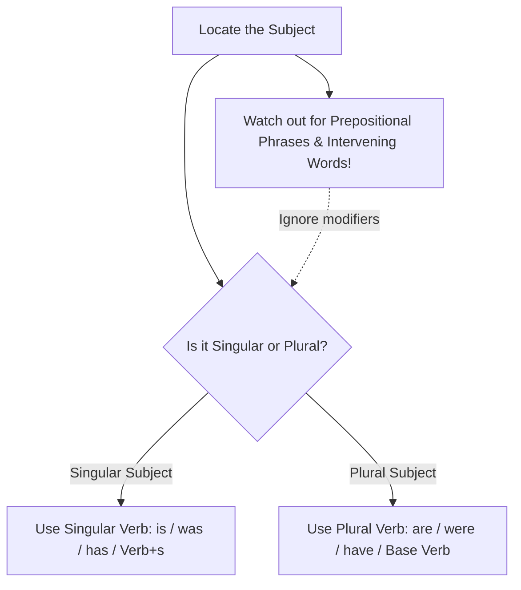

# Chapter 1: Subject-Verb Agreement

## Introduction
Subject-Verb Agreement (also called grammatical concord) is the foundational cornerstone of English sentence mechanics. In Standard Written English, the predicate verb must agree in number (singular or plural) and person (first, second, or third) with its true subject. While the principle sounds elementary, English syntax presents numerous traps: intervening prepositional phrases, inverted word orders, correlative conjunctions, indefinite pronouns, collective nouns, and quantifying fractions that challenge even advanced university scholars.

## Learning Objectives
By completing this chapter, university students will be able to:
1. Identify the authentic grammatical "headword" in complex sentences containing intervening phrases and modifiers.
2. Formulate correct verb choices with compound subjects linked by `and`, `as well as`, `along with`, `together with`, and `accompanied by`.
3. Apply proximity and correlative conjunction rules (`either... or`, `neither... nor`, `not only... but also`).
4. Resolve concord with indefinite pronouns, collective nouns, fractions, percentages, and expressions of quantity/time/distance.
5. Confidently tackle all Subject-Verb Agreement questions appearing in GEEL-1106 Semester End Examinations.

## Easy Definition
**Subject-Verb Agreement** simply means that a singular subject must take a singular verb, and a plural subject must take a plural verb.
- **Singular:** *The engineer works on the project.*
- **Plural:** *The engineers work on the project.*

## Why It Is Important
In academic, technical, and professional engineering writing, agreement errors immediately undermine credibility. Examiners heavily penalize concord errors in Semester End Examinations because verb inflection reveals whether a student understands sentence hierarchy or merely matches verbs to the nearest adjacent word.

## Basic Concept
1. **Third Person Singular inflection:** In the Present Indefinite tense, a third-person singular subject requires the suffix **-s** or **-es** on the lexical verb (*he writes*, *she develops*, *the system operates*).
2. **Plural Inflection:** Plural subjects do **not** take `-s` or `-es` on the lexical verb (*they write*, *the systems operate*).
3. **Be-Verbs & Auxiliaries:**
   - Singular: *is, was, has, does*
   - Plural: *are, were, have, do*

## Detailed Explanation
The core challenge in advanced English is identifying the **true subject (the headword)**. Modifiers—such as prepositional phrases, participial phrases, relative clauses, and appositives—frequently sit between the subject and the verb. 

> [!WARNING]
> **The Proximity Illusion:** Never automatically match the verb with the noun sitting directly before it. Always trace backward to find the grammatical headword of the noun phrase.

---

## Grammar Rules (Rule-by-Rule Explanation)

### Rule 1: The Headword Rule (Intervening Prepositional Phrases)
When a prepositional phrase (e.g., beginning with *of, in, on, at, for, with, about*) separates the subject from the verb, the verb agrees with the **headword** preceding the preposition, **never** with the object of the preposition.
- **Structure:** `Subject (Headword) + [Preposition + Object of Preposition] + Verb`
- **Examples from Course Material:**
  1. *The boys in the room **are** studying.* (Headword: *boys* [plural])
  2. *The freshness of these vegetables **attracts** the customers.* (Headword: *freshness* [uncountable singular])
  3. *The freshness of these vegetables **is** attractive.* (Headword: *freshness* [singular])
  4. *The beauty of many places of Bangladesh **is** attractive to the tourists.* (Headword: *beauty* [singular])
  5. *The study of languages **is** very interesting.* (Headword: *study* [singular])
  6. *Several theories on this subject **have** been proposed.* (Headword: *theories* [plural])
  7. *The view of these disciplines **varies** from time to time.* (Headword: *view* [singular])
  8. *The danger of forest fires **is** not to be taken lightly.* (Headword: *danger* [singular])
  9. *The effects of that crime **are** likely to be devastating.* (Headword: *effects* [plural])
  10. *The fear of rape and robbery **has** caused many people to flee to the cities.* (Headword: *fear* [singular])
  11. *The picture of soldiers **brings** back many memories.* (Headword: *picture* [singular])
  12. *The quality of these recordings **is** not very good.* (Headword: *quality* [singular])
  13. *The effects of cigarette smoking **have** been proven to be extremely harmful.* (Headword: *effects* [plural])
  14. *The use of credit cards in place of cash **has** increased rapidly in recent years.* (Headword: *use* [singular])
  15. *Living expenses in this country as well as in many other countries **are** all time high.* (Headword: *expenses* [plural])
  16. *The levels of intoxication **vary** from time to time.* (Headword: *levels* [plural])

---

### Rule 2: Parenthetical Expressions & Accompaniment Connectors
When a subject is joined to other nouns by additive connectors such as:
- *as well as*
- *along with*
- *together with*
- *accompanied by*
- *with*
- *in addition to*
- *including / excluding*

The verb agrees strictly with the **first subject** (the initial noun). The accompanying phrase is grammatically parenthetical.
- **Formula:** `Subject 1 + [as well as / along with / together with / accompanied by / with] + Subject 2 + Verb (governed by Subject 1)`
- **Examples from Course Material:**
  17. *The actress along with her manager and some friends **is** going to a party tonight.* (Subject 1: *actress* [singular])
  18. *The Prime Minister with all members of her cabinet **has** arrived.* (Subject 1: *Prime Minister* [singular])
  19. *Mr. Robbins accompanied by his wife and children **is** arriving tonight.* (Subject 1: *Mr. Robbins* [singular])
  20. *My father together with my brothers and sisters **has** come to see me off.* (Subject 1: *My father* [singular])
  21. *John along with twenty friends **is** planning a party.* (Subject 1: *John* [singular])
  22. *Mr. Jones accompanied by several members of the committee **has** proposed some changes of the rules.* (Subject 1: *Mr. Jones* [singular])
  23. *My classmates as well as I **are** not willing to suspend the classes.* (Subject 1: *My classmates* [plural] $
ightarrow$ *are*)

---

### Rule 3: Indefinite Pronouns Ending in -body, -one, -thing
Indefinite pronouns with *-one*, *-body*, and *-thing* are grammatically singular in standard English and invariably take a singular verb.
- **Words:** *Everyone, everybody, everything, someone, somebody, something, anyone, anybody, anything, no one, nobody, nothing.*
- **Formula:** `Indefinite Pronoun (-body / -one / -thing) + Singular Verb`
- **Examples from Course Material:**
  24. *Everybody who has not purchased a ticket should be in this line.*
  25. *Something **was** under this house.*
  26. *Somebody **is** waiting outside.*
  27. *Nobody **likes** a liar.*
  28. *No problem **has** ever been so difficult.*
  29. *Anybody who **has** lost his ticket should report to the desk.*
  30. *Nobody **works** harder than John does.*
  31. *After she had perused the material, the secretary decided that everything **was** in order.*
  32. *Anything **is** better than going to another movie tonight.*
  33. *Everybody who **has** a fever must go home immediately.*

---

### Rule 4: `None of` and `No` (Countable vs. Non-Countable Concord)
- When *none of* or *no* modifies an **uncountable (non-count) noun** or a singular noun, it takes a **singular verb**.
- When *none of* or *no* modifies a **plural countable noun**, it takes a **plural verb** in descriptive university grammar.
- **Formula:**
  - `None of / No + Uncountable Noun + Singular Verb`
  - `None of / No + Plural Countable Noun + Plural Verb`
- **Examples from Course Material:**
  34. *None of the student **was** present.* (Singular noun)
  35. *No examples **were** relevant.* (Plural countable noun)
  36. *None of the money **was** spent.* (Uncountable noun)
  37. *No example **was** cited.* (Singular noun)
  38. *No money **was** necessary.* (Uncountable noun)
  39. *No students **have** passed.* (Plural countable noun)
  40. *None of the students **have** submitted the assignment.* (Plural countable noun)

---

### Rule 5: Correlative Conjunctions (`Either... or`, `Neither... nor`) vs. `Either of / Neither of`
1. **Isolated `Either of` / `Neither of`:**
   - When followed by *of*, *either* and *neither* function as pronouns meaning "one of the two" or "not one of the two". They are strictly **singular** and take a **singular verb**.
   - Formula: `Either of / Neither of + Plural Noun / Pronoun + Singular Verb`
   - Examples:
     41. *Either of two brothers **has** done this.*
     42. *Neither of Rafiq and Hasib **was** present.*
     43. *Neither of these two machines **works** tremendously.*
2. **Correlative `Either... or` / `Neither... nor` / `Not only... but also`:**
   - The verb follows the **nearest subject** (Subject 2).
   - Formula: `Neither S1 nor S2 + Verb (governed by S2)`
   - Examples:
     44. *Either Shihab or his classmates **were** reported about it.* (Nearest: *classmates* [plural])
     45. *Neither Maria nor her friends **are** going to class today.* (Nearest: *friends* [plural])
     46. *Neither John nor his friends **are** going to the beach today.* (Nearest: *friends* [plural])
     47. *Either John or his wife **makes** breakfast each morning.* (Nearest: *wife* [singular])
     *(Past Exam)*: *Neither you nor your brothers **are** suitable for the post.* (Nearest: *brothers* [plural])

---

### Rule 6: Collective Nouns vs. Nouns of Multitude
A **collective noun** represents a collection of individuals regarded as a single unit (e.g., *committee, jury, family, government, audience, public, crowd, team*).
1. **Unified Action (Singular):** When the group acts unanimously as a single entity, use a **singular verb**.
2. **Divided Action / Individual Focus (Noun of Multitude - Plural):** When individual members act separately, hold conflicting views, or the context emphasizes their separate activities, use a **plural verb** (often accompanied by plural pronouns like *their*).
- **Words `Majority` and `Minority`:**
  - Used alone without another noun $
ightarrow$ **Singular** (*The majority believes...*).
  - Used with `of + plural noun` $
ightarrow$ **Plural** (*The majority of the students have passed*).
  - Used with `of + non-count noun` $
ightarrow$ **Singular** (*The majority of the building was damaged*).
- **Examples from Course Material:**
  48. *The organization **is** known worldwide.* (Single entity)
  49. *The family **has** gone to Nepal to enjoy vacation.* (Acting together)
  50. *The group **works** with best planning.* (Unified)
  51. *The committee **has** reached a final decision.* (Consensus)
  52. *The committee **are** trying to enforce their widely different views.* (Divided opinions)
  53. *The jury **are** divided in their verdicts.* (Disagreement)
  54. *The jury **has** reached a consensus.* (Unanimous agreement)
  55. *The majority **believes** that the law is oppressive.* (Used alone without 'of')
  56. *The majority of the building **was** affected during the earthquake.* (Portion of a singular object)
  57. *The majority of the students **have** passed.* (Plural countable)
  58. *The public **was** dispersed by the police.* (Unit)
  59. *The crowd **is** moving towards the barricade.* (Unit)

---

### Rule 7: Quantities of Time, Distance, Money, and Weight
Expressions indicating a specific period of time, amount of money, distance, or weight are considered **single units of measurement** and take a **singular verb**.
- **Formula:** `[Number + Plural Unit of Time/Money/Distance/Weight] + Singular Verb`
- **Examples from Course Material:**
  60. *Twenty-five dollars **was** required for the job.*
  61. *Fifty minutes **is** not enough time to finish the test.*
  62. *Forty dollars **has** already been spent here.*
  63. *Thirty miles **means** a whole distance of thirty miles.*
  64. *Fifty kgs **is** a heavy weight for this weak man.*
  65. *Sixty miles **was** covered with one liter of petrol.*

---

### Rule 8: `A number of` vs. `The number of`
This is one of the most frequently tested rules in university exams:
- `A number of + plural noun` = "several" or "many" (indefinite quantifier) $
ightarrow$ takes a **Plural Verb**.
- `The number of + plural noun` = the specific mathematical figure/statistic $
ightarrow$ takes a **Singular Verb**.
- **Formula:**
  $$	ext{A number of} + 	ext{Plural Noun} \longrightarrow \mathbf{Plural\ Verb}$$
  $$	ext{The number of} + 	ext{Plural Noun} \longrightarrow \mathbf{Singular\ Verb}$$
- **Examples from Course Material:**
  66. *A number of students **are** going to the class picnic.*
  67. *The number of days in a week **is** seven.*
  68. *A number of applicants **have** already been interviewed.*
  69. *The number of residents who have been questioned on this matter **is** quite small.*
  70. *A number of reporters **were** on the bureau last night.*
  71. *The number of students who have withdrawn from class this quarter **is** appalling.*
  72. *A number of boys **come** here every day to play football.*
  73. *The number of crows in this town **is** increasing day by day.*

---

### Rule 9: Inverted Sentences Beginning with Expletive `There`
The word *there* is an introductory expletive (dummy pronoun), **never** the grammatical subject. The true subject appears **after** the verb.
- **Formula:**
  - `There + is / was / has been + Singular Subject`
  - `There + are / were / have been + Plural Subject`
- **Examples from Course Material:**
  74. *There **is** a storm approaching.* (Subject: *a storm*)
  75. *There **have** been a number of telephone calls today.* (Subject: *a number of calls* [plural])
  76. *There **was** an accident last night.* (Subject: *an accident*)
  77. *There **work** one hundred laborers in our factory.* (Subject: *one hundred laborers*)
  78. *There **lies** a big pond in front of our house.* (Subject: *a big pond*)
  79. *There **have** been too many interruptions in this class.* (Subject: *too many interruptions*)
  80. *There **lives** a saint in our village.* (Subject: *a saint*)

---

### Rule 10: Compound Subjects Joined by `And` (Two Things vs. One Concept)
1. **Independent Entities:** Two or more singular subjects joined by *and* usually take a **plural verb**.
   - Example 82: *The Founder and the President **were** present.* (Two distinct individuals because article 'the' is repeated).
2. **Single Identity / Person:** If two titles refer to the same person (indicated by a single determiner/article preceding the first noun), the verb is **singular**.
   - Example 81: *The Founder and President **is** coming.* (One person holds both offices).
   - Example 87: *My relative and friend **has** come.* (One person is both relative and friend).
3. **Inseparable Pairs (Compound Idea / Unit):** When two nouns commonly joined by *and* express a single collective concept, food combination, or proverb, the verb is **singular**.
   - Example 83: *Bread and butter **was** his favorite food.*
   - Example 84: *Slow and steady **wins** the race.*
   - Example 85: *Time and tide **waits** for none.* (Proverbial unit; modern variants also accept *wait*, but prescribed course grammar standardizes on *waits*).
   - Example 86: *Early to bed and early to rise **makes** a man healthy.*

---

### Rule 11: Titles of Books, Films, and Proper Names Plural in Form
Titles of literary works, movies, organizations, and countries ending in `-s` are single entities and take a **singular verb**.
- **Examples from Course Material:**
  88. *Gulliver's Travels **is** a famous book.*
  89. *Star Wars **was** a successful film.*
  90. *The Arabian Nights **attracts** the reader.*
  *(Slide examples)*: *The United States of America **is** a rich country.* / *The United States **has** a big navy.*

---

### Rule 12: Subjects Preceded by `Each` and `Every`
When two or more singular nouns are joined by *and* but preceded by *each* or *every*, the subject remains **singular**.
- **Formula:** `Each / Every + Noun 1 + and + [each / every] + Noun 2 + Singular Verb`
- **Examples from Course Material:**
  91. *Each boy and each girl **was** dressed in a new dress.*
  92. *Every man, woman and child **was** charmed.*
  93. *Every man, woman and child in the village **prays** for his well-being.*
  94. *Every hour and minute **brings** its call for duty.*

---

### Rule 13: Nouns Plural in Form but Singular in Meaning
Certain nouns end in `-s` but refer to a single academic discipline, physical phenomenon, or disease. They take a **singular verb**.
- **Words:** *Physics, Mathematics, Economics, Politics, News, Wages, Whereabouts, Measles, Mumps, Ethics.*
- **Examples from Course Material:**
  95. *The news **is** true.*
  96. *The wages of sin **is** death.*
  97. *His whereabouts **is** known to the police.*
  98. *Politics **is** a business of his life.*
  99. *Physics **is** a branch of science.*
  100. *Mathematics **makes** him nervous.*

---

### Rule 14: `More than one` vs. `More than two` & Fractions
1. `More than one + Singular Noun` takes a **singular verb** (governed by the grammatical form of *one*).
2. `More than two / three + Plural Noun` takes a **plural verb**.
3. **Fractions and Percentages (`Two-thirds of`, `Three-fourths of`, `Lots of`, `A lot of`):**
   - If the noun following *of* is **uncountable / singular** $
ightarrow$ **Singular Verb**.
   - If the noun following *of* is **plural countable** $
ightarrow$ **Plural Verb**.
- **Examples from Course Material:**
  101. *More than one student **has** been selected.*
  102. *More than two persons **were** killed.*
  103. *More than one boy **was** present there.*
  104. *There **are** lots of works to do.* / *There **is** lots of work to do.* (Note: *work* non-count takes *is*).
  105. *There **is** a lot of water in this pond.*
  106. *There **are** a lot of problems in this job.*
  107. *Lots of people **think** so.*
  108. *Two-thirds of the job **has** been completed.*
  109. *Three-fourths of the students **come** to the class.*
  110. *Two-fourths of the building **has** been painted white.*

---

### Rule 15: `Many a` vs. `A great many` / `A good many`
- `Many a + Singular Noun` = "many individuals considered one by one" $
ightarrow$ **Singular Verb**.
- `A great many / A good many + Plural Noun` = "a large number" $
ightarrow$ **Plural Verb**.
- **Examples from Course Material:**
  111. *Many a student **fears** English.*
  112. *A great many persons **have** been found waiting there.*
  113. *A good many boys **were** present in the class.*

---

### Rule 16: Paired Objects (`A pair of` vs. Plural Tools/Garments)
*(From Lecture Slides)*
Certain clothing items and tools exist in two connected parts and are inherently plural: *pants, scissors, trousers, jeans, pliers, tweezers, glasses, shorts*.
1. If used alone $
ightarrow$ **Plural Verb** (*The scissors **are** dull* / *The pants **are** in the drawer*).
2. If preceded by `a pair of` / `this pair of` $
ightarrow$ The headword becomes *pair* (singular) $
ightarrow$ **Singular Verb**.
- **Examples from Slides:**
  - *This pair of scissors **is** dull.*
  - *A pair of jeans **was** in the washing machine this morning.*
  - *The pants **are** in the drawer.*
  - *The memoranda **are** not important.* (Latin plural: *memorandum* $
ightarrow$ *memoranda* [plural]).

---

### Rule 17: Subjunctive Mood with `If` and `Wish`
*(From Lecture Slides)*
In hypothetical conditions and counterfactual wishes, the subjunctive form of *be* is invariably **were**, regardless of whether the subject is singular or plural.
- **Examples from Slides:**
  - *If I **were** in your shoes!*
  - *If I **were** a king!*
  - *I wish I **were** a child again!*

---

## Formula Cheat Sheet

| Structure Pattern | Determining Factor | Verb Number |
| :--- | :--- | :--- |
| `Noun 1 + of + Noun 2` | Headword (Noun 1) | Governed by Noun 1 |
| `S1 + as well as / along with + S2` | First Subject (S1) | Governed by S1 |
| `Either S1 or S2` / `Neither S1 nor S2` | Proximity (S2) | Governed by S2 |
| `Either of` / `Neither of` + Plural Noun | Pronoun (*Either/Neither*) | **Singular** |
| `Every- / Some- / Any- / No-` + body/one/thing | Distributive logic | **Singular** |
| `A number of + Plural Noun` | Quantifier (*several*) | **Plural** |
| `The number of + Plural Noun` | Mathematical figure | **Singular** |
| `Amount of money / time / distance` | Single unit | **Singular** |
| `Fraction / % + of + Uncountable` | Non-count mass | **Singular** |
| `Fraction / % + of + Plural Count` | Countable collection | **Plural** |
| `Many a + Singular Noun` | Distributive | **Singular** |
| `A great many + Plural Noun` | Quantifier | **Plural** |
| `A pair of + Plural garment/tool` | Headword (*pair*) | **Singular** |

---

## Step-by-Step Usage Guide (How to Solve in Exam Hall)
1. **Step 1: Isolate the Verb.** Look at the verb or blank in the sentence.
2. **Step 2: Cross out Prepositional Phrases.** Put brackets around all modifying prepositional phrases (*of the students*, *in this country*, *on the table*).
3. **Step 3: Eliminate Additive Parentheticals.** Ignore phrases introduced by *with, together with, as well as, accompanied by*.
4. **Step 4: Identify the Grammatical Subject.** Determine if the headword is singular, plural, non-countable, or an indefinite pronoun.
5. **Step 5: Apply Specific Rules.** Check for correlative conjunctions (*or/nor* $
ightarrow$ nearest), *a number of* (plural) vs *the number of* (singular), or single units of money/time.
6. **Step 6: Match Verb Form.** Select the correct inflection (*is/are, was/were, has/have, Verb-s/Verb*).

---

## Comparison Table: Common Confusions

| Confused Pair | Example 1 | Example 2 | Key Distinction |
| :--- | :--- | :--- | :--- |
| **A number of** vs. **The number of** | *A number of students **are** absent.* | *The number of students **is** forty.* | *A number* = many (plural); *The number* = statistic (singular). |
| **As well as** vs. **And** | *He as well as his brothers **is** coming.* | *He and his brothers **are** coming.* | *And* creates compound plural; *as well as* is parenthetical. |
| **Neither of** vs. **Neither... nor** | *Neither of the boys **is** guilty.* | *Neither the boy nor his parents **are** guilty.* | *Neither of* is strictly singular; *Neither... nor* follows nearest noun. |
| **Bread and butter** (food vs. items) | *Bread and butter **is** wholesome food.* | *Bread and butter **are** sold at the store.* | Unit concept = singular; Separate merchandise items = plural. |
| **Many a** vs. **Many** | *Many a soldier **dies** in war.* | *Many soldiers **die** in war.* | *Many a* takes singular noun & verb; *Many* takes plural. |

---

## Previous Examination Questions (IIUC Solved Archive)

1. *(Spring 2023, Q3a)*: **A bouquet of flowers (was/were) given to the guest at the airport.**
   - **Answer:** **was**
   - **Reasoning:** The headword is *bouquet* (singular collective unit). The prepositional phrase *of flowers* does not alter the number of the subject.

2. *(Spring 2022, Q3b)*: **Living expenses in this country as well as in many other countries (is/are) all time high.**
   - **Answer:** **are**
   - **Reasoning:** The grammatical headword is the plural noun *expenses*. The parenthetical phrase *as well as in many other countries* does not affect the verb.

3. *(Autumn 2023, Q3d)*: **Neither you nor your brothers (is/are) suitable for this post.**
   - **Answer:** **are**
   - **Reasoning:** When joined by *neither... nor*, the verb agrees with the closer subject (*your brothers* [plural]).

4. *(Spring 2024, Q3g)*: **The number of applicants who have been interviewed (is/are) remarkably high.**
   - **Answer:** **is**
   - **Reasoning:** *The number of* takes a singular verb.

---

## Practice Questions

### Section A: Multiple Choice Questions (MCQs)
1. The quality of these mangoes ___ not up to the mark.
   (A) are  (B) were  (C) is  (D) have been
   *Answer:* (C) — Headword *quality* is uncountable singular.
2. The actress, accompanied by her director and producers, ___ arriving on the morning flight.
   (A) are  (B) is  (C) were  (D) have
   *Answer:* (B) — Governed by first subject *actress*.
3. Neither of the two proposals ___ acceptable to the board of directors.
   (A) were  (B) are  (C) is  (D) have been
   *Answer:* (C) — *Neither of* takes singular verb.
4. Three-fourths of the infrastructure ___ damaged during the cyclone.
   (A) was  (B) were  (C) are  (D) have been
   *Answer:* (A) — *Infrastructure* is uncountable singular.
5. A number of engineers ___ currently working on the metro rail project.
   (A) is  (B) are  (C) was  (D) has been
   *Answer:* (B) — *A number of* takes plural verb.

### Section B: Fill in the Blanks
1. Fifty miles on this rough hilly terrain ___ (is/are) a grueling trek. $
ightarrow$ **is**
2. Mathematics ___ (is/are) considered the language of the universe. $
ightarrow$ **is**
3. Many a student ___ (regret/regrets) not attending lectures regularly. $
ightarrow$ **regrets**
4. There ___ (has/have) been severe disruptions in power supply this week. $
ightarrow$ **have**
5. Every boy and girl in the department ___ (was/were) presented a commemorative medal. $
ightarrow$ **was**

### Section C: Sentence Correction Drill
1. *Incorrect:* The use of artificial intelligence in hospitals have reduced human error.
   - *Correct:* The use of artificial intelligence in hospitals **has** reduced human error.
2. *Incorrect:* Neither the manager nor the technicians was able to troubleshoot the circuit.
   - *Correct:* Neither the manager nor the technicians **were** able to troubleshoot the circuit.
3. *Incorrect:* This scissors are too blunt to cut the wiring.
   - *Correct:* **These** scissors are too blunt... / This **pair of** scissors **is** too blunt...
4. *Incorrect:* More than one passenger were injured in the highway collision.
   - *Correct:* More than one passenger **was** injured in the highway collision.
5. *Incorrect:* The jury were unanimous in declaring the defendant guilty.
   - *Correct:* The jury **was** unanimous in declaring the defendant guilty.

---

## Quick Revision (Summary Checklist)
- [ ] Ignore all `of, in, at, on` prepositional phrases when finding the true subject.
- [ ] Connectors like `as well as, along with, together with` $
ightarrow$ Match the **1st subject**.
- [ ] Correlatives `either... or, neither... nor` $
ightarrow$ Match the **2nd (nearest) subject**.
- [ ] `A number of` = **Plural**; `The number of` = **Singular**.
- [ ] `Each, every, everyone, nobody, someone` = **Singular**.
- [ ] Money, time, distance, weight units = **Singular**.
- [ ] Titles of books and films ending in `-s` = **Singular**.
