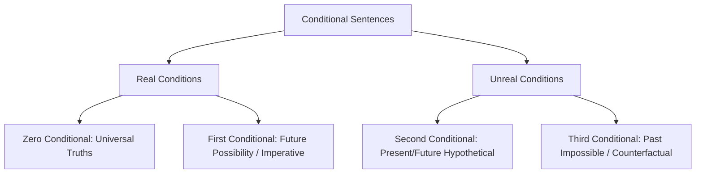

# Chapter 2: Conditional Sentences

## Introduction
Conditional sentences express hypotheses, dependencies, cause-and-effect relationships, and speculative realities. In academic and professional English, conditionals allow scholars to construct hypotheses, analyze counterfactual events, establish engineering constraints, and formulate polite requests. In GEEL-1106 / UREL-1106 examinations, conditionals consistently appear in multiple sections: right form of verbs, completing sentences, sentence corrections, and reading passage rewrites.

## Learning Objectives
By mastering this chapter, students will be able to:
1. Distinguish sharply between **Real Conditions** (factual, predictive, imperative) and **Unreal Conditions** (hypothetical, counterfactual).
2. Construct First, Second, and Third Conditionals using accurate modal auxiliaries and tense sequences.
3. Master Inverted Conditionals without *if* (*Had I known...*, *Were he sincere...*, *Should you encounter...*).
4. Clearly articulate the semantic difference between `if you had` and `if you had had`.
5. Solve all past examination conditional problems with 100% precision.

## Easy Definition
A **Conditional Sentence** is a complex sentence containing two parts:
1. **The Subordinate Clause (If-Clause):** Stating the condition or hypothesis.
2. **The Principal Clause (Main Clause):** Stating the outcome or consequence dependent upon that condition.
- *Example:* *If you attend class regularly [Condition], you will understand the lectures [Result].*

## Why It Is Important
Conditionals govern scientific reasoning, legal clauses, academic argumentation, and problem-solving. Misusing tenses in conditional clauses (such as using *would* inside the *if*-clause) is an immediate indicator of weak English proficiency.

## Basic Concept
The two clauses may appear in either order with identical meaning. When the *if*-clause precedes the main clause, a comma is mandatory. When the main clause comes first, no comma is required.
- *If you work hard, you will get your expected result.* (Comma used)
- *You will get your expected result if you work hard.* (No comma needed)

---

## Grammar Rules & Structural Formulas

### 1. Real Condition (Conditional - 1)
Real conditions state situations where it is genuinely possible or likely that the condition will be fulfilled, resulting in the realization of the action.

#### Structure 1A: Present + Future Indicative
- **Formula:** `If + Present Simple, Subject + shall / will / can / may + Base Verb (V1)`
- **Meaning:** Predictable future outcome based on a present condition.
- **Examples:**
  - *If you wait for me, I shall go with you.*
  - *If you get A+, we shall reward you.*
  - *You will suffer in the long run if you neglect your studies now.*

#### Structure 1B: Present + Present Simple (Zero Conditional / General Truth)
- **Formula:** `If + Present Simple, Subject + Present Simple (V1/Vs)`
- **Meaning:** Scientific facts, habitual truths, or logical certainties.
- **Examples:**
  - *If water is boiled at 100 degrees Celsius, it becomes vapor.* (From Spring 2022 Exam)
  - *If you are an honest man, you are trustworthy as well.*
  - *If you have sincerity and honesty, you are a trustworthy person.*

#### Structure 1C: Present + Imperative (Instructions / Commands / Requests)
- **Formula:** `If + Present Simple, [Imperative: Base Verb (V1) + Object]`
- **Meaning:** Giving instructions, orders, or religious/moral advice.
- **Examples:**
  - *If you have a certificate on computer literacy, apply for the post.*
  - *If you want to win the race, get regular training.*
  - *Read attentively if you want to get the highest grade.*
  - *Hurry up, if you want to avail yourself of the opportunity.*

---

### 2. Unreal Condition: Present & Future (Conditional - 2)
Used for hypothetical, improbable, or counterfactual situations in the present or future. The speaker knows the condition does not exist or is contrary to present reality.

#### Structure 2A: Lexical Past Verb
- **Formula:** `If + Past Simple (V2), Subject + would / could / might + Base Verb (V1)`
- **Examples:**
  - *If I earned one million, I could spend a lot for the welfare of the people.*
  - *If you supported me, I could protest the injustice.*
  - *I would be very grateful to you, if you accompanied me.*
  - *The students could do it themselves if they tried a little.*

#### Structure 2B: Subjunctive `Were`
In unreal conditional clauses, standard grammar requires **were** for all persons (even *I, he, she, it*).
- **Formula:** `If + Subject + were + Complement, Subject + would / could + Base Verb (V1)`
- **Examples:**
  - *If I were you, I would accept the offer.*
  - *If you were honest, we would select you our representative.*
  - *If I were the Prime Minister of Bangladesh, I would work hard to control corruption.*

#### Structure 2C: Past Possession (`If + Subject + had`)
- **Formula:** `If + Subject + had + Noun, Subject + would / could + Base Verb (V1)`
- **Meaning:** Refers to the **present/future**: "I know I do not possess this right now."
- **Examples:**
  - *If I had time, I would wait for you.* (Meaning: I do not have time now, so I cannot wait).
  - *If you had common sense, you would not do it.*
  - *If you had sincerity and honesty, we could support you.*

---

### 3. Unreal Condition: Past Activity (Conditional - 3)
Used for counterfactual situations in the **past**. The event already occurred or failed to occur; it is completely impossible to change the outcome.

#### Structure 3A: Standard Past Perfect
- **Formula:** `If + Subject + had + Past Participle (V3), Subject + would / could / might + have + Past Participle (V3)`
- **Examples:**
  - *If you had arrived earlier, you would have gotten much necessary information.* (Meaning: You did not arrive earlier, so you did not get the information).
  - *If you had done the work systematically, you could have finished successfully.*
  - *The audience would have thanked you, if you had spoken more loudly.*
  - *She would have spent a part of the money for the poor if she had won the lottery.*

#### Structure 3B: Past Subjunctive Condition with `Had been`
- **Formula:** `If + Subject + had been + Complement, Subject + would / could + have + V3`
- **Examples:**
  - *If you had been present at that time, we could have protested the injustice.*
  - *If the anti-corruption commission had been active, corruption would not have been so rampant.*
  - *The thief could have been caught, if the night guard had been awake.*

#### Structure 3C: Past Possession with `Had had`
- **Formula:** `If + Subject + had had + Noun, Subject + would / could + have + V3`
- **Meaning:** Refers to **past possession**: "You did not possess it in the past."
- **Examples:**
  - *If you had had sincerity and honesty, you could have commanded people's respect.*
  - *If my father had had a lot of money, I could have spent a lot.*
  - *If you had had a certificate on computer literacy, you would have gotten the job.*

---

### Rule-by-Rule Explanation: The Critical Contrast

> [!IMPORTANT]
> **Semantic Difference Between `If you had` and `If you had had`**
> - **`If you had [Noun]` (Conditional-2 / Present/Future):**
>   - *Example:* *If you had sincerity and honesty, we could support you.*
>   - *Meaning:* We know that you do **not** have sincerity and honesty right now in the present, so we will not support you.
> - **`If you had had [Noun]` (Conditional-3 / Past):**
>   - *Example:* *If you had had sincerity and honesty, you could have commanded people's respect.*
>   - *Meaning:* You did **not** have sincerity and honesty back then in the past, and consequently you could not command the respect of the people.

---

### 4. Inverted Conditionals (Omission of `If`)
In formal, literary, and examination English, *if* can be omitted by inverting the auxiliary verb before the subject.

#### Inversion Type A: Past Perfect (`Had` Inversion)
- **Standard:** `If + Subject + had + V3...`
- **Inverted:** `Had + Subject + V3, Subject + would / could + have + V3`
- **Examples:**
  - *Had you been honest in all your activities, you could have commanded the respect of the people.*
  - *Had you renewed your visa in time, you would not have fallen into trouble.* (From Spring 2023 / Spring 2022 Exam)
  - *Had I had enough experience in that field, I would not have sought your help.*
  - *Had Bangladesh cricket team been more sincere, they would not have been so badly defeated.*
  - *Had the government taken necessary steps in due time, commodity prices would not have risen.*

#### Inversion Type B: Subjunctive `Were` Inversion
- **Standard:** `If I were in your position...`
- **Inverted:** `Were I in your position, I would not reject the offer.`

#### Inversion Type C: Tentative `Should` Inversion
- **Standard:** `If you should need any assistance...`
- **Inverted:** `Should you need any assistance, please contact our helpline.`

---

### 5. Conditional Conjunctions Beyond `If`
- **Provided that / Providing that / As long as:** Means "only if / on the condition that".
  - *(Exam Spring 2024)*: *I will leave no stone unturned provided that **you support me wholeheartedly**.*
- **Unless:** Means "if not". It already contains a negative meaning; do not use another negative inside the unless-clause.
  - *Unless you start now, you will miss the train.*
- **In case:** Precautionary condition ("because it might happen").
  - *Take an umbrella in case it rains.*
- **As though / As if:**
  - After Present Tense $
ightarrow$ Use Past Simple (Unreal Present): *He talks as though he **knew** everything.*
  - After Past Tense $
ightarrow$ Use Past Perfect (Unreal Past): *He talked as though he **had not known** anything.* (Spring 2024 Exam correction)

---

## Master Comparison Table

| Type | Name | If-Clause Tense | Main Clause Verb Form | Semantic Focus |
| :--- | :--- | :--- | :--- | :--- |
| **Type 0** | Universal Fact | Present Simple | Present Simple | Scientific law / certainty |
| **Type 1** | Real Future | Present Simple | `will / shall / can / may + V1` | Real future possibility |
| **Type 1 (Imp)** | Directive | Present Simple | `Imperative (Base V1)` | Instruction / command |
| **Type 2** | Unreal Present | Past Simple (`were/had/V2`) | `would / could / might + V1` | Counterfactual present/future |
| **Type 3** | Unreal Past | Past Perfect (`had + V3`) | `would / could / might + have + V3`| Regret / counterfactual past |
| **Inverted 3** | Formal Inversion | `Had + Subject + V3` | `would / could / might + have + V3`| High-level formal past condition |

---

## Complete Solved Exercises from Course Materials

### Part 1: Right Form of Verbs (From Uploaded Course Book)
1. *If you attend the classes late, you **will miss** many important lessons.*
2. *If you are a sincere student, **attend** the classes punctually.*
3. *If you are a sincere student, you **are** a regular student as well.*
4. ***Help** yourself in all activities, if you want to be self-dependent in your life.*
5. *You **are** an honest man, if you are a God-fearing man.*
6. ***Hurry up**, if you want to avail yourself of the opportunity.*
7. *He **visits** us twice a week, if he stays in this city.*
8. *I **shall phone** you, if I reach there before you.*
9. *If you waste your time now, you **will repent** for it later on.*
10. *If I were you, I **would not reject** the offer.*
11. *If you supported me, I **could protest** the injustice.*
12. *If I had enough experience in this field, I **could apply** for the post.*
13. *I would be very grateful to you, if you **accompanied** me.*
14. *I could do the work better, if you **gave** me necessary instructions.*
15. *If you had done the work systematically, you **could have finished** successfully.*
16. *The audience would have thanked you, if you **had spoken** more loudly.*
17. *Had you been honest in all your activities, you **could have commanded** the respect of the people.*
18. *You **would have done** a better result, if you had prepared the notes earlier.*
19. *I shall help you if you **ask** me to help.*
20. *If you want to win the race, **get** regular training.*
21. *If I **were** the Prime Minister of Bangladesh, I would work hard to remove terrorism.*
22. *If you had the common sense, you **would not do** it.*
23. *We could elect you the president if you **attended** the meeting.*
24. *If you really had been present, I **would have seen** you.*
25. *She would have spent a part of the money for the poor if she **had won** the lottery.*
26. *If you read attentively, you **will understand** the subject matter.*
27. *If I **had** one million taka, I would spend it in welfare activities.*
28. *If you really had learned the lesson, you **would have been** able to answer the questions.*
29. *If you supported me, I **would win**.*
30. *The students could do it themselves if they **tried** a little.*
31. *He would have attacked you if you **had spoken** to him.*
32. *If my father had had a lot of money, I **would have spent** a lot.*
33. *Had you been well prepared, you **would have done** a better result.*
34. *You would have been able to do the exercise, if you **had understood** the lesson.*
35. *Had you given me necessary information, I **would not have missed** the grand chance.*
36. *Had the government **taken** necessary steps in due time, the price of essential goods would not have risen.*
37. *The thief could have been caught, if the night guard **had been** awake.*
38. *If you **had been** alert, you could have avoided the accident.*
39. *If you had had the honesty you are speaking of, we **would have seen** it in your activities.*
40. *Buy this book, if you **want** to be benefited from the book.*
41. *If the anti-corruption commission had been active, corruption **would not have been** so rampant in the country.*
42. *I would feel much excited, if I **did not get** the information earlier.*
43. *Had the Bangladesh cricket team been more sincere, they **would not have been** so badly defeated.*
44. *If they were your friends, they **would help** you.*
45. *Had I had enough experience in that field, I **would not have sought** your help.*
46. *If the authority **had taken** a drastic step in this regard, definitely we would have gotten a positive result.*
47. *If you consulted an expert, you **could accomplish** the job earlier.*

---

### Part 2: Completing Sentences with Conditionals (Course Guide Drills)
1. *Obey your teachers **if you want to prosper in life**.*
2. *If you see him waiting for me, **tell him to sit in my office**.*
3. *You can have a nice experience **if you visit the historical sites of Bangladesh**.*
4. *I would have given you a nice suggestion **if you had consulted me earlier**.*
5. *I would not reject the offer **if I were in your position**.*
6. *Had you been my supporter, **we could have won the student council election**.*
7. *You will shine in life **provided that you utilize every minute of your youth**.*
8. *Your article would have been more suggestive **if you had incorporated field survey data**.*
9. *If you were a religious person, **you would never indulge in bribery**.*
10. *Had the syllabuses been more comprehensive, **the students would have gained practical engineering skills**.*
11. *If you attend the classes regularly, **you will achieve an excellent CGPA**.*
12. ***If you assist me in this critical project**, I shall be ever grateful to you.*
13. ***If you possessed dynamic leadership qualities**, we would think to make you our representative.*
14. ***Had modern computer laboratories been established**, the students would have been more benefited.*
15. ***If you claim to be an honest citizen**, show your honesty in practice.*
16. *Had I got a job in a multinational company, **I would have settled permanently in Chittagong**.*
17. *Had our cricketers not joined ICL, **their international careers would not have been jeopardized**.*
18. *I would have suggested your name for the committee **if you had demonstrated sincere dedication**.*
19. *If you had had a certificate on computer literacy, **the corporate firm would have appointed you immediately**.*
20. *You could be a doctor **if you prepared thoroughly for the medical admission test**.*

---

## Previous Examination Questions (IIUC Solved)
1. *(Spring 2023, Q3b)*: **Had you renewed your visa in time, you ___ (Complete as a conditional sentence)**
   - **Model Answer:** *...you would not have fallen into such complications.* / *...you could have traveled without any harassment.*
2. *(Spring 2022, Q3e)*: **If water is boiled at 100 degree Celsius, it ___ (become) vapour. (Complete the sentence)**
   - **Model Answer:** **becomes** (Zero conditional / scientific fact).
3. *(Spring 2024, Q3b)*: **I will leave no stone unturned provided that ___ . (Complete it with suitable clause)**
   - **Model Answer:** *...you extend your heartfelt cooperation.* / *...I am given the necessary resources.*
4. *(Autumn 2025, Q3b)*: **Had I the ability to help the poor, I ___ .**
   - **Model Answer:** *...would help them unconditionally.* (Note: *Had I the ability* = Conditional 2 $
ightarrow$ *would + V1*).

---

## Practice MCQs
1. If the software developer had debugged the code thoroughly, the system ___ during the launch.
   (A) will not crash  (B) would not crash  (C) would not have crashed  (D) had not crashed
   *Answer:* (C) — Conditional 3 requires *would have + V3*.
2. Had the university announced the scholarship earlier, I ___ for it.
   (A) would apply  (B) could have applied  (C) will apply  (D) applied
   *Answer:* (B) — Inverted Conditional 3.
3. If I ___ you, I would consult the course instructor immediately.
   (A) was  (B) am  (C) were  (D) have been
   *Answer:* (C) — Subjunctive *were*.
4. Unless the government ___ strict anti-pollution measures, urban air quality will deteriorate.
   (A) will take  (B) takes  (C) does not take  (D) took
   *Answer:* (B) — *Unless* takes present simple indicative.
5. He talks as though he ___ an expert in cyber security.
   (A) is  (B) was  (C) were  (D) has been
   *Answer:* (C) — *As though* following present tense takes unreal past subjunctive *were*.
