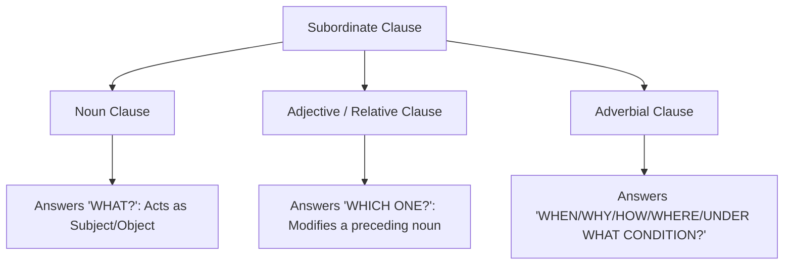

# Chapter 6: Prepositions, Conjunctions & Sentence Synthesis

## Introduction
Precision in academic English relies on two vital syntactic skills: the accurate deployment of **Appropriate Prepositions** and the skillful **Synthesis of Sentences** through conjunctions, connectors, and non-finite clauses. In GEEL-1106 Semester End Examinations, questions on prepositions, sentence combining, clause classification, and conjunction gaps constitute a major portion of the 10-mark Grammar Section.

## Learning Objectives
By mastering this chapter, students will be able to:
1. Accurately use high-frequency appropriate prepositions repeatedly tested in IIUC exams (`adhere to`, `indifferent to`, `cut with`, `for the benefit of`, `in place of`).
2. Deploy coordinating, subordinating, and correlative conjunctions to express subtle logical relationships (contrast, purpose, cause, result, condition).
3. Synthesize multiple short, repetitive sentences into elegant **Simple**, **Complex**, and **Compound** sentences using participial phrases, infinitives, appositives, and nominative absolutes.
4. Classify subordinate clauses with complete precision into **Noun Clauses**, **Adjective (Relative) Clauses**, and **Adverbial Clauses**.
5. Solve all past examination sentence combining and preposition questions from 2018 to 2025.

---

## Part A: High-Yield Appropriate Prepositions (IIUC Exam Archive)

Prepositions in English often do not follow predictable literal translations. University students must master **Fixed (Appropriate) Prepositions** associated with specific verbs, nouns, and adjectives.

### 1. Most Repeated Prepositions on IIUC Question Papers

| Expression | Meaning | Exam Example Sentence | Exam Citation |
| :--- | :--- | :--- | :--- |
| **indifferent to** | Unconcerned, callous | *Students should not be **indifferent to** their studies.* | Spring 2025 |
| **adhere to** | Stick firmly to, comply with | *A researcher must strictly **adhere to** scientific methodology.* | Akhir Islam Guide |
| **cut with (an instrument)** | Use an instrument | *The woodcutter cut down the ancient tree **with** an axe.* | Final Exam Archive |
| **in place of** | As a substitute for | *The use of credit cards **in place of** cash has increased rapidly.* | Spring 2022 / SVA text |
| **benefit of** | Advantage / welfare | *The Co-operative Movement exists for the **benefit of** its members.*| Spring 2022 |
| **rely on / depend on** | Trust / be contingent upon | *Free and fair elections **depend on** the good intentions of government.*| Autumn 2023 |
| **prevent from** | Stop from doing | *Strict security prevented the unauthorized user **from accessing** the database.*| Final Exam Archive |
| **abstain from** | Refrain from | *Citizens must **abstain from** smoking in public transport.* | Exam Practice |
| **participate in** | Take part in | *All citizens should actively **participate in** nation-building.* | Autumn 2025 |
| **capable of** | Having the ability for | *The microprocessor is **capable of** executing millions of instructions per second.*| Spring 2025 |
| **concur with (person)** | Agree with | *I completely **concur with** the chairman on this strategy.* | Final Exam Archive |
| **dispense with** | Do without | *Modern computerized offices have **dispensed with** manual paper files.*| Final Exam Archive |

---

### 2. Prepositions of Instrument vs. Agent
- **WITH + Instrument / Tool:** Used for the object, weapon, or instrument utilized.
  - *He cut the wire **with** pliers.*
  - *He signed the deed **with** a Parker pen.*
- **BY + Agent / Performer:** Used for the person or active force performing the action.
  - *The letter was written **by** John **with** an ink pen.*

---

## Part B: Logical Connectors & Conjunctions

### 1. Purpose Connectors: `so that` vs. `in order that` vs. `lest`
- **So that / In order that:** Followed by `subject + can / could / may / might + V1`.
  - *(Spring 2024 Exam)*: *My brother is learning Japanese **so that** he may get a scholarship in Japan.*
  - *(Autumn 2023 Exam)*: *Government should undertake steps **so that** our education system is developed.*
- **Lest:** Means "for fear that... not"; followed by `subject + should + V1`.
  - *(Spring 2025 Exam)*: *He started to run fast **lest** he should be late.*

---

### 2. Contrast & Concession Connectors: `Though` / `Although` vs. `Despite`
- **Though / Although + Clause (Subject + Verb):**
  - *(Autumn 2023 Exam)*: *Though the creative model is good, many teachers are not aware of it.*
- **Despite / In spite of + Noun Phrase / Gerund:**
  - *Despite having several shortcomings, the system was approved.*
  - *In spite of his poverty, he maintained his integrity.*
  - > [!CAUTION]
    > **Never write:** *despite of*. *Despite* never takes *of*! Only *in spite of* uses *of*.

---

### 3. Correlative Connectors: Parallelism Rules
When using correlative conjunctions (*either... or, neither... nor, not only... but also, both... and*), the grammatical structures following both elements must be **strictly parallel**.
- *(Spring 2024 / Spring 2023 Exam)*:
  - *Incorrect:* *He not only spoke loudly but also clear.*
  - *Correct:* *He spoke **not only loudly but also clearly**.* (Adverb balanced with adverb).
- *(Spring 2023 Exam)*:
  - *Incorrect:* *Mehnaj is a scholar, an athlete, an artistic.*
  - *Correct:* *Mehnaj is a scholar, an athlete, and **an artist**.* (Noun balanced with nouns).

---

## Part C: Sentence Synthesis (Combining a Group of Sentences)

Sentence synthesis is the art of combining multiple simple, repetitive statements into one unified, mature sentence.

```
+--------------------------------------------------------------------------------+
|                        SENTENCE SYNTHESIS STRATEGIES                           |
+--------------------------------------------------------------------------------+
| 1. Combining into a SIMPLE SENTENCE:                                           |
|    - Using a Present or Perfect Participle                                     |
|    - Using a Preposition with a Gerund                                         |
|    - Using an Infinitive of Purpose                                            |
|    - Using a Noun in Apposition                                                |
|    - Using a Nominative Absolute                                               |
| 2. Combining into a COMPLEX SENTENCE:                                          |
|    - Using Subordinating Conjunctions (because, as, though, so that, after)    |
|    - Using Relative Pronouns (who, which, that, where, whose)                  |
| 3. Combining into a COMPOUND SENTENCE:                                         |
|    - Using Coordinating Conjunctions (FANBOYS: for, and, nor, but, or, yet, so)|
+--------------------------------------------------------------------------------+
```

---

### 1. Combining into a Simple Sentence (Exam Tested Techniques)

#### Technique A: Participial Phrase
When two actions have the same subject and happen in close succession:
- **Given Sentences:** *We reached there. The sun was setting at that time.*
- **Combined (Simple Sentence):**
  - *(Spring 2025 Exam, Q3b)*: ***Reaching there, we found the sun setting.*** / ***We reached there at sunset.***

#### Technique B: Perfect Participle (`Having + V3`)
When one action is completely finished before the next action begins:
- **Given Sentences:** *I finished my work. I went to sleep.*
- **Combined (Simple Sentence):** ***Having finished my work, I went to sleep.***

#### Technique C: Preposition + Gerund
- **Given Sentences:** *He revised the syllabus thoroughly. He secured the first position.*
- **Combined (Simple Sentence):** ***By revising the syllabus thoroughly, he secured the first position.***

#### Technique D: Noun in Apposition
- **Given Sentences:** *Louis XVI was the King of France. He was executed at the guillotine in 1793.*
- **Combined (Simple Sentence):** ***Louis XVI, the King of France, was executed at the guillotine in 1793.***

#### Technique E: Nominative Absolute
When two clauses have **different subjects**, the first subject is retained before a participle:
- **Given Sentences:** *The meeting came to an end. The delegates left the conference hall.*
- **Combined (Simple Sentence):** ***The meeting having come to an end, the delegates left the conference hall.***

---

### 2. Combining into a Complex Sentence (Exam Tested Techniques)

#### Technique A: Subordinating Conjunction of Cause/Reason
- **Given Sentences:** *I had finished my assignment. I went to university. I wanted to join a seminar.*
- **Combined (Complex Sentence):**
  - *(Autumn 2025 Exam, Q3c)*: ***After I had finished my assignment, I went to university because I wanted to join a seminar.***

#### Technique B: Relative Pronoun
- **Given Sentences:** *The ancient building collapsed last night. It had been constructed during the colonial era.*
- **Combined (Complex Sentence):**
  - *(Spring 2024 Exam, Q3g)*: ***The ancient building which had been constructed during the colonial era collapsed last night.***

---

## Part D: Subordinate Clause Identification

In university examinations, students are asked to identify the type of underlined subordinate clause.



1. **Noun Clause:** Functions as a subject, direct object, or predicate noun. Can be substituted with the pronoun "something" or "it".
   - *He informed me **what happened there**.* (He informed me *something* $
ightarrow$ **Noun Clause [Object]**).
   - ***What he said** is true.* (**Noun Clause [Subject]**).
2. **Adjective (Relative) Clause:** Modifies an antecedent noun or pronoun immediately preceding it.
   - *The man **whom they had come to see executed** came into sight.* (Modifies *man* $
ightarrow$ **Adjective Clause**).
   - *A square in Paris **which was used to execute traitors** was packed.* (Modifies *square* $
ightarrow$ **Adjective Clause**).
3. **Adverbial Clause:** Modifies a verb, adjective, or another adverb, indicating time, cause, purpose, result, condition, or concession.
   - *(Autumn 2023 Exam, Q3b)*: ***Though the creative model is good**, many teachers are not aware of it.*
     - Classification: **Adverbial Clause of Concession / Contrast**.
   - *Wait here **until I return**.* (**Adverbial Clause of Time**).
   - *He worked hard **so that he might pass**.* (**Adverbial Clause of Purpose**).

---

## Previous Examination Questions (IIUC Solved Archive)

1. *(Spring 2025, Q3f)*: **Students should not be indifferent ___ their studies. (Use appropriate preposition)**
   - **Answer:** **to**

2. *(Spring 2025, Q3b)*: **We reached there. The sun was setting at that time. (Combine these sentences into a simple sentence)**
   - **Answer:** **Reaching there, we found the sun setting.** *(or: We reached there at sunset.)*

3. *(Spring 2024, Q3c)*: **My brother is learning Japanese. ___ he may get a scholarship in Japan. (Complete with suitable conjunction)**
   - **Answer:** **so that** / **in order that**

4. *(Autumn 2023, Q3a)*: **Government should undertake steps ___ our education system is developed. (Use a suitable conjunction)**
   - **Answer:** **so that** / **in order that**

5. *(Autumn 2023, Q3b)*: **"Though the creative model is good, many teachers are not aware of it." What type of subordinate clause is it?**
   - **Answer:** **Adverbial Clause of Concession (or Contrast)**

6. *(Spring 2022, Q3d)*: **Make a sentence with phrase preposition 'in place of'.**
   - **Model Answer:** *The hospital administration decided to recruit experienced nurses in place of temporary trainees.*

7. *(Spring 2022, Q1f)*: **The Co-operative Movement exists ___ the benefit of its members. (Fill in the blank with a preposition)**
   - **Answer:** **for**

8. *(Spring 2025, Q3e)*: **The country was hit very (hard/hardly) by the drought. (Choose the correct adverb)**
   - **Answer:** **hard**
   - **Why:** *Hard* means with great force/severely. *Hardly* is a negative adverb meaning scarcely/almost not at all.

---

## Practice Questions

### Section A: Multiple Choice Questions (MCQs)
1. He persevered through all hardships ___ he might achieve his lifelong ambition.
   (A) lest  (B) so that  (C) although  (D) because of
   *Answer:* (B) — Purpose conjunction followed by *might + V1*.
2. The woodcutter felled the colossal oak tree ___ a heavy axe.
   (A) by  (B) from  (C) with  (D) in
   *Answer:* (C) — Instrument takes *with*.
3. "The news that the flight was cancelled shocked everyone." The underlined clause *that the flight was cancelled* is a:
   (A) Adjective Clause  (B) Noun Clause in Apposition  (C) Adverbial Clause  (D) Coordinate Clause
   *Answer:* (B) — Defines the content of the noun *news*.
4. You will not be permitted to enter the laboratory ___ you produce your institutional ID.
   (A) if  (B) unless  (C) provided  (D) lest
   *Answer:* (B) — *Unless* = if not.
5. In the sentence "He spoke not only fluently but also ___," the blank must be filled with:
   (A) persuasiveness  (B) persuasive  (C) persuasively  (D) with persuasion
   *Answer:* (C) — Parallelism requires an adverb balancing *fluently*.

### Section B: Sentence Synthesis Drill
1. *Combine into a Simple Sentence:* He heard the alarming siren. He immediately evacuated the premises.
   - *Answer:* **Hearing the alarming siren, he immediately evacuated the premises.**
2. *Combine into a Complex Sentence:* The engineer identified the flaw in the circuit. The system was already functioning smoothly.
   - *Answer:* **Although the engineer identified the flaw in the circuit, the system was already functioning smoothly.**
3. *Combine into a Simple Sentence using Noun in Apposition:* Dr. Muhammad Yunus founded Grameen Bank. He was awarded the Nobel Peace Prize.
   - *Answer:* **Dr. Muhammad Yunus, the founder of Grameen Bank, was awarded the Nobel Peace Prize.**
